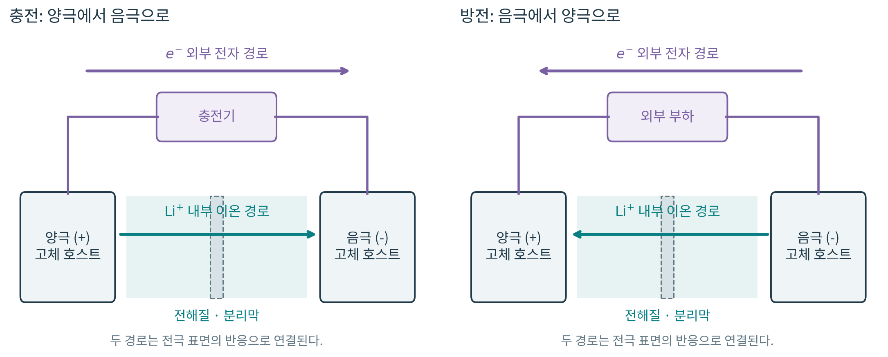
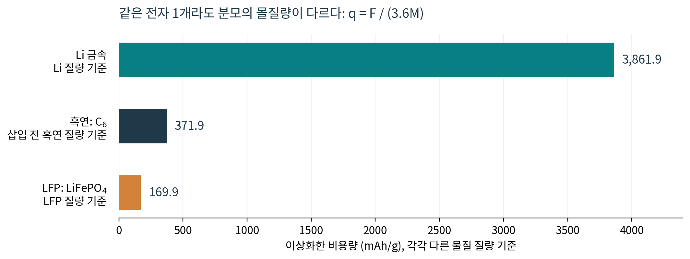
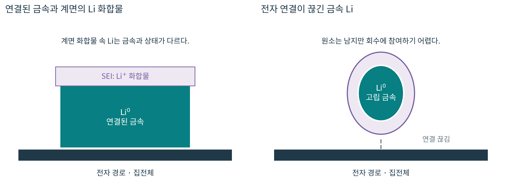

# 1.1.1.1.1 Li: 원소·Li⁺·금속 음극

> 학습 상태: 학습중 | 문서 수준: 상세문서

[항목 PDF](../../References/wbs/1.1.1.1.1_Li_원소·Li⁺·금속_음극.pdf)

## 01  선수학습 · 기초지식 · 학습 목표

### 선수학습

- 1.1.1.3.1 화학결합·산화수
- 1.1.1.3.3 산화·환원과 전위

### 기초지식 - 먼저 알아둘 기초

#### 원소와 존재 형태

Li라는 기호만 보면 어떤 물질인지 정해지지 않는다. LiFePO₄ 안의 Li, 전해질의 Li⁺, 금속 Li는 결합·전자상태·역할이 서로 다르다.

#### 호스트와 삽입

호스트는 Li를 받아들이는 고체 구조다. 삽입은 그 구조 안에 Li를 저장하는 과정이고, 금속 석출은 표면 등에 별도의 Li 금속상을 만드는 과정이다.

#### 전하량·전위의 기준

mAh/g의 분모와 전위를 비교한 기준전극을 확인한다. V vs. Li/Li⁺는 리튬 금속-이온 반응을 기준으로 잰 전극 전위다. 셀 전압은 두 전극 전위의 차이로 읽는다.

### 핵심 내용

Li는 리튬이라는 원소를, Li⁺는 이동·저장되는 이온 상태를, 금속 Li는 별도의 금속상을 뜻한다. 삽입과 금속 석출을 구별하고, 순환 가능한 Li가 줄어드는 과정과 확인할 증거를 이해한다.

### 읽고 나서 설명할 수 있어야 할 것

(1) Li의 세 가지 표현과 존재 형태. (2) 삽입·금속 석출·계면 반응의 차이. (3) 용량·전위·효율의 기준과 Li 손실을 판단할 증거.

> 이 문서는 Li의 상태와 역할을 중심으로 읽는다. 흑연·양극·전해질·리튬 금속 전지는 차이를 보여 주는 예시이며, 각 소재의 전체 설계와 실험 방법은 해당 문서로 이어간다. 본문의 [1], [2]는 마지막 참고근거의 자료 번호다.

## 02  핵심내용 - Li 원소·Li⁺·금속 Li

### 금속의 물성과 화합물의 물성을 구분한다

리튬은 원자번호 3, 1족 s 블록 원소다. 중성 원자의 전자배치는 [He]2s¹, 대표 몰질량은 약 6.94 g/mol이다. 금속 Li의 실온 밀도는 약 0.534 g/cm³, 녹는점은 약 180.50 °C다. 이 밀도·녹는점을 LiFePO₄나 전해액에 적용하지 않는다. [1, 2]

| 표현·위치 | Li의 상태 | 무엇을 뜻할까? |
| --- | --- | --- |
| 금속 Li(s) | 금속상, 형식 산화수 0 | 금속 음극 또는 별도로 석출된 리튬. |
| 전해질의 Li⁺ | 주변 용매·음이온과 상호작용하는 이온 | 용매화(용매 분자가 이온 주변을 둘러싸는 현상) 상태와 이동을 함께 본다. |
| LiFePO₄·NCM 안의 Li | 고체 구조 안의 Li, 형식적으로 +1 | Li가 드나들 때 호스트의 전자상태도 변한다. |
| LiₓC₆ 안의 Li | 흑연 호스트 안에 저장된 Li | 이상화한 화합물의 전하 장부에서 Li는 +1로 읽는다. 별도의 금속 Li상과 구별한다. |

Li⁺는 중성 Li 원자보다 전자가 하나 적다. 다만 고체에서 형식 산화수와 실제 전자밀도 분포는 같지 않다. Li를 받아들인 호스트와의 결합·전자 이동을 함께 설명한다.

> 금속 Li는 물과 강하게 반응한다. 여기의 금속 물성과 반응성은 존재 형태를 구분하기 위한 내용이다. 서로 다른 Li 화합물의 거동은 그 화학식과 환경에서 다시 판단한다. [1]

## 03  핵심내용 - Li⁺와 전자의 이동 경로

리튬이온 전지의 충전에서는 양극에서 Li가 빠지고 음극에 저장된다. 방전에서는 음극에서 나온 Li가 양극으로 돌아간다. 전자는 외부 회로를, Li⁺는 전해질 경로를 지난다. 두 경로가 전극 표면의 반응과 연결되어 전하량이 맞는다. [4]

그림 1. 충전·방전에서 이온과 전자의 방향을 구분한 직접 제작 개념도. 양극은 왼쪽, 음극은 오른쪽이다. 그림의 Li 수와 내부 모양은 실제 조성·입자·결정구조를 재현한 것이 아니다.

### 전해질과 분리막은 무엇을 연결할까?

전해질은 Li⁺를 포함한 이온 이동 경로를 제공하고, 분리막은 두 전극의 직접 접촉을 막으면서 전해질이 채운 기공으로 이온이 지나가게 한다. 전자의 외부 경로와 이온의 내부 경로 중 하나가 막히면 원하는 전극 반응도 계속 이어지기 어렵다.

### Li/Ni 자리 혼입: Li가 이동할 자리도 중요하다

> 일부 층상 양극에서는 원래 Li가 있던 자리에 Ni가 들어가고, Li가 전이금속 자리에 들어가는 자리 교환이 나타난다. Li층의 Ni는 Li가 통과할 경로와 주변 환경을 바꿀 수 있다. 영향은 혼입의 양·배열·조성에 따라 달라져 “혼입은 언제나 같은 정도로 해롭다”고 단정하지 않는다. Li의 일반 물성이나 모든 전극에 공통인 현상과 구분한다. [10]

## 04  핵심내용 - 삽입과 금속 석출은 다른 반응

### 삽입: 호스트 구조 안으로 저장한다

> 흑연의 이상화한 삽입 반응
C₆ + xLi⁺ + xe⁻ → LiₓC₆  (0 ≤ x ≤ 1)
금속 석출 반응
Li⁺ + e⁻ → Li(s)

흑연 삽입에서는 Li와 전자가 함께 참여하며 탄소 전자상태가 바뀐다. LiₓC₆에서 Li는 형식적으로+1, C₆ 전체는-x로 배정해 중성을 맞춘다. LiC₆라면 C 평균은-1/6이다. 실제 부분 전하는 형식 산화수와 다르다. [11, 12]
금속 석출은 표면에 별도 Li 금속상을 만든다. 이동·계면 반응이 충분히 따라오지 못하면 흑연 삽입과 석출이 경쟁할 수 있다. [5, 7]

### 양극에서 Li를 빼면 누가 전하를 보상할까?

단순한 LFP 예에서는 충전 방향을 LiFePO₄ → FePO₄ + Li⁺ + e⁻로 쓴다. Li⁺와 전자가 함께 빠져나가며 Fe의 형식 산화수가 +2에서 +3으로 바뀐다. Ni계 양극에서도 같은 전하 중성 원리를 쓰지만, 실제 전자 배분은 조성과 결합에 따라 다르다.

| 과정 | Li가 있는 곳 | 읽을 핵심 |
| --- | --- | --- |
| 삽입·탈삽입 | 고체 호스트 안 | 호스트 구조와 전자상태가 함께 변한다. |
| 금속 석출·용출 | 별도의 금속상 | 표면 형상·전자 연결·계면의 가역성이 중요하다. |
| 부반응에 의한 고정 | 계면 생성물 등의 화합물 | 원소 Li는 남아 있어도 순환에 참여하지 못할 수 있다. |

> 리튬 금속 음극에서는 석출·용출이 의도한 저장 반응이다. 하지만 흑연 기반 리튬이온 전지에서는 표면 금속 석출이 원하지 않은 반응이 될 수 있다. 어떤 전지를 설명하는지 먼저 확인한다.

## 05  핵심내용 - 비용량 계산과 질량 기준

전자 1몰의 전하량은 F≈96485 C/mol이고 1 mAh=3.6 C다. 반응 전자 수를 n, 기준 물질의 몰질량을 M으로 두면 q=nF/(3.6M)이다. Li 금속은 한 Li당 전자 1개이므로 q≈96485/(3.6×6.94)=3861.9 mAh/g이다. [2, 3]

그림 2. 명시한 화학식·전자 수로 직접 계산한 비용량. Li 금속은 Li 질량, 흑연은 삽입 전 C₆ 질량, LFP는 LiFePO₄ 질량 기준이다. 측정값이나 셀 성능 비교 결과가 아니다.

### 왜 흑연은 약 372 mAh/g일까?

이상화한 완전 삽입 상태 LiC₆까지 가는 데 C₆당 전자 1개를 사용한다. M(C₆)=6×12.011=72.066 g/mol을 분모로 쓰면 371.9 mAh/g이다. LFP는 M=157.755 g/mol에 전자 1개를 가정해 약 169.9 mAh/g이 된다. 세 계산의 질량 기준을 바꾸면 숫자도 바뀐다. [2, 3]

> 셀 에너지에는 전압과 실제 가역 용량, 상대 전극·집전체·전해질 등의 질량이 함께 들어간다. 큰 활물질 비용량만으로 셀의 에너지와 수명을 정할 수 없다.

## 06  핵심내용 - 전위·효율·Li 재고를 읽기

### 0 V vs. Li/Li⁺는 무엇의 기준일까?

리튬 금속과 Li⁺가 평형을 이루는 반응을 그 기준에서 0 V로 둔다. 양극 전위와 음극 전위를 같은 기준으로 비교하면 평형 셀 전압은 대략 E양극-E음극이다. 교육용 예로 양극 3.7 V, 음극 0.1 V라면 차이는 3.6 V다. 이 숫자는 특정 셀의 측정값이 아니다.

전류가 흐르면 반응·전달 저항 때문에 분극(평형에서 전위가 벗어나는 변화)이 생긴다. 그래서 셀 단자 전압만 보고 음극 표면의 국소 전위를 바로 알 수 없다. 흑연의 삽입 전위와 Li 금속 석출 기준이 가까워 반응 조건의 관리가 중요하다. [7]

### 도금·박리 효율의 직접 계산

> 석출 전하량 Q입력=1.000 mAh
회수 전하량 Q회수=0.995 mAh
회수 효율=Q회수/Q입력×100=99.5%
차이=0.005 mAh

이 효율은 정한 시험에서 들어간 전하 중 얼마나 회수했는지를 나타낸다. 같은 차이가 SEI 생성, 전자 연결이 끊긴 금속, 회수되지 않은 활성 Li 등 서로 다른 상태로 남을 수 있다. 전압·종료 조건까지 확인해야 한다. [6, 8]

> 순환 가능한 Li 재고는 실제 충방전에 사용할 수 있는 Li의 양이다. 원소 Li의 총량과 구별한다. 시료를 전부 녹여 ICP-OES(유도결합플라즈마 발광분석) 등으로 Li 총량을 측정해도, 어떤 Li가 다시 반응에 참여할 수 있는지는 별도 증거가 필요하다.

## 07  핵심내용 - SEI·금속 고립·Li 손실

### SEI는 왜 생기고 어떤 역할을 할까?

SEI(Solid Electrolyte Interphase, 고체 전해질 계면층)는 음극 표면에서 전해질이 반응해 생기는 층이다. Li⁺ 전달을 허용하면서 추가 전해질 반응을 억제하는 계면이 필요하다. 초기 형성에 Li가 사용될 수 있고, 균열·새 표면 노출로 계속 재형성되면 추가 손실이 누적된다. [5]

그림 3. Li가 원소로 남아 있어도 순환에 참여하지 못하는 두 상태를 구분한 직접 제작 개념도. 위치·두께·비율은 실험값이 아니다. 녹색 금속과 계면층 안의 Li⁺ 화합물을 구별해 읽는다.

금속 Li⁰가 전자 경로와 끊어지면 금속으로 남아 있어도 정상적인 용출에 참여하기 어렵다. SEI에 들어간 Li⁺ 화합물과 이런 고립 금속은 화학 상태가 다르다. 2019년 연구는 두 기여를 분리해 정량했고, 연구한 조건에서 고립된 금속이 큰 손실 원인이었다. 모든 셀에 같은 비율을 적용하지 않는다. [6]

> LLI(Loss of Lithium Inventory, 순환 가능한 Li 감소)는 손실의 결과를 가리킨다. SEI 성장·금속 고립 등 어떤 과정이 그 결과를 만들었는지 분석으로 연결해야 한다.

## 08  핵심내용 - 금속 석출과 분석·해석

빠른 충전, 낮은 온도, 높은 충전 상태, 전극 내 불균일성은 Li 전달과 삽입의 부담을 키울 수 있다. 국소 음극 전위와 핵생성 조건에 따라 금속 석출이 경쟁한다. 모든 셀에 공통인 온도·전류 임계값 하나를 제시하지 않는다. [5, 7]

| 현상·질문 | 확인할 분석·관찰 | 해석의 한계 |
| --- | --- | --- |
| 전하 회수가 줄었는가? | 충방전 전하량·효율·전압 변화를 비교한다. | 전하량 차이만으로 화학종과 손실 위치를 확정하지 못한다. |
| 금속이 어떤 형상인가? | SEM(주사전자현미경), 단면·저온 관찰로 형태와 전자 연결을 본다. | 공기 노출·시료 준비로 상태가 바뀔 수 있다. 한 위치로 전체 양을 정량하지 않는다. |
| 고립 금속과 Li⁺ 화합물은 얼마인가? | 적정 가스 분석·질량분석 등 화학 상태를 구별하는 정량법을 쓴다. | 선택성·공시험·회수율·다른 반응종 간섭을 확인한다. |
| 계면·전달 저항이 변했는가? | EIS(Electrochemical Impedance Spectroscopy, 전기화학 임피던스 분광법)와 구조·화학 증거를 함께 본다. | 저항 변화 하나만으로 금속 석출이나 특정 SEI 성분을 확정하지 못한다. |

2019년 연구의 TGC(Titration Gas Chromatography, 적정 가스 크로마토그래피)와 2022년 질량분석 프로토콜은 화학 상태를 구별하려는 정량 사례다. 반응종·시험 조건을 검토해 적용해야 한다. 여기서는 직접 실험 절차를 제시하지 않는다. [6, 8]

> 판단은 “관찰 → 가능한 설명 → 추가 확인”으로 쓴다. 효율 저하를 관찰했다면 고립 금속과 계면 부반응을 후보로 두고, 형태와 화학종 정량을 연결한다. 금속 Li 문제는 수지상 형상 하나로만 설명되지 않는다. [9]

## 09  핵심내용 - 스스로 확인할 질문

정의·반응·계산·분석의 한계를 자신의 말로 설명해 본다. 답이 막히면 해당 장으로 돌아간다.

1. LiFePO₄에 Li가 들어 있다는 말과 리튬 금속 음극이라는 말은 무엇이 다른가?

2. 충전할 때 양극에서 나온 Li⁺와 전자는 각각 어떤 경로로 음극에 도달하는가?

3. 흑연에 Li를 삽입하는 반응과 흑연 표면에 금속 Li가 석출되는 반응을 비교해 보자.

4. Li 금속의 약 3862 mAh/g와 흑연의 약 372 mAh/g를 비교할 때 분모는 무엇인가?

5. 1.000 mAh를 석출하고 0.995 mAh를 회수했다면 효율과 전하량 차이는 얼마인가? 원인도 알 수 있는가?

6. ICP에서 전체 Li 양이 같게 나왔는데 순환 가능한 Li가 줄어들 수도 있는가?

## 10  핵심내용 - 답과 해설

1. LiFePO₄는 Li·Fe·P·O가 결합한 화합물이며 Li는 형식적으로 +1이다. 리튬 금속 음극에는 산화수 0인 금속상이 있다. 원소가 포함되어 있다는 사실만으로 금속상이라고 할 수 없다.

2. Li⁺는 전극 기공·분리막의 전해질 경로를, 전자는 충전기가 연결된 외부 회로를 지난다. 두 경로와 전극 반응이 함께 이어져야 충전이 진행된다. 분리막을 통한 전자 이동은 정상적인 경로가 아니다.

3. 삽입은 C₆+xLi⁺+xe⁻ → LiₓC₆처럼 호스트 안에 저장하는 반응이다. 석출은 Li⁺+e⁻ → Li(s)로 별도의 금속상을 만든다. 같은 Li와 전자를 사용해도 저장 위치와 상이 다르다.

4. 앞의 값은 Li 금속 질량, 뒤의 값은 Li 삽입 전 흑연 C₆의 질량이다. 두 값 모두 이상화한 활물질 비용량이며 셀 전체 비용량이 아니다. 집전체·전해질·상대 전극 등의 질량과 실제 이용률이 추가로 필요하다.

5. 회수 효율은 99.5%, 차이는 0.005 mAh다. 이것만으로 SEI에 고정된 Li⁺와 고립된 금속 Li⁰를 구별할 수 없다. 시험의 전압 범위·종료 조건을 확인하고 화학종과 형태 분석을 더해야 한다.

6. 그렇다. Li가 SEI 화합물로 고정되거나 금속 상태로 전자 경로와 끊어지면 원소로는 시료 안에 남아 있어도 반응에 참여하지 못할 수 있다. 원소량과 전기화학적으로 사용할 수 있는 양을 구별한다.

## 11  참고근거

본문의 [1]~[12]는 아래 자료에 연결된다. 계산·그림은 명시한 가정의 교육용 자료다. 논문 결과는 해당 시료·조건에 한정한다.

- [1] [Royal Society of Chemistry, Lithium](https://periodic-table.rsc.org/element/3/lithium)
- [2] [CIAAW: Abridged Standard Atomic Weights 2024](https://ciaaw.org/abridged-atomic-weights.htm)
- [3] [OpenStax Chemistry 2e §17.4 — 패러데이 상수와 전하량](https://openstax.org/books/chemistry-2e/pages/17-4-potential-free-energy-and-equilibrium)
- [4] [DOE, DOE Explains...Batteries](https://www.energy.gov/science/doe-explainsbatteries)
- [5] [Photochemically driven SEI, Nature Communications (2021)](https://doi.org/10.1038/s41467-021-27095-w)
- [6] [Fang et al., Nature 572 (2019): Quantifying inactive lithium in lithium metal batteries](https://doi.org/10.1038/s41586-019-1481-z)
- [7] [Huang et al., Nature Communications 13 (2022): Onboard early detection and mitigation of lithium plating in fast-charging batteries](https://doi.org/10.1038/s41467-022-33486-4)
- [8] [Communications Materials 3 (2022): Protocol for quantifying inactive lithium in anode-free lithium batteries by mass spectrometry titration](https://doi.org/10.1038/s43246-022-00273-z)

## 12  참고근거 · 연계학습

- [9] [DOE, Why Is It So Hard to Make Batteries Smaller and Lighter?](https://www.energy.gov/science/bes/articles/why-it-so-hard-make-batteries-smaller-and-lighter)
- [10] [Nature Communications 16, 2203 (2025): Tuning Li occupancy and local structures for advanced Co-free Ni-rich positive electrodes](https://doi.org/10.1038/s41467-025-57063-7)
- [11] [IUPAC Gold Book: oxidation state - 형식 산화수의 정의](https://goldbook.iupac.org/terms/view/O04365)
- [12] [Electronic structure of alkali-intercalated graphite studied by soft-x-ray emission spectroscopy (1987)](https://doi.org/10.1103/PhysRevLett.58.614)

### 이후 연계학습

- 1.1.1.1.7 C: 탄소
- 1.1.1.4.1 확산·이온 전달
- 1.1.1.4.4 계면 반응·젖음성
- 1.1.2.2.4.1 리튬 금속 음극
- 1.4.3.1 LLI: 순환 가능한 Li 감소
- 1.4.3.4 리튬 석출·고립
- 1.1.1.1.2 Ni: 니켈
- 1.1.1.2.1 층상 구조
- 1.1.1.2.4 공공·자리 혼입·입계
