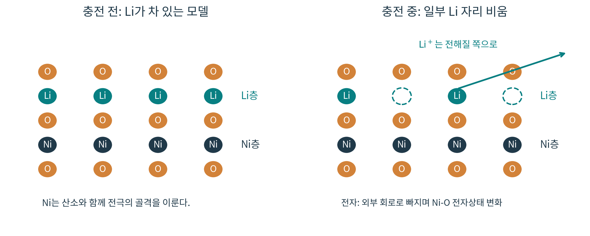
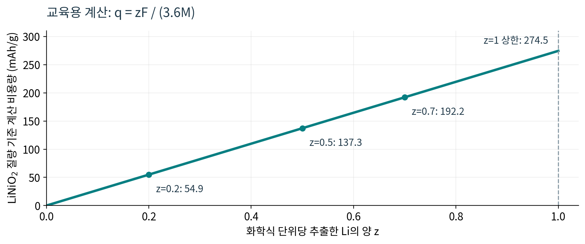
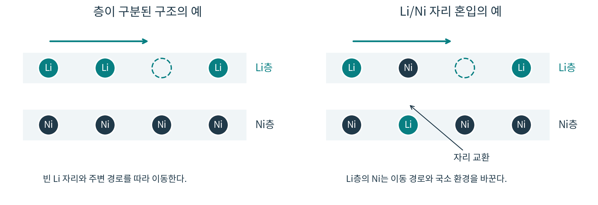

# 1.1.1.1.2 Ni: 니켈

> 학습 상태: 미학습 | 문서 수준: 상세문서

[항목 PDF](../../References/wbs/1.1.1.1.2_Ni_니켈.pdf)

## 01  선수학습 · 기초지식 · 학습 목표

### 선수학습

- 1.1.1.1.1 Li: 원소·Li⁺·금속 음극
- 1.1.1.3.1 화학결합·산화수
- 1.1.1.3.3 산화·환원과 전위

### 기초지식 - 먼저 알아둘 기초

#### 원소·금속·화합물

Ni라는 원소 이름은 같은 원자 종류를 뜻한다. 금속 Ni, 용액의 Ni²⁺, 산화물 안의 Ni는 결합과 전자상태가 달라 같은 물질처럼 다룰 수 없다.

#### 산화수와 전하 중성

산화수는 결합 전자를 정해진 규칙으로 배분한 형식적인 수다. 화학식의 전하 합을 맞추는 데 유용하지만, 원자에 실제로 국소화된 전하를 그대로 측정한 값은 아니다.

#### 용량을 읽는 기준

비용량 mAh/g는 어떤 물질의 질량으로 나눴는지 확인한다. 여기의 계산은 양극 활물질 기준이며 전극 전체·셀 전체 기준 수치와 직접 비교하지 않는다.

### 핵심 내용

니켈은 층상 산화물 양극에서 Ni-O 결합의 전자상태 변화로 전하 저장에 기여한다. Li의 이동, Ni의 형식 산화수, 실제 용량과 구조·표면 열화를 구분해 이해한다.

### 이 문서를 읽고 설명할 수 있어야 하는 것

(1) 금속 Ni와 양극재 안의 Ni의 차이. (2) 충전할 때 Li와 전자가 어디로 이동하며 Ni의 전자상태가 어떻게 달라지는지. (3) 전하 중성과 용량 계산의 가정, 그리고 Ni 관련 열화를 확인할 증거.

> 읽는 순서: 존재 형태 → 전극 안의 역할 → 반응과 계산 → 열화와 분석 → 확인 문제. NCM·NCA는 니켈의 역할을 보여 주는 예시로 사용한다. 각 소재의 합성·설계 전체는 해당 문서에서 다룬다.

## 02  핵심내용 - 니켈은 어떤 형태로 존재할까?

### 원소의 기본 성질

니켈은 원자번호 28, 주기율표 10족의 d 블록 원소다. 중성 원자의 전자배치는 [Ar] 3d⁸4s²이며, 계산에 사용하는 몰질량은 약 58.693 g/mol이다. 중성 원자의 전자배치를 화합물 안 Ni의 전자상태로 그대로 옮기지 않는다. [1, 2]

| 형태 | 형식 산화수 | 여기서 알아둘 점 |
| --- | --- | --- |
| 금속 Ni(s) | 0 | 금속 결합을 이루는 고체. 금속의 전도·물성과 관련된다. |
| NiSO₄ 수용액의 Ni²⁺ | +2 | 물·주변 리간드에 둘러싸인 이온. 금속 Ni 입자와 구별한다. |
| Ni(OH)₂ | +2 | 수산화물. Ni가 포함되어도 층상 리튬 산화물과 반응 환경이 다르다. |
| 이상적인 LiNiO₂ | +3 | Li⁺와 O²⁻를 가정한 전하 장부의 값. 실제 전자는 Ni-O 결합에 걸쳐 있다. |

### 금속 물성을 적용할 때의 주의점

금속 니켈의 밀도는 20 °C에서 약 8.90 g/cm³, 녹는점은 약 1455 °C다. 이 값은 금속 Ni의 물성이다. NCM의 밀도나 열적 안정성을 이 숫자로 대신 설명할 수 없다. 화학 조성·결정구조·충전 상태를 함께 봐야 한다. [1]

> “니켈이 들어 있다”는 말만으로 금속인지, 이온인지, 어느 화합물인지 알 수 없다. 먼저 화학식과 존재 형태를 확인한다.

## 03  핵심내용 - 양극재 안에서 맡는 역할

층상 산화물에서는 Li가 주로 있는 층과 전이금속이 주로 있는 층이 구분되고, 산소가 결합 골격을 만든다. Ni는 전이금속 자리에서 산소와 결합한다. 정상적인 충방전에서 Ni가 전해질을 통해 양·음극 사이를 왕복하는 것으로 이해하면 안 된다. [6]

그림 1. Li 이동과 전극 골격을 구분한 교육용 개념도. 원자 수·거리·배열은 실제 결정 단위격자를 재현한 것이 아니다. 전자 이동은 외부 회로를 뜻하며, 도식은 반쪽 전극의 충전 방향이다.

### NCM 조성을 읽는 법

NCM의 이상화한 화학식은 Li(NiₐCoᵦMn_c)O₂이며 a+b+c=1이다. NCM811은 Ni:Co:Mn의 몰비가 8:1:1이라는 뜻이다. Ni 80%는 전이금속 자리 중의 비율이며, Li와 O까지 포함한 전체 원자 비율이나 질량 비율을 뜻하지 않는다.

NCA는 Ni·Co·Al을 포함하는 계열이다. LFP의 기본 화학식 LiFePO₄에는 Ni가 포함되지 않는다. 따라서 Ni의 역할은 어떤 소재 계열과 자리에서 사용되는지를 함께 설명해야 한다.

> Ni가 풍부한 층상 양극은 높은 실용 용량을 얻을 가능성이 있지만, 사용할 수 있는 충전 범위와 구조·표면 안정성이 함께 결정한다. “Ni 함량만 올리면 모든 성능이 좋아진다”는 규칙으로 외우지 않는다. [8]

## 04  핵심내용 - 충전할 때 무엇이 산화될까?

### LiNiO₂로 보는 반쪽 반응

> 충전: LiNiO₂ → Li₁₋zNiO₂ + zLi⁺ + ze⁻
방전: 위 반응의 역방향. z는 화학식 단위당 빠져나간 Li의 양이다.

충전 중 Li⁺는 양극에서 빠져 전해질을 지나 음극 쪽으로 이동한다. 같은 양의 전자는 양극의 외부 회로로 빠져나간다. 충전기가 이 과정을 구동한다. 방전에서는 Li⁺와 전자의 이동 방향이 반대가 된다.

### 형식 산화수로 먼저 설명하기

Li⁺와 O²⁻를 가정하면 LiNiO₂의 Ni는 평균 +3이다. Li를 z만큼 제거하면 Li₁₋zNiO₂의 Ni 평균 형식 산화수는 +(3+z)가 된다. Ni³⁺ → Ni⁴⁺ + e⁻는 이 전하 장부를 설명하는 간단한 표현이다. NCM의 초기 Ni 산화수는 조성에 따라 다르므로 모든 양극이 Ni³⁺에서 출발하지는 않는다.

### 실제 전자구조까지 볼 때

Ni와 O는 공유결합 성격을 가진다. LiNiO₂에 대한 분광 연구는 벌크 충전 반응을 Ni-O 결합의 전자 재배치로 설명한다. 따라서 형식 산화수의 증가를 “Ni 원자에서만 정수 개의 전자가 빠졌다”는 그림과 동일시하지 않는다. [4, 5]

> 정상적인 벌크 전하 저장과 표면 열화를 구분한다. 충전으로 벌크가 산화되는 동안, 일부 열화된 표면에서는 산소 손실과 함께 환원된 Ni 성분이 나타날 수 있다. 서로 다른 깊이를 측정했다면 두 관찰은 함께 존재할 수 있다. [4, 5]

## 05  핵심내용 - NCM의 Ni 산화수 계산

### 가정을 먼저 고정한다

이 예제는 Li₁NiₐCoᵦMn_cO₂, a+b+c=1이며 Li=+1, O=-2, Co=+3, Mn=+4를 가정한다. 결함이나 산소 산화·환원을 별도로 넣지 않은 이상화한 전하 중성 계산이다. 원소 몰질량은 [2]를 따른다.

> 1 + a·vNi + 3b + 4c - 4 = 0
vNi = (3 - 3b - 4c) / a

| 조성 | 대입 | Ni 평균 형식 산화수 |
| --- | --- | --- |
| NCM111 | a=b=c=1/3 | (3-1-4/3)/(1/3) = 2 |
| NCM622 | a=0.6, b=0.2, c=0.2 | (3-0.6-0.8)/0.6 ≈ 2.667 |
| NCM811 | a=0.8, b=0.1, c=0.1 | (3-0.3-0.4)/0.8 = 2.875 |

### NCM811에서 Li를 0.5만큼 제거하면?

Li₁₋zNi₀.₈Co₀.₁Mn₀.₁O₂에서 같은 가정을 유지하면 vNi=(2.3+z)/0.8이다. z=0.5를 넣으면 vNi=3.5가 된다. Ni 한 종류의 원자가 모두 정확히 +3.5 이온으로 존재한다는 뜻이 아니라, 가정한 전하 장부의 평균값이다.

> 이 계산만으로 Ni²⁺·Ni³⁺·Ni⁴⁺ 각각의 실제 비율을 확정할 수 없다. 산소 비화학량론, Co의 반응, Ni-O 공유결합 등이 있으면 전하 배분 해석이 달라진다. 실제 전자상태는 분석 결과와 함께 판단한다.

## 06  핵심내용 - 용량을 직접 계산해 보기

### LiNiO₂ 한 몰에서 전자를 z몰 이동시키는 모델

M=6.94+58.693+2×15.999=97.631 g/mol. 전자 1몰의 전하량 F≈96485 C/mol이며 1 mAh=3.6 C이므로, 활물질 기준 비용량은 q=zF/(3.6M)≈274.5z mAh/g이다. 예를 들어 z=0.7이면 약 192.2 mAh/g이다. [2, 3]

그림 2. 전하량 정의에서 직접 계산한 직선. 측정 데이터나 전압-용량 곡선이 아니다. z=1은 이상화한 한 전자 계산 상한이며, 실제 운전 가능한 범위를 제시하지 않는다.

### Ni 함량과 용량을 연결할 때 생기는 오해

같은 “화학식 단위당 전자 1개” 가정으로 계산하면 NCM111은 약 277.9, NCM811은 약 275.5 mAh/g이다. Ni가 많아질 때의 실용 용량 이점은 단순히 화학식당 Li 수가 늘어나는 데서 생기지 않는다. 실제로 가역적으로 사용할 수 있는 산화·환원 범위가 중요하다.

> 에너지는 용량과 전압을 함께 반영한다. 비교할 때는 활물질·전극·셀 중 질량 기준, 전압 범위, 온도, 전류 조건, 초기값인지 수명 말기인지까지 맞춘다. 계산 상한으로 수명이나 안전성을 예측할 수는 없다.

## 07  핵심내용 - Li/Ni 자리 혼입과 이동 경로

층상 구조의 Li 자리 일부에 Ni가 있고, 전이금속 자리 일부에 Li가 있는 결함을 Li/Ni 자리 혼입이라고 한다. 그림은 두 자리의 교환을 단순화한 예다. 실제 재료에는 Li 과잉·결손이나 다른 결함도 함께 있을 수 있다. [6]

그림 3. Li/Ni 자리 교환을 보여 주는 개념도. 점선 원은 빈 Li 자리다. 이동 화살표는 가능한 경로를 설명하기 위한 표시이며, 실제 이동 장벽이나 확산 속도를 계산한 결과가 아니다.

### 왜 성능에 영향을 줄까?

Li층의 Ni는 Li가 지나는 경로와 주변 결합 환경을 바꾼다. 자리 점유와 국소 구조가 달라지면 Li 이동 속도와 사용할 수 있는 반응 범위에 영향을 줄 수 있다. 다만 자리 혼입이 처음부터 있었는지, 충방전 중 늘었는지 구분해야 한다.

### 어떻게 확인할까?

회절 데이터에 구조 모델을 맞추는 리트벨트 정련으로 자리 점유를 추정한다. 조성 분석과 구조 가정이 함께 필요하며, X선만으로 Li 자리 점유를 명확히 분리하기 어려운 경우 중성자 회절 등 보완 자료를 사용한다. 특정 피크 강도비 하나로 모든 결함을 확정하지 않는다. [6]

> 자리 혼입의 영향은 양과 분포, 조성, 전압 범위에 따라 달라진다. 2025년의 특정 Co-free Ni-rich 연구에서는 Li 점유와 국소 구조를 조절해 안정성을 개선했다. 모든 계열에 “혼입은 0일수록 최선”이라는 규칙을 적용하지 않는다. [6]

## 08  핵심내용 - 구조·표면 열화와 확인할 증거

### 격자 변화가 균열로 이어지는 과정

충전으로 Li가 빠지면 결합과 층 간 상호작용이 변한다. 깊은 탈리튬화 영역에서는 격자 변화가 방향마다 달라질 수 있다. 층에 수직인 c축 변화와 층 내 변화가 같지 않은 것을 비등방성 격자 변화라고 한다. 입자·결정립마다 변형이 달라지면 응력이 쌓이고 균열로 이어질 수 있다. 전압에 따른 변화 방향과 크기는 조성·상태별로 확인한다. [7]

| 열화 현상 | 성능에 미치는 경로 | 확인할 증거와 한계 |
| --- | --- | --- |
| 입자·입계 균열 | 전자·Li 이동 연결이 약해지거나 새 표면에 전해질이 접근한다. | SEM 단면·형태 관찰. 관찰 위치와 시료 수를 기록하며 Ni 산화수는 이 사진으로 알 수 없다. |
| 표면 산소 손실·구조 재구성 | 환원된 표면 Ni와 다른 구조의 층이 생겨 이동 저항을 키울 수 있다. | 표면 분광과 현미경·회절을 결합한다. 벌크 XRD가 뚜렷하지 않아도 얇은 표면층은 존재할 수 있다. |
| 전해질과의 부반응 | 계면 생성물과 저항 증가가 추가적인 용량 손실에 기여할 수 있다. | 표면 화학·전기화학 변화와 대조군을 함께 본다. 저항 증가 하나로 원인을 확정하지 않는다. |

균열과 전해질 침투의 연결은 [7], 벌크 반응과 표면 Ni 환원의 구별은 [4, 5]를 근거로 한 설명이다. 이 표는 가능한 경로를 정리한 것이며, 실제 시료의 단일 원인을 진단한 결과가 아니다.

### 개선 전략은 어떤 원인을 겨냥할까?

표면 코팅은 계면 접촉·반응을, 조성·도핑은 결합과 국소 구조를, 입자·결정립 설계는 응력과 경로 연결을 조절하려는 접근이다. 특정 설계의 성공 결과를 모든 Ni-rich 재료에 적용하지 않고, 같은 조성·시험 조건의 대조군을 확인한다. [7, 8]

## 09  핵심내용 - 분석 결과를 연결해 해석하기

| 분석법 | 확인하는 질문 | 바로 결론낼 수 없는 것 |
| --- | --- | --- |
| ICP-OES 유도결합플라즈마 발광분광분석 | Ni:Co:Mn의 평균 원소 조성이 목표와 맞는가? | 산화수·자리 점유·표면층을 조성만으로 알 수 없다. |
| XRD X선 회절 | 결정상과 격자 변화는 무엇인가? 구조 모델은 패턴을 설명하는가? | 얇은 표면층·모든 국소 결함을 한 번에 확정할 수 없다. |
| XANES X선 흡수단 근처 구조 | Ni 주변 전자상태가 충전·방전에서 어떻게 변하는가? | 흡수단 이동만으로 형식 산화수와 실제 전하를 완전히 동일시할 수 없다. |
| XPS X선 광전자분광법 | 표면 가까이의 화학 상태는 벌크 반응과 어떻게 다른가? | 한 피크를 전체 입자 평균 Ni 산화수로 읽지 않는다. 충전·위성 피크·피팅을 검토한다. |

Ni-rich 구조 연구에서 ICP-OES·회절·흡수 분광을 함께 쓰는 예는 [6, 8], 깊이에 따른 분광 해석의 차이는 [4, 5]를 참고한다. 분석법의 일반 원리는 해당 WBS 문서에서 이어서 다룬다.

### 예시: 충전 후 벌크는 산화됐는데 표면 Ni²⁺는 늘었다면?

먼저 측정 깊이와 시료 조건을 확인한다. 벌크 반응과 표면 열화가 공존할 가능성을 세울 수 있다. 다만 한 스펙트럼만으로 산소 손실을 확정하지 않고, 표면 구조·산소 관련 신호·충전 전 대조 시료를 더 확인한다. 이는 [4, 5]의 결과를 바탕으로 만든 해석 연습이다.

> 보고서에는 “관찰 → 가능한 설명 → 추가 확인”을 나눠 쓴다. 예: 표면 Ni²⁺ 성분 증가를 관찰했다 / 표면 환원·재구성을 의심한다 / 깊이·산소·구조 자료로 확인한다. 원소 분석의 질량비는 몰질량으로 나눈 뒤 합이 1이 되도록 정규화해야 몰비와 비교할 수 있다.

## 10  핵심내용 - 스스로 확인할 질문

자료를 잠깐 덮고 말이나 식으로 설명해 본다. 답이 막히는 질문의 앞 장으로 돌아간다.

1. NCM811에서 Ni 80%라는 말의 분모는 무엇인가? 금속 Ni가 80 질량% 들어 있다는 뜻인가?

2. LiNiO₂를 충전할 때 Li⁺와 전자는 각각 어디로 이동하는가? Ni는 어느 자리에 남는가?

3. Co³⁺·Mn⁴⁺·O²⁻를 가정한 NCM622의 Ni 평균 형식 산화수를 계산해 보자.

4. LiNiO₂에서 z=0.7일 때 계산 비용량은 얼마인가? 이 값이 실제 셀 용량을 보장하는가?

5. 균열이 용량 저하와 연결되는 두 경로를 말하고, 균열을 확인할 분석법을 하나 제안하자.

6. 벌크 산화와 표면 Ni²⁺ 증가가 동시에 관찰되면 무엇을 먼저 확인하고 어떤 가설을 세울까?

## 11  핵심내용 - 답과 해설

1. 전이금속 Ni·Co·Mn의 몰수 합이 분모다. Ni:Co:Mn=8:1:1이며, 전체 원자 비율이나 금속 Ni의 질량 비율이 아니다. 실제 양극에서는 Ni가 산소와 결합한 구조 안에 있다.

2. Li⁺는 전해질을 통해 음극 쪽으로, 전자는 양극에서 외부 회로로 이동한다. Ni는 정상적인 반응에서 전극의 전이금속 골격 안에 머물며 Ni-O 전자상태가 변한다. 용출은 정상적인 왕복 이동과 구별해야 한다.

3. 1+0.6vNi+0.2×3+0.2×4-4=0이므로 vNi=2.667이다. 조성에 따른 형식 평균이며, 이 수만으로 각 Ni 산화수 성분의 실제 비율을 정할 수 없다.

4. q≈274.5×0.7=192.2 mAh/g이다. 양극 활물질 질량 기준의 이상화한 전하량 계산이다. 가역 반응, 전압 범위, 전극 구성, 손실과 수명에 대한 정보가 없어 실제 셀 성능을 보장하지 않는다.

5. 입자·결정립 간 이동 연결이 약해지는 경로와, 새 균열 표면에 전해질이 들어가 부반응이 늘어나는 경로가 있다. SEM 단면으로 균열을 관찰하되, 화학 변화와 저항은 별도 자료로 확인한다.

6. 시료의 충전 상태, 측정 깊이·검출 방식, 표면 오염과 피팅 조건을 확인한다. 정상적인 벌크 반응과 환원된 표면 열화층이 공존한다는 가설을 세울 수 있다. 산소·구조·대조 시료의 증거로 추가 검증한다.

## 12  참고근거 · 연계학습

본문의 [1]~[8]은 아래 자료를 가리킨다. 그림 1·3은 구조를 설명하기 위해 직접 만든 개념도이고, 그림 2와 산화수·용량 예제는 명시한 가정과 상수로 직접 계산했다. 논문 사례는 해당 조성·측정 조건의 범위에서 읽는다.

- [1] [Royal Society of Chemistry: Nickel — 원소 및 금속 물성](https://periodic-table.rsc.org/element/28/nickel)
- [2] [CIAAW: Abridged Standard Atomic Weights 2024](https://ciaaw.org/abridged-atomic-weights.htm)
- [3] [OpenStax Chemistry 2e §17.4 — 패러데이 상수와 전하량](https://openstax.org/books/chemistry-2e/pages/17-4-potential-free-energy-and-equilibrium)
- [4] [An et al. (2024): Distinguishing bulk redox from near-surface degradation in lithium nickel oxide cathodes](https://doi.org/10.1039/D4EE02398F)
- [5] [University of Oxford Materials (2024): 위 논문의 저자 기관 해설](https://www.materials.ox.ac.uk/article/distinguishing-bulk-redox-near-surface-degradation-in-batteries)
- [6] [Nature Communications 16, 2203 (2025): Tuning Li occupancy and local structures for advanced Co-free Ni-rich positive electrodes](https://doi.org/10.1038/s41467-025-57063-7)
- [7] [Nature Communications 15, 1503 (2024): Kirkendall effect-induced uniform stress distribution stabilizes nickel-rich layered oxide cathodes](https://doi.org/10.1038/s41467-024-45373-1)
- [8] [Ni-rich layered oxide cathodes, Nature Communications (2024)](https://doi.org/10.1038/s41467-024-54637-9)

### 이후 연계학습

- 1.1.1.1.3 Co: 코발트
- 1.1.1.1.4 Mn: 망간
- 1.1.1.2.1 층상 구조
- 1.1.1.2.4 공공·자리 혼입·입계
- 1.1.1.2.5 상전이·응력·균열
- 1.1.2.1.1.1 NCM
- 1.1.2.1.1.2 NCA
