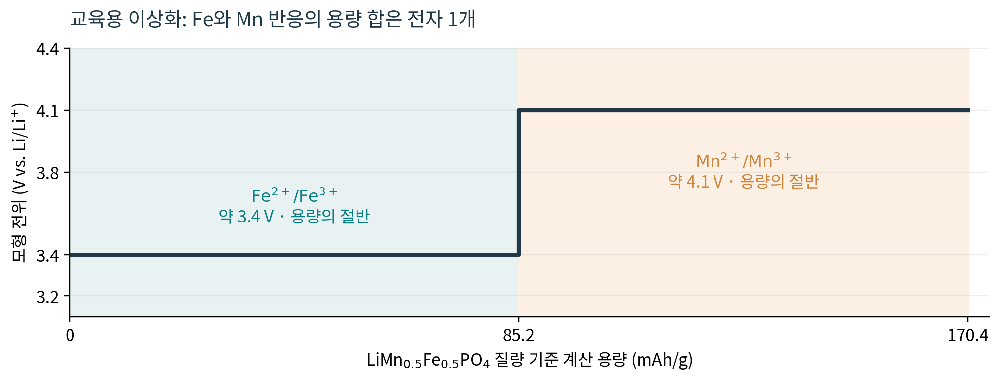
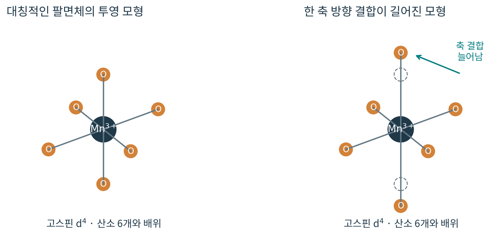
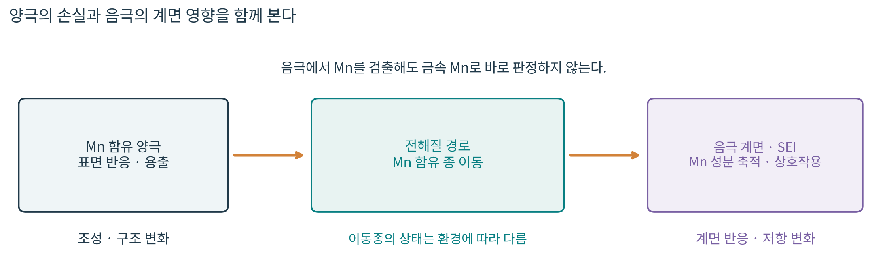

# 1.1.1.1.4 Mn: 망간

> 학습 상태: 학습중 | 문서 수준: 상세문서

[항목 PDF](../../References/wbs/1.1.1.1.4_Mn_망간.pdf)

## 01  선수학습 · 기초지식 · 학습 목표

### 선수학습

- 1.1.1.1.1 Li: 원소·Li⁺·금속 음극
- 1.1.1.3.1 화학결합·산화수
- 1.1.1.3.3 산화·환원과 전위

### 기초지식 - 먼저 알아둘 기초

#### 평균 산화수

Li⁺·O²⁻ 등의 가정을 놓고 전하 합을 맞춘 형식적인 평균이다. 평균 +3.5는 모든 원자가 실제로 +3.5 이온이라는 뜻이 아니다.

#### 배위와 구조 왜곡

배위는 중심 원자 주변의 가까운 결합 환경이다. MnO₆ 팔면체는 Mn 주변에 O 6개가 있는 환경을 말한다. 구조 왜곡은 그 결합 길이·각도가 달라지는 변화다.

#### 용출과 전극 간 영향

용출은 고체에 있던 Mn 성분이 전해질 쪽으로 빠져나오는 과정이다. 이동한 성분은 다른 전극의 계면에도 영향을 줄 수 있으므로 양극과 음극의 증거를 함께 본다.

### 핵심 내용

Mn의 역할은 산화수와 주변 구조에 따라 달라진다. LMO의 Mn³⁺/Mn⁴⁺와 LMFP의 Mn²⁺/Mn³⁺ 반응을 구분하고, 구조 왜곡·용출·전극 간 이동을 서로 다른 증거로 확인한다.

### 읽고 나서 설명할 수 있어야 할 것

(1) 소재별 Mn의 존재 형태와 반응 산화수. (2) Mn 관련 구조 왜곡·용출·전극 간 영향의 차이. (3) 그 변화에 맞는 분석법과 정량·해석의 가정.

> 이 문서는 Mn이라는 원소의 역할을 중심으로 LMO·LMFP 등을 비교한다. 결정구조와 합성·설계의 전체 내용은 해당 소재 문서에서 이어간다. 본문의 [1], [2]는 마지막 참고근거의 자료 번호다.

## 02  핵심내용 - 원소·금속·화합물 속 Mn

망간은 원자번호 25, 7족 d 블록 원소다. 중성 원자의 전자배치는 [Ar]3d⁵4s², 대표 몰질량은 약 54.938 g/mol이다. 금속 Mn의 실온 밀도는 약 7.3 g/cm³, 녹는점은 약 1246 °C다. 이 값으로 Mn 함유 양극재의 밀도·열적 안정성을 대신 설명하지 않는다. [1, 2]

| 형태 | 형식 산화수 | 이 문서에서의 의미 |
| --- | --- | --- |
| 금속 Mn(s) | 0 | 별도의 금속상. 양극 화합물 속 Mn와 구별한다. |
| MnSO₄·MnO | +2 | 전하 중성으로 읽는 대표적인 +2 화합물. |
| Mn₂O₃ | +3 | 두 Mn의 평균 산화수는 +3. |
| MnO₂ | +4 | O²⁻를 가정하면 Mn는 +4. |
| LiMn₂O₄ | 평균 +3.5 | 이상화한 장부에서는 Mn³⁺와 Mn⁴⁺의 혼합으로 읽는다. |

### 전자 수가 달라지면 결합 환경도 달라진다

단순한 이온 전자배치에서 Mn²⁺는 d⁵, Mn³⁺는 d⁴, Mn⁴⁺는 d³이다. 전자를 채우는 방식과 주변 산소의 배위 환경이 결합·반응·구조 왜곡에 영향을 준다. 실제 고체의 전자밀도는 Mn-O 결합에도 걸쳐 있으므로 형식 산화수와 분광 신호를 함께 읽는다. [4]

> 평균 산화수 계산은 유용한 출발점이다. 실제 산화수 성분의 비율이나 결함을 특정하려면 화학 조성·구조·전자상태를 확인하는 증거가 필요하다.

## 03  핵심내용 - 소재에 따라 달라지는 역할

| 소재·구조 | Mn를 읽는 출발점 | 구별할 역할 |
| --- | --- | --- |
| NCM · 층상 | 흔히 쓰는 이상화한 계산에서 Mn⁴⁺를 가정한다. | Ni·Co·Mn-O 골격과 전하 보상을 함께 본다. Mn가 모든 조건에서 반응하지 않는다는 보편 규칙은 아니다. |
| LMO · 스피넬 | LiMn₂O₄에서 평균 +3.5 | Mn³⁺/Mn⁴⁺ 반응과 Li 탈삽입이 용량에 기여한다. |
| LMFP · 올리빈 | LiMnₓFe₁₋ₓPO₄에서 Mn²⁺를 출발점으로 읽는다. | Mn²⁺/Mn³⁺ 반응이 Fe 반응보다 높은 전위의 용량에 기여할 수 있다. |
| LNMO · 스피넬 | 이상적인 LiNi₀.₅Mn₁.₅O₄는 Mn⁴⁺·Ni²⁺를 가정해 전하를 맞춘다. | 산소 결손·조성·질서에 따라 실제 Mn³⁺ 비중과 반응이 달라질 수 있다. |

표의 산화수는 명시한 화학식과 전하 중성의 가정이며, 모든 시료를 직접 측정한 값이 아니다. LMO와 LMFP의 반응은 다음 장에서 따로 계산한다. 소재 비교의 원 연구 예는 [5, 6, 7]을 따른다.

### Mn이 많으면 무엇을 함께 확인할까?

전자 수, 반응 전위, 가역적으로 쓰는 용량, 전달 속도, 구조와 표면 안정성을 함께 본다. 같은 원소 비율을 바꿔도 구조와 반응 산화수가 다르면 결과가 달라진다. Mn가 들어갔다는 사실만으로 성능을 한 방향으로 예측하지 않는다.

> 이 문서에서는 “전하 저장에 기여하는 반응”과 “골격·조성을 구성하는 역할”을 함께 보되, 각 소재의 실제 충전 범위와 결함을 확인한다.

## 04  핵심내용 - LMO의 반응과 용량 계산

### LiMn₂O₄의 전하 중성

> Li⁺·O²⁻를 가정하면 1+2vMn-8=0
Mn 평균 형식 산화수 vMn=+3.5
충전: LiMn₂O₄ → Li₁₋zMn₂O₄ + zLi⁺ + ze⁻
vMn=3.5+z/2
z: 화학식당 제거한 Li의 양 (0 ≤ z ≤ 1)

Li를 빼고 전자를 제거하면 Mn의 평균 형식 산화수가 증가한다. z=1의 이상화한 한 전자 장부에서는 +4가 된다. “두 Mn가 있으니 전자도 항상 두 개를 쓴다”는 뜻이 아니다. 이 반응 범위에서 Li 하나에 대응하는 전자 수는 화학식당 1이다.

### 비용량을 직접 계산한다

M(LiMn₂O₄)=6.94+2×54.938+4×15.999=180.812 g/mol. F≈96485 C/mol, 1 mAh=3.6 C를 사용하면 전자 1개 기준 q=F/(3.6M)≈148.2 mAh/g이다. 실제 시험 용량은 가역성·전압 범위·전류 조건에 따라 달라진다. [2, 3]

### 스피넬과 더 깊은 리튬 삽입

LMO는 Li가 이동하는 경로를 가진 스피넬 골격이다. 더 리튬화된 Li₂Mn₂O₄에서는 전하 장부상 Mn 평균이 +3이 된다. 그 구간의 구조 왜곡과 상변화를, 위의 한 전자 4 V 계열 반응 범위에 그대로 섞어 설명하지 않는다. 표면에서의 과리튬화도 별도로 관찰해야 한다. [5]

> 반응식은 Li의 이동과 전하 보상을, 구조 분석은 실제 어떤 상이 유지·생성되는지를 보여 준다. 충방전 곡선 하나만으로 구조가 완전히 가역적이라고 판단하지 않는다.

## 05  핵심내용 - LMFP의 두 반응과 전위

올리빈 인산염의 이상화한 출발 상태에서는 Li⁺와 PO₄³⁻를 가정해 Mn·Fe 평균을 +2로 맞춘다. 충전 중 Fe²⁺/Fe³⁺와 Mn²⁺/Mn³⁺ 반응이 서로 다른 전위 영역에서 기여할 수 있다. LFP 계열은 약 3.4 V, Mn 인산염은 약 4.1 V vs. Li/Li⁺를 대표적인 설명 값으로 쓴다. 실제 혼합 조성의 곡선은 조건에 따라 달라진다. [7]

그림 1. LiMn₀.₅Fe₀.₅PO₄를 설명하기 위한 이상화한 충전 모형. 3.4·4.1 V와 각 반응의 절반씩 용량을 가정한 직접 제작 도식이며, 실제 측정 곡선·전압 범위 권고·엄밀한 반응 순서의 재현이 아니다.

### 높은 전위와 전자 수를 구분한다

LiMn₀.₅Fe₀.₅PO₄ 한 화학식에서 전체 금속 자리는 1개, 추출하는 Li는 최대 1개라는 가정을 유지한다. M=157.3015 g/mol, 전자 1개 기준 q≈170.4 mAh/g이다. Mn를 넣는다고 이 전자 수가 두 배로 늘지는 않는다. [2, 3]

> 높은 전위에서 반응하는 용량이 늘면 에너지에 이점이 생길 수 있다. 동시에 낮은 전자·이온 전달 속도, 구조 변화와 계면 반응을 확인해야 한다. [7]의 나노막대·그래핀 연구는 경로와 전도 연결을 개선한 특정 설계 사례다.

## 06  핵심내용 - Jahn-Teller 구조 왜곡

### Mn³⁺에서 왜 자주 등장할까?

Jahn-Teller 왜곡(전자상태의 에너지를 낮추기 위해 대칭이 낮아지는 구조 변화)은 Mn 주변의 결합 길이·각도가 달라지는 현상으로 읽는다. 팔면체 환경의 고스핀 Mn³⁺는 단순한 결정장 모형에서 d⁴ 전자배치이며, 위쪽 두 오비탈의 비대칭 점유가 왜곡과 연결된다. 결정장(주변 원자가 d 오비탈의 에너지를 나누는 효과)의 일반 원리는 [4]를 참고한다.

그림 2. 팔면체 배위에서 한 방향 결합이 길어지는 경우의 직접 제작 개념도. 실제 결합 길이·격자상수·시료의 변형량을 나타내지 않는다. 모든 Mn³⁺ 시료가 같은 정도·방향으로 변한다는 뜻은 아니다.

### 국소 왜곡에서 성능 영향으로 연결하기

국소 결합 변화가 격자 변형·상변화로 이어지고 입자 내부에서 변형 차이가 커지면 응력·균열이 생길 수 있다. LMO 연구에서는 리튬화된 상, 표면 변화와 균열을 함께 확인했다. 왜곡 하나를 모든 Mn 함유 소재의 수명 원인으로 단정하지 않는다. [5, 6]

> XRD(X-ray Diffraction, X선 회절)는 상·평균 격자 변화를 본다. 국소 Mn-O 결합 환경은 흡수 분광·현미경 등 보완 자료로 확인한다. Mn³⁺가 검출됐다는 사실만으로 구조 왜곡의 크기와 균열을 확정할 수 없다.

## 07  핵심내용 - 용출과 전극 간 영향

### Mn가 양극 밖으로 이동하는 과정

LMO를 설명할 때 2Mn³⁺ → Mn²⁺+Mn⁴⁺라는 불균등화(같은 산화수에서 산화·환원된 종이 함께 생기는 반응)를 출발점으로 쓴다. 실제 용출은 표면 구조·전해질·산성 성분·충전 상태와 연결되며, 이 식 하나로 모든 경로를 설명하지 않는다. [5, 6]

그림 3. 양극의 Mn 성분이 전해질을 통해 이동해 음극 계면에 영향을 주는 직접 제작 개념도. 이동종을 단일한 자유 이온으로 고정하거나, 음극 성분을 모두 금속 Mn로 가정한 그림이 아니다.

용출은 양극의 조성과 구조를 바꾸고, 이동한 Mn 성분은 음극 SEI(고체 전해질 계면층)와도 상호작용할 수 있다. 2013년 스피넬-탄소 계 연구는 음극에 쌓인 Mn가 +2 상태임을 확인하고 저항 증가·용량 저하와 연결했다. 검출된 Mn를 곧바로 금속 Mn 석출로 읽지 않는다. [8]

### 구조 열화와 용출은 서로 영향을 줄 수 있다

균열로 새 표면이 노출되면 계면 반응과 용출이 달라질 수 있고, 성분이 빠져나간 표면은 구조 변화에도 영향을 받는다. 양극 구조 손상과 음극 계면 영향이 함께 용량을 떨어뜨릴 수 있어, 빠져나온 Mn 질량을 용량 손실과 1:1로 환산하지 않는다. [5]

## 08  핵심내용 - 분석과 정량을 연결하기

| 확인할 변화 | 분석·관찰 | 해석의 한계 |
| --- | --- | --- |
| 용액에 있는 Mn 양 | ICP-OES·ICP-MS(유도결합플라즈마 발광·질량분석)로 원소 농도를 정량한다. | 산화수·원래 고체 자리·모든 손실 경로는 농도만으로 알 수 없다. |
| 구조 왜곡·새 상 | XRD와 국소 구조 자료를 충전 상태별로 비교한다. | 평균 회절에 안 보이는 얇은 표면층·국소 변화가 있을 수 있다. |
| 전자상태 변화 | XAS(X-ray Absorption Spectroscopy, X선 흡수 분광)·표면 분광을 표준과 비교한다. | 흡수단 이동·피크 하나를 정확한 이온 비율로 바로 환산하지 않는다. |
| 균열·음극 Mn 위치 | SEM·TEM(주사·투과전자현미경), 원소 분포와 단면을 확인한다. | 원소 분포가 존재 형태·산화수를 모두 알려 주지는 않는다. |

### 농도에서 질량으로: 교육용 계산

직접 측정한 수거 용액의 Mn 농도가 6.0 mg/L, 용액 부피가 10.0 mL라면 m=cV=6.0×0.0100=0.060 mg이다. 만약 6.0 mg/L가 원액을 5배 희석한 뒤의 값이면, 원액 10.0 mL의 Mn는 0.300 mg이다. 수치 자체는 실제 시료의 측정값이 아니다.

> 공시험·희석배수·전처리 회수율을 확인한다. 수거 용액의 Mn 양과, 다른 위치에 재축적되거나 수거되지 않은 양을 구별한다. “검출 → 원인 확정”으로 뛰지 않고 구조·상태·대조 시료와 연결한다. 분석을 결합한 사례는 [5, 6, 8]을 참고한다.

## 09  핵심내용 - 스스로 확인할 질문

소재별 반응, 구조 왜곡과 용출의 차이, 정량의 기준을 자신의 말과 식으로 설명해 본다.

1. LiMn₂O₄와 LiMnPO₄의 Mn 평균 형식 산화수를 각각 계산해 보자.

2. LMO에서 Li를 제거할 때 Mn 평균 형식 산화수는 어떻게 바뀌는가?

3. LMFP에서 Mn을 넣는 것이 전자 수를 두 배로 늘린다는 뜻인가?

4. Jahn-Teller 왜곡과 Mn 용출은 어떤 변화이며, 각각 무엇으로 확인할까?

5. 6.0 mg/L Mn을 포함한 용액 10.0 mL에서 Mn 질량은 얼마인가? 원래 전해질을 5배 희석한 시료였다면?

6. 음극에서 Mn 원소가 검출되면 금속 Mn가 석출됐다고 바로 결론낼 수 있는가?

## 10  핵심내용 - 답과 해설

1. LiMn₂O₄는 1+2vMn-8=0으로 평균 +3.5다. LiMnPO₄는 Li⁺와 PO₄³⁻를 가정하면 1+vMn-3=0으로 +2다. 같은 Mn이어도 화학식과 반응 환경이 다르다.

2. Li₁₋zMn₂O₄의 전하 중성을 맞추면 vMn=(7+z)/2=3.5+z/2다. z=1의 이상화한 장부에서는 +4다. 실제 결함·부반응이 있으면 이 가정과 분리해 판단한다.

3. 이상적인 LiMn₀.₅Fe₀.₅PO₄ 한 화학식에서 Li 1개에 대응하는 전자는 합계 1개다. Fe와 Mn 반응의 전위가 달라 높은 전위에서 사용할 수 있는 용량 비중을 바꾼다. 실제 이용률과 구조·계면 안정성도 확인해야 한다.

4. 왜곡은 결합·격자 구조 변화, 용출은 Mn 성분이 고체에서 전해질로 이동하는 변화다. 왜곡·상변화는 회절과 국소 구조 자료로, 용출은 수거 전해질의 Mn 정량 등으로 확인한다. 서로 영향을 주어도 같은 현상으로 묶지 않는다.

5. 수거한 용액 자체를 직접 측정했다면 6.0×0.0100=0.060 mg이다. 6.0 mg/L가 5배 희석액의 값이고 원래 전해질 부피가 10.0 mL라면 원 농도는 30 mg/L, 질량은 0.300 mg이다. 농도와 부피가 어느 시료를 가리키는지 맞춘다.

6. 원소 존재만으로 금속 상태를 정할 수 없다. 연구한 스피넬-탄소 계에서는 음극 Mn가 +2 상태임을 X선 흡수 분광 등으로 확인했다. 화학 상태·위치·대조 시료를 추가로 확인해야 한다.

## 11  참고근거 · 연계학습

본문의 [1]~[8]은 아래 자료를 가리킨다. 계산·그림은 명시한 화학식·산화수·전자 수·전위 모형으로 직접 만든 교육용 자료다. 실제 시료의 산화수·성능을 보장하는 계산이 아니다.

- [1] [Royal Society of Chemistry: Manganese - 원소·금속 물성](https://periodic-table.rsc.org/element/25/manganese)
- [2] [CIAAW: Abridged Standard Atomic Weights 2024](https://ciaaw.org/abridged-atomic-weights.htm)
- [3] [OpenStax Chemistry 2e §17.4 — 패러데이 상수와 전하량](https://openstax.org/books/chemistry-2e/pages/17-4-potential-free-energy-and-equilibrium)
- [4] [OpenStax Chemistry 2e §19.3 - 배위 화합물의 전자상태·결정장](https://openstax.org/books/chemistry-2e/pages/19-3-spectroscopic-and-magnetic-properties-of-coordination-compounds)
- [5] [Nature Communications 10 (2019): Correlation between manganese dissolution and dynamic phase stability in spinel-based lithium-ion battery](https://doi.org/10.1038/s41467-019-12626-3)
- [6] [Core-shell LiMn2O4, Communications Chemistry (2022)](https://doi.org/10.1038/s42004-022-00670-y)
- [7] [Wang et al. (2011), 저자 원고: LiMn1-xFexPO4 Nanorods Grown on Graphene Sheets for Ultra-High Rate Performance Lithium Ion Batteries](https://arxiv.org/abs/1107.0111)
- [8] [Nature Communications 4 (2013): Mn(II) deposition on anodes and its effects on capacity fade in spinel lithium manganate-carbon systems](https://doi.org/10.1038/ncomms3437)

### 이후 연계학습

- 1.1.1.1.5 Fe: 철
- 1.1.1.3.2 오비탈·밴드·전자상태
- 1.1.1.2.3 스피넬 구조
- 1.1.1.2.5 상전이·응력·균열
- 1.1.2.1.3.1 LMO
- 1.1.2.1.2.2 LMFP
- 1.1.2.1.3.2 LNMO
