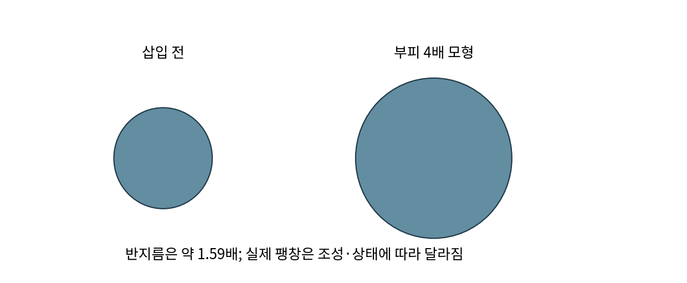

# 1.1.1.1.8 Si: 규소

> 학습 상태: 미학습 | 문서 수준: 상세문서

[항목 PDF](../../References/wbs/1.1.1.1.8_Si_규소.pdf)

## 01  선수학습 · 기초지식 · 핵심 원리

### 선수학습

- 1.1.1.3.1 화학결합·산화수

### 기초지식 - 먼저 알아둘 기초

#### 원소와 복합재

Si, SiOₓ, Si/C는 다른 재료다. Si 원소 함량만으로 반응과 비가역 손실이 같다고 가정하지 않는다.

#### 합금화

Li와 Si의 결합·상이 변하며 저장하는 반응이다. 흑연의 층간 삽입과 구별한다.

### 핵심 내용

Si 음극은 Li와 합금화하며 용량 확보와 팽창 제어를 함께 고려한다.

### 역할과 작동 원리

Si는 많은 Li를 합금화로 저장할 수 있지만 반응에 따른 부피 변화가 크다. 입자 팽창이 전극 팽창, 접촉 변화, SEI 재형성과 연결되며 기계적 설계가 전기화학 이용률을 바꾼다. [1, 2]

Si의 반도체 성질만으로 복합전극의 전도성을 정할 수 없다. 탄소·바인더·공극과 Si의 전자 연결을 본다. 산소를 포함한 SiOₓ에서는 초기 반응 생성물과 활성 Si의 반응이 함께 존재할 수 있다. [1, 2]

## 02  핵심내용 - 예제와 적용 조건

### 가정과 단위를 적고 읽기

> 부피가 교육용으로 4배가 된 구형 입자는 r후/r전=4^(1/3)=1.59다. 반지름이 4배가 아니다. 실제 팽창률은 조성·Li 함량·구속 조건으로 달라진다.

### 결과를 좌우하는 조건

Si 함량뿐 아니라 입자 크기, 공극 여유, 바인더 접착, 도전망, 충전 깊이가 중요하다. 높은 활물질 용량과 높은 셀 에너지는 분리해서 계산한다.

직접 제작한 구형 팽창 모형. 실제 Si의 측정 팽창률이 아니다.

### 연구 사례 - 2026-10-03 확인

2025년 흑연/Si 복합전극의 3D 연구는 도전재·바인더 영역이 너무 적거나 많을 때 서로 다른 이용률·공극 문제가 생김을 보였다. 조성 비율과 공간 분포를 함께 본다. [3]

## 03  핵심내용 - 열화·분석과 확인 문제

현상과 측정 신호를 연결하고, 가능한 원인을 추가 분석으로 구분한다.

| 현상·질문 | 분석·관찰할 증거 | 해석의 한계 |
| --- | --- | --- |
| 입자·전극 팽창 | 충전 상태별 단면·3D 영상·두께 변화를 측정한다. | 전극 두께는 Si 부피만 아니라 공극·바인더 변화도 반영한다. |
| 초기 Li 손실 | 초기 효율·표면 분석·생성물 분석을 연결한다. | 효율 손실 전부를 고립된 Li 금속으로 해석하지 않는다. |
| 전자 접촉 상실 | 3D 도전망 관찰과 용량·EIS(전기화학 임피던스 분광: 주파수별 저항 응답)를 비교한다. | Si가 존재해도 전자 연결이 끊기면 반응에 참여하지 못할 수 있다. |

### 확인 문제

1. 부피가 8배인 이상적 구의 반지름은 몇 배인가?

2. 입자·전극 팽창을 관찰했다. 어떤 증거를 연결해야 하며 무엇을 단정할 수 없는가?

### 답과 해설

1. 8^(1/3)=2배다. 선형 길이와 부피 변화는 세제곱 관계다.

2. 충전 상태별 단면·3D 영상·두께 변화를 측정한다. 전극 두께는 Si 부피만 아니라 공극·바인더 변화도 반영한다.

## 04  참고근거 · 연계학습

본문의 번호는 아래 근거와 연결된다. 기초 이론과 교육용 계산은 명시한 가정의 범위에서 읽고, 연구 사례의 결과는 해당 조성·전극·전해질·시험 조건으로 제한한다. 직접 제작한 도식의 크기·비율은 측정값이 아니다.

- [1] [Royal Society of Chemistry: silicon - 원소·전자배치](https://periodic-table.rsc.org/element/14/silicon)
- [2] [Silicon-graphite anodes, Nature Communications (2021)](https://doi.org/10.1038/s41467-021-22662-7)
- [3] [Unravelling electro-chemo-mechanical processes in graphite/silicon composites for designing nanoporous and microstructured battery electrodes (2025)](https://doi.org/10.1038/s41565-025-02027-7)

### 이후 연계학습

- 1.1.2.2.2.1 Si
- 1.1.2.2.2.2 SiOₓ
- 1.1.2.2.2.3 Si-C 복합체
- 1.1.3 바인더
