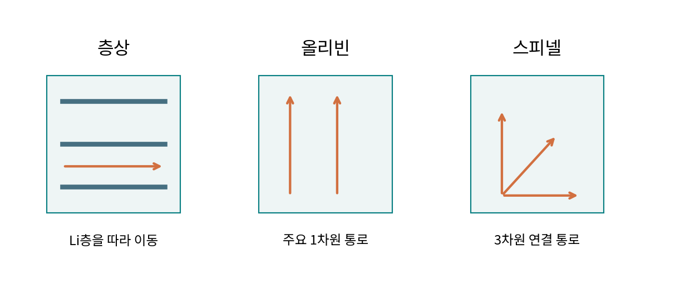

# 1.1.1.2.2 올리빈 구조

> 학습 상태: 미학습 | 문서 수준: 상세문서

[항목 PDF](../../References/wbs/1.1.1.2.2_올리빈_구조.pdf)

## 01  선수학습 · 기초지식 · 핵심 원리

### 선수학습

- 1.1.1.3.1 화학결합·산화수

### 기초지식 - 먼저 알아둘 기초

#### 올리빈

LiMPO₄ 계열의 대표 구조다. Li 자리·금속-산소 팔면체·인산기 골격을 구별한다.

#### 통로 방향

주요 Li 이동 통로는 특정 결정 방향으로 이어진다. 분말 입자의 긴 방향과 항상 같지는 않다.

### 핵심 내용

LFP·LMFP의 대표 구조이며 인산염 골격과 Li 이동 경로를 읽는다.

### 역할과 작동 원리

LFP·LMFP의 Li 이동은 결정 내 주요 통로를 따라 일어난다. 같은 입자 지름이어도 통로 방향의 길이가 다르면 확산 부담이 다르다. 반응에는 이온 이동과 전자 공급이 모두 필요하다. [1]

금속 이온이 Li 자리에 들어간 antisite(자리 뒤바뀜) 결함은 통로를 막을 수 있다. 위치·농도에 따라 영향이 달라지고, 벌크 통로 차단과 표면의 경로 변화는 구별해서 읽는다. [1]

## 02  핵심내용 - 예제와 적용 조건

### 가정과 단위를 적고 읽기

> 같은 확산계수에서 통로 길이를 200 nm에서 100 nm로 줄이면 시간 척도 L²/D는 1/4이다. 전체 충전 시간이 정확히 1/4이라는 뜻은 아니며 계면·전자·전해질 전달이 남는다.

### 결과를 좌우하는 조건

Li 통로 길이·결함 위치, 탄소 코팅, 반응 상 경계와 전류를 기록한다. 안정한 P-O 골격이 낮은 전자전도도와 계면 반응까지 해결하지는 않는다.

층상·올리빈·스피넬의 이동 경로를 비교한 교육용 모형.

### 연구 사례 - 2026-10-03 확인

2026년 LMFP 연구는 제어한 표면 자리 결함으로 이동 경로를 바꾸는 사례를 제시했다. 결함은 종류·위치·농도와 증거를 붙여 평가한다. [3]

## 03  핵심내용 - 열화·분석과 확인 문제

현상과 측정 신호를 연결하고, 가능한 원인을 추가 분석으로 구분한다.

| 현상·질문 | 분석·관찰할 증거 | 해석의 한계 |
| --- | --- | --- |
| 자리 결함 증가 | 자리 점유 정련·원자 관찰과 속도 성능을 연결한다. | 평균 결함률로 표면과 벌크의 분포를 구별하지 못한다. |
| 고율 이용률 저하 | 입자 방향·전류별 전압·전달 분석을 비교한다. | 작은 입자라고 모든 전달 제한이 해소되지는 않는다. |
| 코팅 불균일 | 탄소 분포·접촉과 전압 분극을 비교한다. | 탄소 총량만으로 연속 코팅을 확인할 수 없다. |

### 확인 문제

1. 입자의 평균 지름만으로 올리빈 확산 길이를 정해도 되는가?

2. 자리 결함 증가을 관찰했다. 어떤 증거를 연결해야 하며 무엇을 단정할 수 없는가?

### 답과 해설

1. 통로 방향의 치수와 입자 배향을 확인해야 한다. 동일 지름도 실제 이동 길이가 다를 수 있다.

2. 자리 점유 정련·원자 관찰과 속도 성능을 연결한다. 평균 결함률로 표면과 벌크의 분포를 구별하지 못한다.

## 04  참고근거 · 연계학습

본문의 번호는 아래 근거와 연결된다. 기초 이론과 교육용 계산은 명시한 가정의 범위에서 읽고, 연구 사례의 결과는 해당 조성·전극·전해질·시험 조건으로 제한한다. 직접 제작한 도식의 크기·비율은 측정값이 아니다.

- [1] [OpenStax, Chemistry 2e: Lattice Structures](https://openstax.org/books/chemistry-2e/pages/10-6-lattice-structures-in-crystalline-solids)
- [2] [Wang et al. (2011), 저자 원고: LiMn1-xFexPO4 Nanorods Grown on Graphene Sheets for Ultra-High Rate Performance Lithium Ion Batteries](https://arxiv.org/abs/1107.0111)
- [3] [Surface Antisite Defect-Induced Three-Dimensional Li+ Diffusion Enables Stable and Kinetic-Enhanced LiFe1-xMnxPO4 Cathodes (2026)](https://doi.org/10.1021/acs.nanolett.5c06021)

### 이후 연계학습

- 1.1.2.1.2.1 LFP
- 1.1.2.1.2.2 LMFP
- 1.1.1.2.4 공공·자리 혼입·입계
- 1.1.1.4.1 확산·이온 전달
