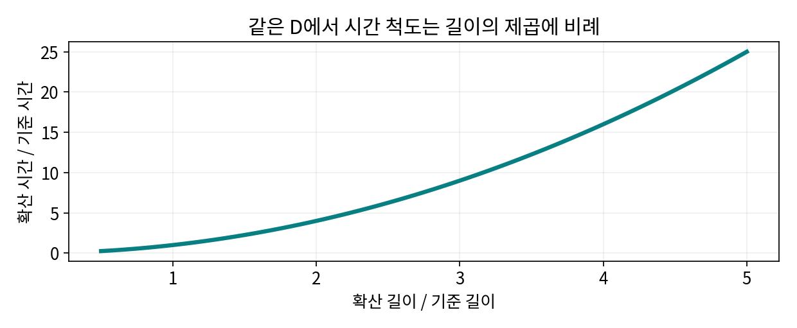

# 1.1.1.4.1 확산·이온 전달

> 학습 상태: 미학습 | 문서 수준: 상세문서

[항목 PDF](../../References/wbs/1.1.1.4.1_확산·이온_전달.pdf)

## 01  선수학습 · 기초지식 · 핵심 원리

### 선수학습

- 1.1.1.3.1 화학결합·산화수

### 기초지식 - 먼저 알아둘 기초

#### 확산계수

D는 보통 m²/s 또는 cm²/s로 쓴다. 화학 확산과 추적자 확산의 의미를 구별한다.

#### 확산 길이

이온이 실제 이동해야 할 거리다. 결정 방향과 입자·전극 구조에 따라 다르다.

### 핵심 내용

농도 차에 따른 이동을 다루며 고체 내부와 전해질 이동을 구분한다.

### 역할과 작동 원리

농도 차이에 의한 확산은 단순한 경우 J=-D·농도 기울기로 표현한다. 음의 부호는 높은 농도에서 낮은 농도로 향하는 방향을 나타낸다. 전극의 전기화학 전달에서는 전위·상 경계·반응도 함께 고려한다. [1]

시간 척도 L²/D는 크기 효과를 읽는 유용한 근사다. GITT(갈바노스태틱 간헐 적정: 펄스·휴지 응답)로 얻는 겉보기 D는 형상·평형·단일상·저항 보정 가정에 좌우된다. 상전이 구간이나 복합전극에서 고유 재료 상수처럼 그대로 쓰지 않는다. [1]

## 02  핵심내용 - 예제와 적용 조건

### 가정과 단위를 적고 읽기

> L=100 nm=10⁻⁵ cm, D=10⁻¹² cm²/s 가정이면 L²/D=100 s. L=1 μm면 10,000 s다. 이는 시간 척도 비교이며 실제 충전 완료 시간을 예측한 값이 아니다.

### 결과를 좌우하는 조건

온도·Li 함량·방향·결함에 따른 D 변화, 입자 분포, 전해질·계면 제한을 기록한다. 작은 입자는 전달 길이를 줄이지만 표면 부반응과 밀도에도 영향을 준다.

직접 계산한 L²/D 상대 모형. 측정한 확산계수나 충전 시간 자료가 아니다.

## 03  핵심내용 - 열화·분석과 확인 문제

현상과 측정 신호를 연결하고, 가능한 원인을 추가 분석으로 구분한다.

| 현상·질문 | 분석·관찰할 증거 | 해석의 한계 |
| --- | --- | --- |
| 고율 용량 감소 | 전류별 전압과 휴지 후 회복·입자 치수를 비교한다. | 고율 손실을 고체 확산 하나의 원인으로 정하지 않는다. |
| GITT 응답 변화 | 펄스·휴지·전압 기울기와 구조 상태를 검토한다. | 모델 가정이 깨지면 계산 D의 물리적 해석이 제한된다. |
| 농도 불균일 | 공간 분해 구조·전압 분석과 전달 모델을 연결한다. | 표면 한 위치의 상태를 입자 전체 평균으로 확대하지 않는다. |

### 확인 문제

1. 같은 D에서 길이가 3배라면 시간 척도는 몇 배인가?

2. 고율 용량 감소을 관찰했다. 어떤 증거를 연결해야 하며 무엇을 단정할 수 없는가?

### 답과 해설

1. 9배다. 이는 L²/D 가정의 비교이며 계면 반응이나 전해질 전달이 지배하면 전체 시간과 다를 수 있다.

2. 전류별 전압과 휴지 후 회복·입자 치수를 비교한다. 고율 손실을 고체 확산 하나의 원인으로 정하지 않는다.

## 04  참고근거 · 연계학습

본문의 번호는 아래 근거와 연결된다. 기초 이론과 교육용 계산은 명시한 가정의 범위에서 읽고, 연구 사례의 결과는 해당 조성·전극·전해질·시험 조건으로 제한한다. 직접 제작한 도식의 크기·비율은 측정값이 아니다.

- [1] [Rate performance in battery electrodes, Nature Communications (2019)](https://doi.org/10.1038/s41467-019-09792-9)
- [2] [Gamry, Galvanostatic Intermittent Titration Technique](https://help.gamry.com/Framework/experiments_j_galvanostaticintermittenttitrationtechnique.html)
- [3] [Surface Antisite Defect-Induced Three-Dimensional Li+ Diffusion Enables Stable and Kinetic-Enhanced LiFe1-xMnxPO4 Cathodes (2026)](https://doi.org/10.1021/acs.nanolett.5c06021)

### 이후 연계학습

- 1.1.1.4.4 계면 반응·젖음성
- 1.1.1.2.2 올리빈 구조
- 1.1.2.1.1.1 NCM
- 1.4.1.5 GITT·PITT
