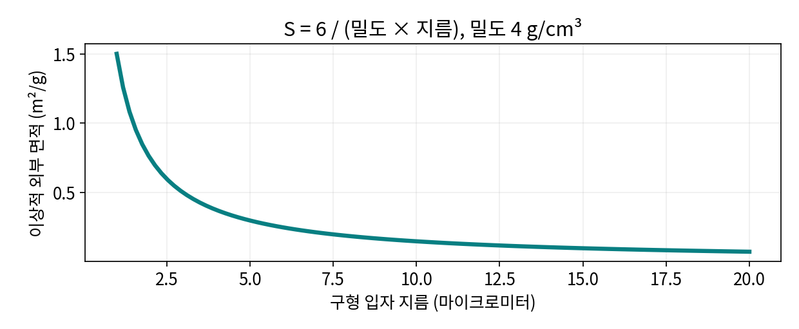

# 1.1.1.5.2 비표면적·표면화학

> 학습 상태: 미학습 | 문서 수준: 상세문서

[항목 PDF](../../References/wbs/1.1.1.5.2_비표면적·표면화학.pdf)

## 01  선수학습 · 기초지식 · 핵심 원리

### 선수학습

- 1.1.1.5.1 입도·입도분포

### 기초지식 - 먼저 알아둘 기초

#### 비표면적

질량당 접근 가능한 면적이다. BET(기체 흡착 기반 비표면적) 기체 흡착 면적과 전해질 접근 면적은 같다고 가정하지 않는다.

#### 공극

열린 공극과 닫힌 공극은 접근 가능한 탐침이 다르다.

### 핵심 내용

비표면적은 단위 질량당 표면적이며 표면 반응·수분 영향도 함께 본다.

### 역할과 작동 원리

표면이 늘면 반응 접촉이 늘 수 있지만 전해질 분해·바인더 요구량도 커질 수 있다. 단위 면적당 화학 반응성·코팅·젖음이 다르면 같은 BET 면적도 다른 초기 효율로 이어진다. [1]

매끈한 구의 외부 면적 S=6/(밀도×지름)는 단순 기하학 모형이다. 거칠기·내부 공극·응집을 가진 실제 분말의 BET 값과 차이가 날 수 있다. [1]

## 02  핵심내용 - 예제와 적용 조건

### 가정과 단위를 적고 읽기

> 구형, 밀도 4 g/cm³, 지름 10 μm=0.001 cm 가정: S=6/(4×0.001)=1500 cm²/g=0.15 m²/g. 지름 1 μm면 1.5 m²/g으로 10배다.

### 결과를 좌우하는 조건

흡착 기체·탈기·기공 모형·측정 범위를 기록한다. 닫힌 공극을 연구할 때는 산란·영상·전자상태 등 추가 근거를 사용한다.

구형 외부 면적을 직접 계산한 모형. 실제 BET 측정값이 아니다.

## 03  핵심내용 - 열화·분석과 확인 문제

현상과 측정 신호를 연결하고, 가능한 원인을 추가 분석으로 구분한다.

| 현상·질문 | 분석·관찰할 증거 | 해석의 한계 |
| --- | --- | --- |
| 부반응 면적 증가 | BET·표면 화학과 초기 효율·가스를 비교한다. | 면적 증가만으로 생성 SEI 양을 정량하지 않는다. |
| 공극 접근성 변화 | 흡착·젖음·산란과 저장 구간을 비교한다. | 기체가 못 들어간 공극이 전기화학적으로 항상 무관한 것은 아니다. |
| 코팅 효과 해석 | 코팅 분포·BET·계면 저항을 함께 본다. | BET 감소만으로 완전한 균일 코팅을 뜻하지 않는다. |

### 확인 문제

1. 구 지름을 절반으로 줄이면 같은 밀도의 외부 면적은 몇 배인가?

2. 부반응 면적 증가을 관찰했다. 어떤 증거를 연결해야 하며 무엇을 단정할 수 없는가?

### 답과 해설

1. 질량당 면적은 2배다. 이는 매끈하고 비다공성인 구 모형의 결과다.

2. BET·표면 화학과 초기 효율·가스를 비교한다. 면적 증가만으로 생성 SEI 양을 정량하지 않는다.

## 04  참고근거 · 연계학습

본문의 번호는 아래 근거와 연결된다. 기초 이론과 교육용 계산은 명시한 가정의 범위에서 읽고, 연구 사례의 결과는 해당 조성·전극·전해질·시험 조건으로 제한한다. 직접 제작한 도식의 크기·비율은 측정값이 아니다.

- [1] [Malvern Panalytical, BET Surface Area](https://www.malvernpanalytical.com/en/products/category/bet-surface-area-analyzers)
- [2] [Rate performance in battery electrodes, Nature Communications (2019)](https://doi.org/10.1038/s41467-019-09792-9)
- [3] [Electron paramagnetic resonance as a tool to determine the sodium charge storage mechanism of hard carbon (2024)](https://doi.org/10.1038/s41467-024-45460-3)

### 이후 연계학습

- 1.1.5.4 SEI·CEI 계면막
- 1.1.3 바인더
- 1.1.2.2.1.2 하드카본
- 1.4.2.6 PSA·BET·공극분석
