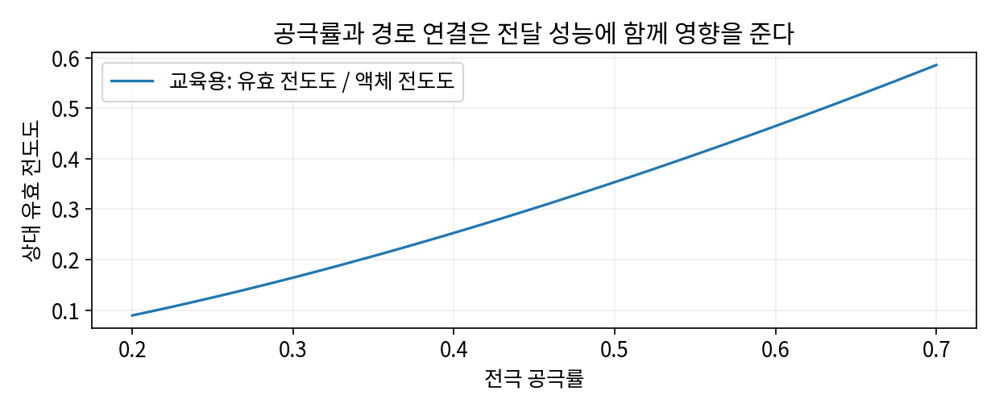

# 1.1.1.5.3 진밀도·탭밀도·충전성

> 학습 상태: 미학습 | 문서 수준: 상세문서

[항목 PDF](../../References/wbs/1.1.1.5.3_진밀도·탭밀도·충전성.pdf)

## 01  선수학습 · 기초지식 · 핵심 원리

### 선수학습

- 1.1.1.5.1 입도·입도분포

### 기초지식 - 먼저 알아둘 기초

#### 진밀도·탭밀도

고체 자체의 밀도와 두드려 채운 분말의 벌크 밀도를 구별한다.

#### 전극 밀도

전극 혼합물 질량을 공극을 포함한 코팅 부피로 나눈 값이다. 집전체 포함 여부를 적는다.

### 핵심 내용

진밀도는 재료 자체, 탭밀도는 입자 사이 빈 공간을 포함한 충전 밀도다.

### 역할과 작동 원리

탭밀도는 분말의 충전·형상·분포·마찰을 반영한다. 같은 진밀도의 물질도 입자 배열에 따라 다르다. 탭밀도를 셀 안 전극 밀도로 그대로 쓰지 않는다. [1]

전극 압축은 체적당 활물질을 늘리지만 공극과 연결 경로를 바꾼다. 높은 밀도는 에너지에 유리할 수 있어도 이온 이동·젖음·Si 팽창 여유가 부족해질 수 있다. [1]

## 02  핵심내용 - 예제와 적용 조건

### 가정과 단위를 적고 읽기

> 코팅 질량 20 mg/cm², 두께 100 μm=0.01 cm이면 전극 밀도=0.020/0.01=2.0 g/cm³. 혼합물 고체 밀도를 4.0 g/cm³로 가정하면 공극률≈1-2/4=50%.

### 결과를 좌우하는 조건

혼합 고체 밀도는 각 성분 질량·밀도로 계산하고, 코팅 두께·집전체 제외·압축 조건을 기록한다. 닫힌 공극이나 팽창 상태의 경우 단순 모형을 검토한다.

공극률의 전달 영향을 보여주는 교육용 모형. 실제 전극별 계수를 검증한 그래프가 아니다.

## 03  핵심내용 - 열화·분석과 확인 문제

현상과 측정 신호를 연결하고, 가능한 원인을 추가 분석으로 구분한다.

| 현상·질문 | 분석·관찰할 증거 | 해석의 한계 |
| --- | --- | --- |
| 과도한 압축 | 두께·공극·젖음과 전류별 분극을 비교한다. | 밀도가 높다는 사실만으로 성능 향상을 뜻하지 않는다. |
| 사이클 중 팽창 | 충전 상태별 두께·3D 공극과 용량을 연결한다. | 부피 증가를 활물질 반응 팽창 하나로 정하지 않는다. |
| 탭밀도 변화 | 입도·형상·반복 탭 조건을 비교한다. | 탭밀도 차이가 진밀도 차이를 뜻하지 않는다. |

### 확인 문제

1. 같은 질량에서 코팅 두께가 100 μm에서 80 μm로 줄면 밀도는?

2. 과도한 압축을 관찰했다. 어떤 증거를 연결해야 하며 무엇을 단정할 수 없는가?

### 답과 해설

1. 2.0에서 2.5 g/cm³로 25% 증가한다. 이온 통로와 공극 감소의 영향은 별도로 확인한다.

2. 두께·공극·젖음과 전류별 분극을 비교한다. 밀도가 높다는 사실만으로 성능 향상을 뜻하지 않는다.

## 04  참고근거 · 연계학습

본문의 번호는 아래 근거와 연결된다. 기초 이론과 교육용 계산은 명시한 가정의 범위에서 읽고, 연구 사례의 결과는 해당 조성·전극·전해질·시험 조건으로 제한한다. 직접 제작한 도식의 크기·비율은 측정값이 아니다.

- [1] [Rate performance in battery electrodes, Nature Communications (2019)](https://doi.org/10.1038/s41467-019-09792-9)
- [2] [Solvent-free dry electrode processing, Communications Materials (2026)](https://doi.org/10.1038/s43246-025-01046-0)
- [3] [Unravelling electro-chemo-mechanical processes in graphite/silicon composites for designing nanoporous and microstructured battery electrodes (2025)](https://doi.org/10.1038/s41565-025-02027-7)

### 이후 연계학습

- 1.2.2 로딩량·면적당 용량
- 2.2.3.1 압연
- 1.1.1.4 전달·반응·열 특성
