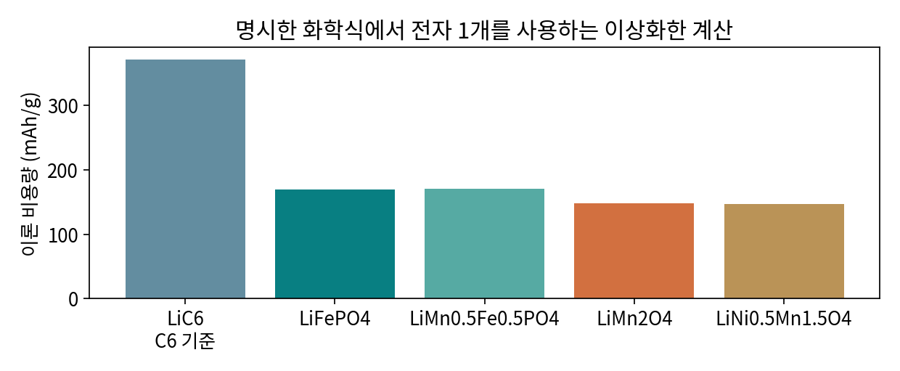

# 1.1.2.1.2.1 LFP

> 학습 상태: 미학습 | 문서 수준: 상세문서

[항목 PDF](../../References/wbs/1.1.2.1.2.1_LFP.pdf)

## 01  선수학습 · 기초지식 · 핵심 원리

### 선수학습

- 1.1.1.1.1 Li: 원소·Li⁺·금속 음극
- 1.1.1.1.5 Fe: 철
- 1.1.1.1.6 P: 인
- 1.1.1.2.2 올리빈 구조
- 1.1.1.3.3 산화·환원과 전위

### 기초지식 - 먼저 알아둘 기초

#### 반응

LiFePO₄ ⇄ FePO₄ + Li⁺ + e⁻. 충전 방향에서 Fe²⁺가 Fe³⁺로 산화된다.

#### 평탄 전압

상 공존과 반응 자유에너지에 관계한다. 평탄 구간이 무저항 반응을 뜻하지 않는다.

### 핵심 내용

LiFePO₄ 올리빈 양극으로 Fe²⁺/Fe³⁺ 반응과 전도성 확보를 이해한다.

### 역할과 작동 원리

LFP는 올리빈 인산염이다. P-O 골격과 Fe 반응을 구별하고 Li 통로와 전자 연결을 함께 읽는다. 일반적인 반응의 전위는 약3.4~3.5 V vs. Li/Li⁺ 범위로 설명하되 전류에서의 곡선은 분극과 조건을 포함한다. [1]

LiFePO₄와 FePO₄의 상 공존·상 경계 진행은 입자 크기·전류·온도에 따라 다르게 관찰될 수 있다. 모든 상태를 단일한 두 상 모형으로 고정하지 않는다. 탄소 코팅과 입자 설계는 전달·이용률을 개선하지만 불필요한 탄소는 질량과 밀도 부담이다. [1]

## 02  핵심내용 - 예제와 적용 조건

### 가정과 단위를 적고 읽기

> M=157.755 g/mol, 전자 1개 →169.9 mAh/g. 교육용 실제160 mAh/g·평균3.4 V를 가정하면 활물질 에너지544 Wh/kg. 셀에서는 상대 전극·전해질·집전체·분리막 질량을 더해야 한다. [4, 5]

### 결과를 좌우하는 조건

통로 길이·자리 결함·코팅 균일성·도전망·면적 용량·압축·온도를 기록한다. 재료의 열적 안정성과 셀 전체의 발열·전해질 반응은 별도로 평가한다.

화학식·전자 1개 가정으로 직접 계산한 비용량 비교. 셀 성능의 서열이 아니다.

## 03  핵심내용 - 상 경계와 전극 이용률

### 평탄 구간에서 무슨 변화가 일어나는가?

LFP에서 Li가 빠진 FePO₄와 LiFePO₄의 공존을 출발 모형으로 읽을 수 있다. 상 경계 이동과 입자별 반응 순서는 크기·전류·온도·구속에 의존한다. 전압이 평탄하다고 입자 전체가 동시에 균일하게 반응한다고 가정하지 않는다.

### 탄소의 두 위치

입자 탄소 코팅은 국소 전자·계면 경로, 도전재는 입자 사이와 집전체를 잇는 경로에 주로 기여한다. 코팅이 있어도 이차 입자 내부·전극 전체의 접촉이 부족할 수 있다. 이온 통로·전자망·전해질 접근 중 어느 것이 병목인지 나눈다.

> 자가 점검: 저율에서는 충분한데 고율에서 용량이 작고 휴지 뒤 회복된다면 전달 제한을 후보로 둔다. 구조·재고 손실과 구별하려면 전류·온도·입자·공극·계면 증거가 필요하다.

## 04  핵심내용 - 열화·분석과 확인 문제

현상과 측정 신호를 연결하고, 가능한 원인을 추가 분석으로 구분한다.

| 현상·질문 | 분석·관찰할 증거 | 해석의 한계 |
| --- | --- | --- |
| 고율 용량 감소 | 전류별 전압과 입자·코팅·전극 공극을 연결한다. | 낮은 전자전도도 하나만으로 전체 분극을 설명하지 않는다. |
| 활물질 이용률 저하 | 충전 상태별 XRD(X선 회절: 결정상·격자 분석)와 용량·전자 접촉을 비교한다. | 잔류 상은 전달 제한과 재고 문제 모두의 결과일 수 있다. |
| 계면 손실 | 초기 효율·표면·용출 분석과 수명을 비교한다. | 안정한 골격이라도 계면 반응이 없다고 가정하지 않는다. |

### 확인 문제

1. LFP를 작게 만들고 탄소를 늘리면 항상 셀 에너지가 증가하는가?

2. 고율 용량 감소을 관찰했다. 어떤 증거를 연결해야 하며 무엇을 단정할 수 없는가?

### 답과 해설

1. 전달 이점과 표면 손실·탄소 질량·전극 밀도·상대 전극을 함께 계산해야 한다.

2. 전류별 전압과 입자·코팅·전극 공극을 연결한다. 낮은 전자전도도 하나만으로 전체 분극을 설명하지 않는다.

## 05  참고근거 · 연계학습

본문의 번호는 아래 근거와 연결된다. 기초 이론과 교육용 계산은 명시한 가정의 범위에서 읽고, 연구 사례의 결과는 해당 조성·전극·전해질·시험 조건으로 제한한다. 직접 제작한 도식의 크기·비율은 측정값이 아니다.

- [1] [Wang et al. (2011), 저자 원고: LiMn1-xFexPO4 Nanorods Grown on Graphene Sheets for Ultra-High Rate Performance Lithium Ion Batteries](https://arxiv.org/abs/1107.0111)
- [2] [Revealing the Role of Carbon Layers in Lithium Manganese Iron Phosphate Cathodes (2025)](https://doi.org/10.1021/acsaem.5c00437)
- [3] [Rate performance in battery electrodes, Nature Communications (2019)](https://doi.org/10.1038/s41467-019-09792-9)
- [4] [CIAAW: Abridged Standard Atomic Weights 2024](https://ciaaw.org/abridged-atomic-weights.htm)
- [5] [OpenStax Chemistry 2e §17.4 — 패러데이 상수와 전하량](https://openstax.org/books/chemistry-2e/pages/17-4-potential-free-energy-and-equilibrium)

### 이후 연계학습

- 1.1.2.1.2.2 LMFP
- 1.1.1.4.1 확산·이온 전달
- 1.1.4 도전재
- 1.4.1.1 GCD·CC-CV
