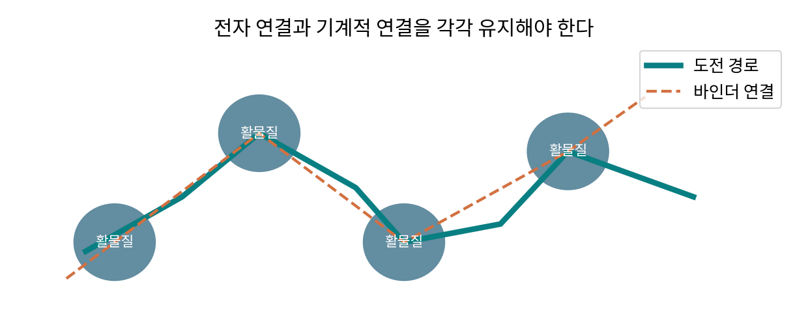

# 1.1.2.2.2.3 Si-C 복합체

> 학습 상태: 미학습 | 문서 수준: 상세문서

[항목 PDF](../../References/wbs/1.1.2.2.2.3_Si-C_복합체.pdf)

## 01  선수학습 · 기초지식 · 핵심 원리

### 선수학습

- 1.1.2.2.2.1 Si
- 1.1.1.1.7 C: 탄소
- 1.1.1.4.2 전자 전달

### 기초지식 - 먼저 알아둘 기초

#### Si/C

여기서는 Si-탄소 복합재를 뜻한다. 탄화규소 SiC 화합물과 구별한다.

#### 복합 역할

Si는 주로 합금 저장, 탄소는 저장·전자 연결·완충·계면 등 구조에 따른 역할을 한다.

### 핵심 내용

Si와 탄소의 복합화로 전도·응력·계면을 조절하며 Si 함량을 함께 본다.

### 역할과 작동 원리

Si/C에서는 Si 영역을 탄소 구조와 연결해 팽창 중 전자 접촉을 유지하고 전해질 접근·계면을 조절한다. 탄소 껍질이 있다는 사실만으로 균일한 보호·충분한 이온 이동을 보증하지 않는다. [1]

복합재 용량은 Si와 탄소의 질량·이용률·손실을 함께 계산한다. Si 질량 기준의 큰 값과 전체 복합분말·코팅·셀 기준의 값을 구별한다. 공극 여유는 팽창을 수용하지만 체적 밀도를 낮출 수 있다. [1]

## 02  핵심내용 - 예제와 적용 조건

### 가정과 단위를 적고 읽기

> 교육용 Si20 wt%(가역2000 mAh/g), 탄소80 wt%(350 mAh/g)이 독립적으로 이용되면 복합재=0.2×2000+0.8×350=680 mAh/g. 실제 반응·연결·부반응을 포함한 측정값은 아니다.

### 결과를 좌우하는 조건

Si 함량·영역 크기·탄소 두께·빈 공간·밀도·바인더·초기 효율을 기록한다. 내부 빈 공간과 높은 체적 에너지의 상충을 계산한다.

전자·기계적 연결을 나눈 직접 제작 모형. 실제 3D 관찰 자료가 아니다.

### 연구 사례 - 2026-10-03 확인

2025년 Si/흑연 연구는 도전재·바인더와 공극의 분포를 3D로 연결했다. 복합재의 공간 설계가 단순 함량 계산을 넘어서는 사례다. [2]

## 03  핵심내용 - 열화·분석과 확인 문제

현상과 측정 신호를 연결하고, 가능한 원인을 추가 분석으로 구분한다.

| 현상·질문 | 분석·관찰할 증거 | 해석의 한계 |
| --- | --- | --- |
| 탄소망·접촉 상실 | 3D 관찰·전자 전달·용량을 연결한다. | 탄소 총량만으로 연결망 상태를 정하지 않는다. |
| 계면층 재형성 | 효율·가스·코팅 전후 표면 분석을 비교한다. | 코팅이 있어도 균열·이온 경로에 따라 반응이 달라진다. |
| 공극·두께 손실 | 충전 상태별 공극·팽창과 밀도를 비교한다. | 높은 비용량이 높은 체적 용량을 자동으로 뜻하지 않는다. |

### 확인 문제

1. Si/C와 SiC를 왜 구별해야 하는가?

2. 탄소망·접촉 상실을 관찰했다. 어떤 증거를 연결해야 하며 무엇을 단정할 수 없는가?

### 답과 해설

1. Si/C는 복합 구조의 표기이고 SiC는 탄화규소 화합물이다. 결합·반응·질량 계산이 다르다.

2. 3D 관찰·전자 전달·용량을 연결한다. 탄소 총량만으로 연결망 상태를 정하지 않는다.

## 04  참고근거 · 연계학습

본문의 번호는 아래 근거와 연결된다. 기초 이론과 교육용 계산은 명시한 가정의 범위에서 읽고, 연구 사례의 결과는 해당 조성·전극·전해질·시험 조건으로 제한한다. 직접 제작한 도식의 크기·비율은 측정값이 아니다.

- [1] [Silicon-graphite anodes, Nature Communications (2021)](https://doi.org/10.1038/s41467-021-22662-7)
- [2] [Unravelling electro-chemo-mechanical processes in graphite/silicon composites for designing nanoporous and microstructured battery electrodes (2025)](https://doi.org/10.1038/s41565-025-02027-7)
- [3] [Synthesis of graphite, Nature Communications (2020)](https://doi.org/10.1038/s41467-020-20380-0)

### 이후 연계학습

- 1.1.2.2.2.2 SiOₓ
- 1.1.3 바인더
- 1.2.2 로딩량·면적당 용량
