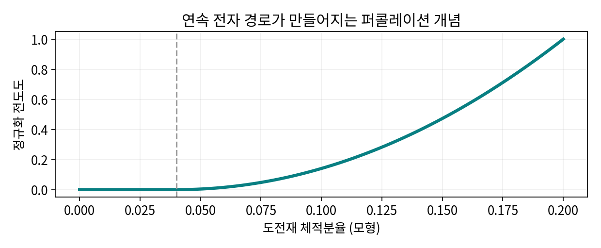

# 1.1.4 도전재

> 학습 상태: 미학습 | 문서 수준: 상세문서

[항목 PDF](../../References/wbs/1.1.4_도전재.pdf)

## 01  선수학습 · 기초지식 · 핵심 원리

### 선수학습

- 1.1.1.1.7 C: 탄소
- 1.1.1.4.2 전자 전달

### 기초지식 - 먼저 알아둘 기초

#### 도전재

주로 입자 사이 전자 경로를 만드는 첨가재다.

#### 형상

집합체·튜브·판의 모양과 분산이 연결 임계·접촉을 바꾼다.

### 핵심 내용

활물질 사이에 전자 이동 경로를 만들며 함량·분산 상태가 중요하다.

### 역할과 작동 원리

카본블랙·CNT·그래핀 계열은 전자 연결 방식과 분산·표면·밀도가 다르다. 같은 질량비가 같은 체적·접촉·경로를 뜻하지 않는다. 고유 전도도와 복합전극 전도도를 구별한다. [1]

도전재는 바인더·활물질·공극과 함께 전극 구조를 만든다. 전자망이 충분해도 이온 접근이 막히면 반응이 제한된다. 과량은 비활성 질량과 표면·공극의 부담이 될 수 있다. [1]

## 02  핵심내용 - 예제와 적용 조건

### 가정과 단위를 적고 읽기

> 교육용 활성분96 wt%·활물질200 mAh/g이면 코팅192. 전자 연결 부족으로 이용률80%면153.6 mAh/g. 활성분94%라도 이용률95%면178.6. 질량비와 이용률을 함께 계산한다.

### 결과를 좌우하는 조건

형상·함량·분산·잔류물·바인더·압축·방향·사이클 변형을 적는다. 높은 전도도와 낮은 부반응을 각각 검증한다.

연결망 형성의 비선형성을 나타낸 직접 계산 모형. 실제 임계 농도는 아니다.

### 연구 사례 - 2026-10-03 확인

2026년 고로딩 양극 연구는 CNT와 바인더 네트워크를 함께 설계했다. 도전재를 독립된 함량보다 연결 구조로 볼 사례다. [2]

## 03  핵심내용 - 열화·분석과 확인 문제

현상과 측정 신호를 연결하고, 가능한 원인을 추가 분석으로 구분한다.

| 현상·질문 | 분석·관찰할 증거 | 해석의 한계 |
| --- | --- | --- |
| 망 불균일 | 공간 영상·방향별 전도도와 이용률을 비교한다. | 탄소 총량은 연속 경로를 나타내지 않는다. |
| 이온 경로 손실 | 공극·젖음·전류별 분극을 연결한다. | 전자전도도 개선만으로 전체 속도 향상을 보증하지 않는다. |
| 변형 중 접촉 상실 | 사이클 전후 도전망·저항·용량을 본다. | 초기 전도도가 장기 전도망 유지를 뜻하지 않는다. |

### 확인 문제

1. 활성분이 더 적어도 코팅의 실제 용량이 높을 수 있는가?

2. 망 불균일을 관찰했다. 어떤 증거를 연결해야 하며 무엇을 단정할 수 없는가?

### 답과 해설

1. 전자·이온 연결로 이용률이 높아지면 가능하다. 활성분과 실제 반응 비율을 함께 비교한다.

2. 공간 영상·방향별 전도도와 이용률을 비교한다. 탄소 총량은 연속 경로를 나타내지 않는다.

## 04  참고근거 · 연계학습

본문의 번호는 아래 근거와 연결된다. 기초 이론과 교육용 계산은 명시한 가정의 범위에서 읽고, 연구 사례의 결과는 해당 조성·전극·전해질·시험 조건으로 제한한다. 직접 제작한 도식의 크기·비율은 측정값이 아니다.

- [1] [Rate performance in battery electrodes, Nature Communications (2019)](https://doi.org/10.1038/s41467-019-09792-9)
- [2] [Charge-engineered cellulose nanofibril binders for PFAS-free, high-loading lithium battery positive electrodes (2026)](https://doi.org/10.1038/s41467-026-73909-0)
- [3] [Unravelling electro-chemo-mechanical processes in graphite/silicon composites for designing nanoporous and microstructured battery electrodes (2025)](https://doi.org/10.1038/s41565-025-02027-7)

### 이후 연계학습

- 1.1.4.1 카본블랙
- 1.1.4.2 CNT
- 1.1.4.3 그래핀
- 1.1.3 바인더
