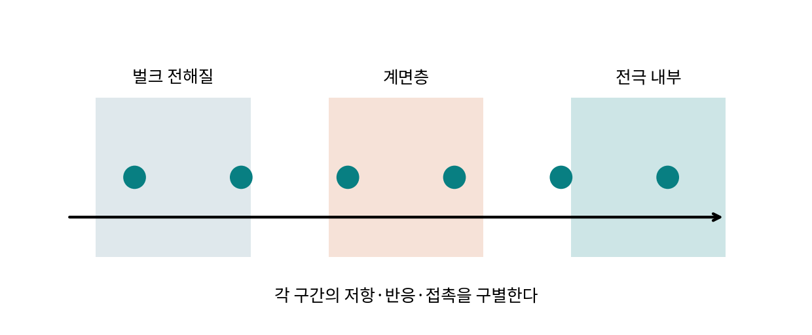

# 1.1.5.4 SEI·CEI 계면막

> 학습 상태: 미학습 | 문서 수준: 상세문서

[항목 PDF](../../References/wbs/1.1.5.4_SEI·CEI_계면막.pdf)

## 01  선수학습 · 기초지식 · 핵심 원리

### 선수학습

- 1.1.1.4.4 계면 반응·젖음성
- 1.1.5 전해질

### 기초지식 - 먼저 알아둘 기초

#### SEI·CEI

주로 음극·양극에서 전해질 반응으로 생기는 계면층을 뜻한다. 조성·전위·시간에 따라 다르다.

#### 기능

추가 전자성 분해를 억제하면서 필요한 이온을 전달해야 한다.

### 핵심 내용

SEI·CEI는 전해질 반응으로 생기는 계면층이며 성장과 저항을 함께 본다.

### 역할과 작동 원리

초기 계면층 형성은 순환 가능한 Li·Na와 전해질을 소비할 수 있다. 이후 균열·용해·새 표면 노출로 반복 생성되면 재고 감소와 저항 증가가 누적된다. 얇음·두꺼움만으로 좋은 계면을 정하지 않는다. [1]

SEI·CEI의 조성·연속성·기계·이온 전달·전자 차단을 구별한다. XPS(X선 광전자 분광: 표면 화학 상태)는 표면 근처의 화학 정보를 주고 시료 준비·공기·깊이 분석이 상태를 바꿀 수 있다. 성분과 기능을 연결하는 별도 증거가 필요하다. [1]

## 02  핵심내용 - 예제와 적용 조건

### 가정과 단위를 적고 읽기

> 교육용 입력1.000 mAh, 첫 회수0.900이면 효율90%. 차이0.100 mAh에는 계면·잔류·다른 부반응이 포함될 수 있다. SEI 질량으로 환산하려면 생성물·반응 전자 수·선택성이 필요하다.

### 결과를 좌우하는 조건

염·용매·첨가제·전극 표면·충전 범위·화성·온도·분석 전처리를 기록한다. LiF 등 한 성분의 상대 비율만으로 전체 기능을 판단하지 않는다.

계면층과 벌크 전달을 나눈 직접 제작 모형.

### 연구 사례 - 2026-10-03 확인

2026년 Na 하드카본 사례는 코팅으로 Na⁺ 접근과 NaF 중심 계면을 조절했다. 이 결과를 모든 Li SEI의 최적 조성으로 확대하지 않는다. [3]

## 03  핵심내용 - 열화·분석과 확인 문제

현상과 측정 신호를 연결하고, 가능한 원인을 추가 분석으로 구분한다.

| 현상·질문 | 분석·관찰할 증거 | 해석의 한계 |
| --- | --- | --- |
| 계면 저항 증가 | EIS(전기화학 임피던스 분광: 주파수별 저항 응답)·표면·단면과 전위·온도를 연결한다. | 한 반원을 SEI만의 저항으로 고정하지 않는다. |
| 지속 재고 손실 | 효율·가스·화학 정량과 팽창·균열을 비교한다. | 효율 차이만으로 모든 계면 성분을 정량하지 않는다. |
| 계면층 균열·용해 | 충전 상태별 형태·액체/표면 성분을 본다. | 사이클 후 한 시점으로 전체 형성 경로를 복원하지 않는다. |

### 확인 문제

1. SEI에서 LiF가 많으면 항상 좋은 계면인가?

2. 계면 저항 증가을 관찰했다. 어떤 증거를 연결해야 하며 무엇을 단정할 수 없는가?

### 답과 해설

1. 분포·연속성·이온 전달·전자 차단·다른 성분·작동 조건을 함께 봐야 한다.

2. EIS·표면·단면과 전위·온도를 연결한다. 한 반원을 SEI만의 저항으로 고정하지 않는다.

## 04  참고근거 · 연계학습

본문의 번호는 아래 근거와 연결된다. 기초 이론과 교육용 계산은 명시한 가정의 범위에서 읽고, 연구 사례의 결과는 해당 조성·전극·전해질·시험 조건으로 제한한다. 직접 제작한 도식의 크기·비율은 측정값이 아니다.

- [1] [Photochemically driven SEI, Nature Communications (2021)](https://doi.org/10.1038/s41467-021-27095-w)
- [2] [Fang et al., Nature 572 (2019): Quantifying inactive lithium in lithium metal batteries](https://doi.org/10.1038/s41586-019-1481-z)
- [3] [Metal-organic framework glass enables durable sodium-ion storage for hard carbon negative electrodes (2026)](https://doi.org/10.1038/s41467-026-75060-2)
- [4] [Li2ZrF6 protective layer enabled high-voltage LiCoO2 positive electrode in sulfide all-solid-state batteries (2025)](https://doi.org/10.1038/s41467-024-55695-9)

### 이후 연계학습

- 1.1.2.2.1.1 흑연
- 1.1.2.2.2.1 Si
- 1.1.2.1.3.2 LNMO
- 1.4.2.3 XPS·표면분석
- 1.4.1.3 EIS
