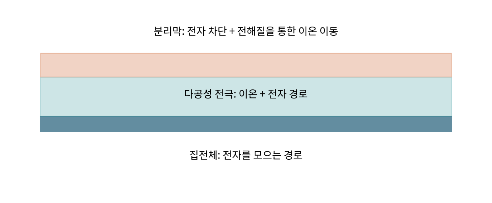

# 1.1.6 분리막

> 학습 상태: 미학습 | 문서 수준: 상세문서

[항목 PDF](../../References/wbs/1.1.6_분리막.pdf)

## 01  선수학습 · 기초지식 · 핵심 원리

### 선수학습

- 1.1.5 전해질
- 1.1.1.4 전달·반응·열 특성

### 기초지식 - 먼저 알아둘 기초

#### 분리막

전극의 직접 전자 접촉을 막으며 공극의 전해질을 통해 이온 이동을 허용하는 막이다.

#### 전자·이온

전자 차단과 이온 전달을 서로 다른 기능으로 평가한다.

### 핵심 내용

전자 접촉을 막으면서 이온 이동을 허용하며 공극·젖음·열 특성을 본다.

### 역할과 작동 원리

두께·공극·굴곡 경로·젖음·기계 강도·열 치수 안정성이 분리막 기능을 결정한다. 얇아지면 질량·저항을 줄일 수 있지만 결함·관통·취급·열 안정성 여유가 달라질 수 있다. [1]

공극을 통한 액체 이온 이동과 기능성 코팅의 역할을 구별한다. shutdown(공극 폐쇄로 전달이 줄어드는 현상)은 막이 무너지거나 전극 접촉이 생기는 상태와 다르다. 기능이 있어도 셀의 모든 발열·단락을 막는다고 보증하지 않는다. [1]

## 02  핵심내용 - 예제와 적용 조건

### 가정과 단위를 적고 읽기

> 교육용 L=20 μm, 액체 전도도10 mS/cm, 공극률0.4, 굴곡계수2 가정. 유효전도도=10×0.4/2=2 mS/cm, 면적 저항=0.002/0.002=1 Ω·cm². 실제 계수는 별도 측정한다.

### 결과를 좌우하는 조건

두께·공극·젖음·치수 변화·인장/관통·전해질·온도·압력을 기록한다. 공기 투과도와 액체 이온 전달을 동일한 값으로 취급하지 않는다.

분리막·전극·집전체의 서로 다른 기능을 나눈 직접 제작 모형.

### 연구 사례 - 2026-10-03 확인

2025년 무음극 Li 전지 연구는 분리막의 기능층으로 계면을 조절했다. 이런 코팅은 기본 분리 기능·전달·재고 효과를 함께 검증한다. [3]

## 03  핵심내용 - 열화·분석과 확인 문제

현상과 측정 신호를 연결하고, 가능한 원인을 추가 분석으로 구분한다.

| 현상·질문 | 분석·관찰할 증거 | 해석의 한계 |
| --- | --- | --- |
| 이온 전달 저하 | 젖음·EIS(전기화학 임피던스 분광: 주파수별 저항 응답)·공극과 온도를 비교한다. | 공기 투과도만으로 액체 저항을 확정하지 않는다. |
| 열 수축·치수 손실 | 조건별 면적·두께·열·기계 관찰을 연결한다. | 공극 폐쇄가 모든 조건에서 안전한 분리를 보장하지 않는다. |
| 관통·오염·국소 결함 | 현미경·관통·전자 누설과 셀 거동을 본다. | 평균 막 두께는 국소 얇은 부분을 나타내지 않는다. |

### 확인 문제

1. 분리막에서 이온은 고분자 자체만을 통해 이동하는가?

2. 이온 전달 저하을 관찰했다. 어떤 증거를 연결해야 하며 무엇을 단정할 수 없는가?

### 답과 해설

1. 일반적인 다공성 액체계에서는 주로 공극에 포함된 전해질을 통해 이동한다.

2. 젖음·EIS·공극과 온도를 비교한다. 공기 투과도만으로 액체 저항을 확정하지 않는다.

## 04  참고근거 · 연계학습

본문의 번호는 아래 근거와 연결된다. 기초 이론과 교육용 계산은 명시한 가정의 범위에서 읽고, 연구 사례의 결과는 해당 조성·전극·전해질·시험 조건으로 제한한다. 직접 제작한 도식의 크기·비율은 측정값이 아니다.

- [1] [Celgard 2325: 25 μm PP/PE/PP 삼층 분리막 공식 자료 (2026-01)](https://www.celgard.com/storage/components/2325_com_data_2026-01.pdf)
- [2] [Gamry, EIS in Wetting of Li-ion Battery Materials](https://www.gamry.com/application-notes/EIS/eis-wetting-li-ion-battery-materials/)
- [3] [Multiscale interfacial stabilization via prelithiation separator engineering for Ah-level anode-free lithium batteries (2025)](https://doi.org/10.1038/s41467-025-59521-8)

### 이후 연계학습

- 1.1.6.1 PE·PP계
- 1.1.6.2 세라믹·기능성 코팅
- 1.4.2.6 PSA·BET·공극분석
- 1.4.2.7 DSC·TGA·ARC
