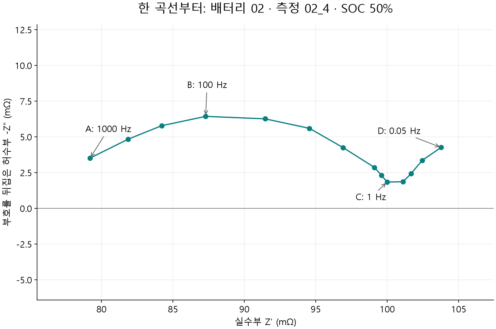
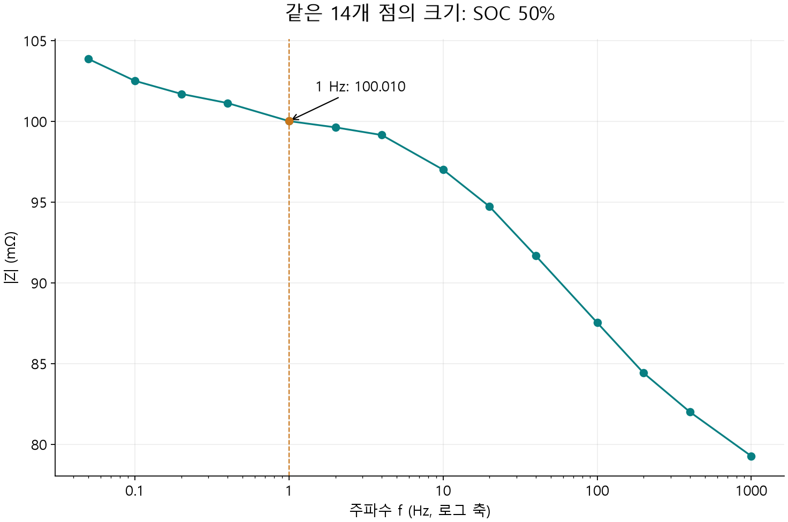
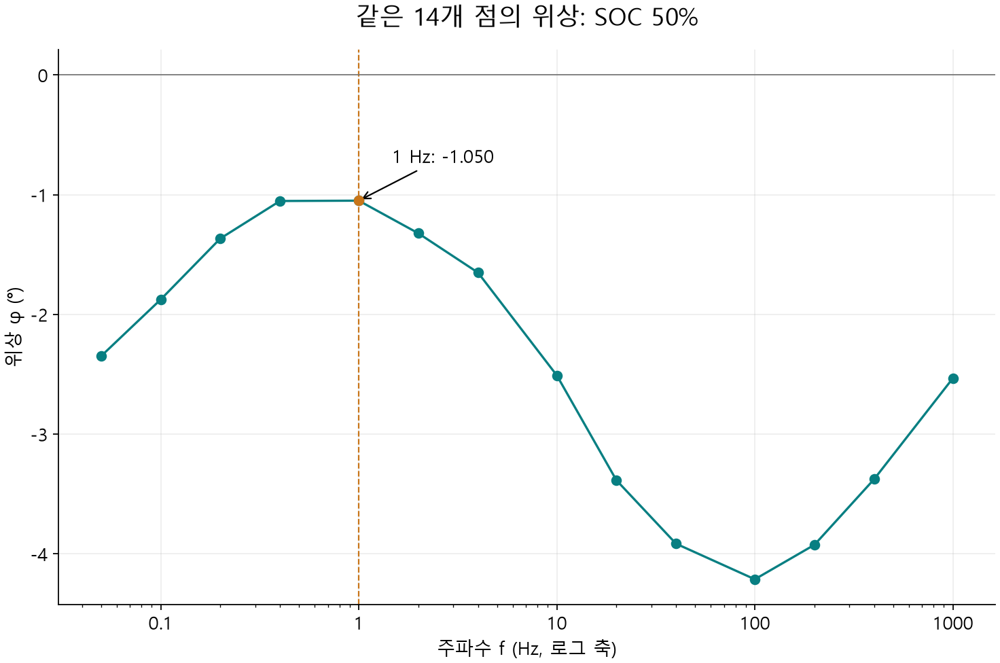

# 1.4.1.3 EIS

> 학습 상태: 학습중 | 공개 데이터로 그래프와 조건별 비교를 배우는 문서

[전체 INDEX](../../index.md) · [SOC별 분석예시](1.4.1.3%20EIS분석예시.md) · [작업 계획](../../study-plan.md)

**이번 학습 질문: 같은 배터리에서 온도를 일정하게 유지하고 SOC를 바꾸면 EIS 곡선은 어떻게 달라질까?** 처음에는 SOC 50% 한 곡선만 읽는다. 점·축·선과 크기·위상을 이해한 뒤 분석예시에서 SOC 20%·50%·80%를 비교한다. SOC는 충전상태를 뜻한다.

## 1. 이번 데이터가 어떤 실험인지 먼저 안다

EIS는 작은 주기적 전류 또는 전압을 주고 그에 대한 응답을 측정하는 방법이다. 주파수는 신호가 1초에 반복되는 횟수이며 Hz로 적는다. 빠른 신호와 느린 신호에서 전압·전류의 비율과 어긋남이 달라지는지를 살펴본다. 임피던스는 그 비율을 크기와 위상 또는 실수부와 허수부로 표현한 값이다.

이번에는 Buchicchio 등의 [공개 데이터 v3](https://data.mendeley.com/datasets/mbv3bx847g/3)와 [실험 설명 논문](https://pmc.ncbi.nlm.nih.gov/articles/PMC9493380/)을 사용한다. 원본 CSV는 그대로 보존하고 그래프에 필요한 값을 별도 계산한다.

| 구분 | 논문·데이터에서 확인한 조건 |
| --- | --- |
| 시료 | 새 Samsung ICR18650-26J 완전셀, 정격 3.7 V·2.6 Ah |
| 비교 조건 | SOC 100%→10%를 10%씩 낮춰 측정; 본문은 20%·50%·80% 선택 |
| 온도 | 항온조 25 ± 1°C; 개별 측정의 실제 온도 기록은 CSV에 없음 |
| SOC를 낮추는 방법 | 1 A로 936초 방전: 0.26 Ah, 정격 용량의 10%; 이후 1800초(30분) 휴지 |
| 장비·연결 | Keysight U2351A DAQ를 포함한 자체 제작 측정계, 4선 연결 |
| EIS 신호 | 여러 주파수를 동시에 합친 다중사인 전류, 각 주파수 성분의 진폭 50 mA |
| 범위 | 0.05–1000 Hz, 14개 주파수; EIS 한 측정 구간 40초 |
| 전체 자료 | 배터리 4개 × 별도 방전 회차 6개 × SOC 10개 × 주파수 14개 = 3360행 |
| 학습용 선택 | 배터리 ID `02`, 측정 ID `02_4`, SOC 50%의 14개 점 |

50 mA는 **각 주파수 성분**의 진폭이며 합쳐진 신호 전체의 RMS 전류라고 바꾸어 적지 않는다. `02_4`는 원본 측정 ID다. 뒤의 `4`를 논문에서 확인된 실제 사이클 수라고 해석하지 않는다. 이번 SOC는 정격 용량으로 계산한 방전 단계이며 개별 셀의 실제 가용 용량으로 다시 산정한 값이라고 주장하지 않는다.

### 1-1. 두 CSV를 연결한다

[impedance.csv](../../Data/static/eis/buchicchio-2022/impedance.csv)에는 모든 시료의 임피던스가 함께 들어 있다. [frequencies.csv](../../Data/static/eis/buchicchio-2022/frequencies.csv)는 주파수 ID와 실제 Hz를 대응시키는 표다. `FREQUENCY_ID=4`를 4 Hz라고 읽으면 안 된다. 대응표에서는 **1 Hz**다.

| 원본 열 | 뜻 | 사용 방법 |
| --- | --- | --- |
| MEASURE_ID | 측정 회차를 구별하는 ID | `02_4` 선택; 반복 회차 비교 시 다른 ID도 확인 |
| SOC | 충전상태 (%) | 문자열 `050`은 숫자 50%로 해석 |
| BATTERY_ID | 배터리 ID | `02` 선택; 앞의 0을 포함해 ID 보존 |
| FREQUENCY_ID | 주파수 대응표의 ID | 실제 주파수 Hz로 연결 |
| IMPEDANCE_VALUE | 복소 임피던스, Ω | 괄호 안에서 실수부·허수부와 부호를 분리 |

전체 3360행을 검사해 각 시료·측정·SOC 조합에 14개 주파수가 빠짐없이 있는지 확인했다. 이번 한 곡선은 **14개 점, 0.05–1000 Hz, 누락·비수치·주파수 중복 없음**이다. 이는 파일 검사 결과이며 선형성·정상성·측정 정확성을 새로 검증했다는 뜻은 아니다.

**주의:** 실수부 한 값을 전하전달저항이나 전해질 저항으로 바로 이름 붙이지 않는다. 여러 과정이 합쳐진 응답일 수 있다.

실수부에 함께 영향을 줄 수 있는 요소는 다음과 같다. 아래는 해석할 때 검토할 후보이며, 이번 데이터에서 각각의 기여가 확인되었다는 뜻은 아니다.

| 영향을 줄 수 있는 요소 | 어떤 과정인가 | 한 값을 해석할 때 확인할 것 |
| --- | --- | --- |
| 전해질·분리막·전극 기공의 이온 이동 | 전해질을 통해 이온이 이동하며 생기는 저항성 기여. 이동 거리·전도도·기공 구조·젖음 상태가 관련됨 | 고주파 측 값에도 전해질 외의 저항이 포함될 수 있으므로 전해질 저항 하나로 단정하지 않음 |
| 전극·집전체·탭의 전자 전도와 내부 접촉 | 전자가 전극과 금속 경로를 지나고 접촉부를 통과하며 생기는 저항성 기여 | 전극 구성과 내부 접촉 상태를 함께 확인 |
| 전극 표면의 계면막 | 음극 SEI 등 표면막을 통과하는 이온 이동과 계면 응답 | 계면막의 응답과 전하전달 응답이 겹칠 수 있음 |
| 양극·음극의 전하전달 반응 | 전극과 전해질 계면에서 전하가 전달되는 반응과 이중층의 결합 응답 | 2단자 셀 측정에는 두 전극의 응답이 함께 들어오므로 어느 전극의 Rct인지 한 점으로 구분하지 않음 |
| 확산·농도 변화 | 활물질 내부 또는 전해질에서 물질이 이동하며 농도가 변하는 과정 | 느린 응답은 실수부·허수부 모두에 기여할 수 있어 저주파 실수값을 단순 저항 하나로 읽지 않음 |
| 측정 리드·클립·치구의 저항과 접촉 | 셀 외부 연결부가 측정값에 포함시키는 저항성 기여 | 2단자/4단자 구성·전압 감지 위치·접촉 상태·보정 여부 확인 |

셀 내부의 전극·분리막·계면막·반응·확산 기여는 [BioLogic의 배터리 EIS 설명 7쪽](https://www.biologic.net/wp-content/uploads/2019/08/studying-batteries-with-electrochemical-impedance-spectroscopy-wp1-electrochemistry-battery.pdf), 외부 배선·접촉의 영향은 [Gamry의 저임피던스 배터리 측정 설명](https://www.gamry.com/application-notes/EIS/eis-measurement-of-a-very-low-impedance-lithium-ion-battery)을 참고한다.

**같은 셀에서도 주파수에 따라 각 과정의 기여가 달라진다.** 예를 들어 뒤의 이상적인 `Rs + (Rp ∥ C)` 모형에서도 실수부는 항상 Rs나 Rp 하나가 아니라 주파수에 따라 달라지는 합성값이다. 따라서 한 행의 실수부를 특정 저항으로 이름 붙이기 전에 전체 주파수 곡선·측정조건·회로 가정을 함께 확인한다. 온도·SOC·휴지 시간은 위 과정들의 상태를 바꾸는 조건이며, 그 비교 방법은 5절에서 설명한다.


## 2. 원본 한 행을 그래프의 점으로 바꾼다

SOC 50%에서 1 Hz인 행을 고른다. 원본 `impedance.csv`의 **파일 967번째 줄**이며, 열 이름 행을 제외한 데이터 행 번호는 966이다. 행 위치가 바뀌어도 ID와 SOC·주파수로 같은 점을 찾을 수 있다.

```csv
MEASURE_ID,SOC,BATTERY_ID,FREQUENCY_ID,IMPEDANCE_VALUE
02_4,050,02,4,(0.0999931838023928-0.00183267524145727j)
```

`j`는 허수 단위다. 이 행은 실수부 **0.0999931838023928 Ω**, 허수부 **-0.00183267524145727 Ω**다. `Z = Z′ + jZ″`로 쓴다.

### 2-1. Nyquist의 가로·세로 좌표

```text
X = 실수부 × 1000 = 99.993 mΩ
Y = -허수부 × 1000 = 1.833 mΩ
점 = (99.993, 1.833), 이 점의 주파수 = 1 Hz
```

1 Ω = 1000 mΩ다. 원본 허수부가 음수라 부호를 뒤집은 세로값은 양수다. 파일이 이미 `-Zimag`를 제공하면 다시 뒤집지 않는다. 실수부·허수부는 서로 다른 시료가 아니라 **같은 주파수 응답의 두 성분**이다.

### 2-2. 같은 행을 크기와 위상으로 바꾼다

```text
크기 |Z| = sqrt(실수부² + 허수부²) × 1000 = 100.010 mΩ
위상 φ = atan2(허수부, 실수부) × 180/π = -1.050°
```

그래서 같은 행이 Nyquist에서는 `(99.993, 1.833)`, 크기 그림에서는 `(1 Hz, 100.010 mΩ)`, 위상 그림에서는 `(1 Hz, -1.050°)`로 나타난다. `atan2`는 두 성분의 부호를 함께 반영하는 각도 계산이다. 세 가지 표현은 서로 다른 실험 결과가 아니다.

## 3. 그래프를 하나씩 처음부터 읽는다

### 3-1. 첫 그림 — Nyquist: 한 점·축·선은 무엇인가?



1. **가로축**은 실수부 Z′, 단위는 mΩ다. 오른쪽일수록 실수부가 크다. 가로축은 시간·SOC·주파수가 아니다.
2. **세로축**은 허수부의 부호를 뒤집은 -Z″, 단위는 mΩ다. 0선보다 위에 있다는 것은 원본 Z″가 음수라는 뜻이다.
3. **점 하나**는 한 주파수에서 측정한 한 행이다. A는 1000 Hz, B는 100 Hz, C는 1 Hz, D는 0.05 Hz다. C가 바로 앞에서 계산한 점이다.
4. **선**은 높은 주파수→낮은 주파수 순서로 14개 점을 잇는다. 선 사이의 모든 주파수를 측정한 것은 아니다. 피팅·평활화 곡선도 아니다. 다중사인 신호로 동시에 구한 주파수 응답을 보기 좋게 연결한 것이며 측정 시간순 궤적이 아니다.
5. **모양**을 말해본다. A에서 올라가 굽고, C 부근에서 낮아졌다가 D 쪽에서 다시 오른다. 호와 꼬리는 모양을 설명하는 말이며 원인을 확정하는 이름이 아니다.

가로 1 mΩ와 세로 1 mΩ를 같은 화면 길이로 그려 모양이 찌그러져 보이지 않게 했다. 이번 곡선은 측정범위 안에서 세로 0선을 지나지 않는다. **A를 실축 교차점이나 Rs로 부르면 안 된다.** 더 높은 주파수에서 어떻게 이어지는지는 이 자료로 모른다.

**이해 확인:** C의 가로·세로값을 찾을 수 있나? A와 D가 다른 시간의 SOC 변화가 아니라 같은 SOC의 서로 다른 주파수라는 것을 설명할 수 있나?

### 3-2. 두 번째 그림 — Bode 크기: 주파수별 응답은 얼마나 큰가?



1. 가로축은 주파수 Hz다. 0.1→1→10→100→1000처럼 10배 증가가 같은 화면 간격인 **로그 축**이다. 시간축이 아니다.
2. 세로축은 크기 |Z|, 단위는 mΩ이며 선형 축이다. 실수부만 읽는 값과 달리 실수부·허수부를 함께 반영한다.
3. 1 Hz 주황색 점은 **100.010 mΩ**다. 앞 Nyquist C의 실수부 99.993 mΩ와 아주 비슷해도 같은 정의는 아니다.
4. 이번 곡선은 낮은 주파수 쪽의 크기가 높은 주파수 쪽보다 크다. 그 차이를 먼저 읽으며 크기 하나로 셀의 성능·열화 상태를 판정하지 않는다.

주파수마다 Nyquist에서 가로·세로 방향을 함께 보던 값을 이 그림에서는 크기 하나로 읽는다. 전압·전류 원시 시간 파형은 이번 CSV에 포함되어 있지 않다.

**이해 확인:** 1 Hz의 크기를 찾고, 왜 1→10과 10→100의 가로 간격이 같은지 설명할 수 있나?

### 3-3. 세 번째 그림 — Bode 위상: 전압과 전류는 얼마나 어긋나는가?



1. 가로축은 앞 그림과 같은 로그 주파수 Hz다.
2. 세로축은 위상 φ, 단위는 도(°)다. 이 문서는 임피던스의 위상, 즉 전압 위상−전류 위상의 부호를 사용한다.
3. 0°는 두 신호의 위상이 같은 경우다. 음수는 전압 위상이 전류보다 뒤에 있다는 표현이다. 이번에는 원시 파형을 직접 읽은 것이 아니라 복소 임피던스에서 계산했다.
4. 1 Hz 주황색 점은 **-1.050°**다. 크기 그림의 100.010 mΩ와 함께 같은 응답을 설명한다. 음수의 절댓값이 크다는 것만으로 성능이 나쁘다고 결론 내리지 않는다.

**이해 확인:** 크기와 위상이 각각 어떤 정보를 표현하는지, 같은 1 Hz의 두 값을 연결해 말할 수 있나?

## 4. 세 그림을 익힌 뒤 종합한다

SOC 50%, 1 Hz에서 **Nyquist (99.993, 1.833) mΩ → 크기 100.010 mΩ → 위상 -1.050°**다. 세 그림은 같은 응답을 좌표·크기·어긋남으로 표현한다.

| 보는 부분 | 확인할 수 있는 것 | 바로 확정할 수 없는 것 |
| --- | --- | --- |
| 고주파 끝 A | 이번에 측정한 1000 Hz의 실수부·허수부 | 실축 교차점·순수 전해질 저항·확정된 Rs |
| 굽은 구간 B 부근 | 호의 높이·위치와 그때의 주파수 | 하나의 Rct, 양극/음극의 독립 기여 |
| 저주파 끝 D | 0.05 Hz까지 측정한 응답과 꼬리 모양 | DC 저항·확산계수·더 낮은 주파수에서의 모양 |
| 크기·위상 | 같은 주파수의 크기와 상대 위상 | SOC 추정 모델의 정확도·열화 판정 |

다음으로 [분석예시](1.4.1.3%20EIS분석예시.md)에서 SOC 20%·50%·80% 곡선을 같은 축에 놓는다. 먼저 한 측정 ID의 차이를 읽고, 이후 같은 배터리의 6개 회차 범위로 비교를 넓힌다.

## 5. 측정조건을 바꾸면 무엇을 확인할까?

| 바꾸는 조건 | 먼저 볼 것 | 함께 같게 유지·기록할 것 |
| --- | --- | --- |
| SOC | 같은 주파수의 실수부·크기·위상, 곡선 모양 | 배터리·온도·휴지·신호·주파수·충방전 방향 |
| 온도 | 고주파 끝·굽은 구간·크기·위상 변화 | SOC·실제 시료 온도·안정화·휴지·연결 |
| 진폭 | 진폭별 곡선 일치·산포·검증 지표 | 전압/전류 모드·주파수·peak/RMS 기준 |
| 휴지·측정 순서 | 회차별 재현성·저주파 변화·전압 드리프트 | 직전 충방전·SOC·온도·경과 시간 |
| 연결·접촉 | 고주파 응답과 회차 간 산포 | 4선 전압 감지 위치·치구·보정·접촉 |

SOC·온도 등은 여러 응답을 함께 바꿀 수 있다. 한 지표의 변화만으로 특정 원인을 확정하지 않는다. 이번 데이터는 **SOC 비교**를 보여주며 실제 온도·진폭 변화 실험을 했다고 기록하지 않는다. 측정 조건·선형성·정상성의 기본은 [Gamry EIS 기초](https://www.gamry.com/application-notes/EIS/basics-of-electrochemical-impedance-spectroscopy/)를 참고한다.

## 6. 선택 학습 — 가상 회로로 원리를 분리해서 본다

여기부터는 앞의 그래프를 읽은 뒤 선택해서 보는 보충 설명이다. 아래 그림은 **교육용 계산 곡선**이며 이번 배터리의 피팅이나 실제 온도·SOC 변경 실험 결과가 아니다. 모형의 숫자 하나를 바꾸면 어떤 모양 변화가 생기는지 분리해서 본다.

모형에는 직렬 저항 Rs, 병렬 저항 Rp, 전하를 저장하는 용량 C가 있다. Rs는 같은 응답 전체에 더해지는 저항이고, Rp와 C는 병렬로 연결해 주파수에 따라 달라지는 응답을 만든다. 이것은 셀 전체를 그대로 복제한 회로가 아니라 원리 설명을 위한 간단한 회로다.

**첫 모형 그림 — Rs만 바꾼다.** 청록색이 기준, 주황색이 Rs를 5 mΩ 늘린 곡선이다.


먼저 두 곡선의 왼쪽 끝, 꼭대기, 오른쪽 끝을 각각 비교한다. 모양과 높이는 같은데 모두 오른쪽으로 5 mΩ 이동했다. Rs만 증가하면 모든 주파수의 실수부에 같은 값이 더해지기 때문이다. 이것을 실제 온도 변화의 결과로 해석하지 않는다.

**두 번째 모형 그림 — Rp만 바꾼다.** 청록색이 기준, 보라색이 Rp를 10→20 mΩ로 늘린 곡선이다. C는 같은 값으로 유지했다.


왼쪽 끝은 같지만 반원의 폭은 10→20 mΩ, 높이는 5→10 mΩ로 커진다. 꼭대기 주파수는 318.3→159.2 Hz로 낮아진다. 따라서 “모양을 유지한 이동”과 “호 자체가 커지는 변화”를 구분해 볼 수 있다.

실제 온도나 SOC를 바꾸면 여러 성분이 함께 변할 수 있다. 오른쪽 이동만 보고 원인을 하나로 확정하거나, 이 모형의 Rp를 검증 없이 실제 전하전달저항 Rct라고 부르지 않는다.

<details>
<summary>선택해서 읽기: 모형의 계산식·입력값·꼭대기 주파수</summary>

`∥`는 병렬 연결을 뜻한다. 이 모형은 `Rs + (Rp ∥ C)`이며 식에서 j는 허수 단위, f는 주파수(Hz), C는 용량(F)이다.

```text
Z(f) = Rs + Rp / (1 + j·2πf·Rp·C)

기준:       Rs = 14 mΩ, Rp = 10 mΩ, C = 0.05 F
Rs 변화:    Rs = 19 mΩ, Rp = 10 mΩ, C = 0.05 F
Rp 변화:    Rs = 14 mΩ, Rp = 20 mΩ, C = 0.05 F
```

이상적 모형의 꼭대기 주파수는 `1/(2πRpC)`다. Rp를 두 배로 하고 C를 고정하면 꼭대기 주파수는 절반으로 줄어든다. 이 모형의 실수부는 `Rs + Rp/[1 + (2πfRpC)²]`이므로 한 주파수의 실수부도 Rs 또는 Rp 하나와 일반적으로 같지 않다.

실제 셀은 여러 응답이 겹칠 수 있으므로 호의 높이를 두 배 해서 바로 Rct라고 부르거나 전체 곡선에 단일 반원을 강제로 맞추지 않는다. [모형과 해석 범위](https://www.gamry.com/application-notes/EIS/basics-of-electrochemical-impedance-spectroscopy/)

</details>


## 7. 다음 데이터와 더 깊은 학습

- 처음 보는 분석은 이번처럼 그림 하나씩 배운다. 같은 종류의 새 데이터는 목적·조건·중점 특징·비교 수치·해석과 한계를 중심으로 정리한다.
- 이번 예시 다음에는 같은 배터리의 반복 회차, 다른 배터리의 차이, 더 세밀한 주파수 자료를 순서대로 확인할 수 있다. 학습 순서는 사용자가 선택한다.
- 회로 피팅이나 SOC 예측은 별도 질문이다. 필요한 범위·모델·잔차·식별성·측정 검증을 함께 확인한다. 이번 14개 점에서 독립 저항을 확정하지 않는다.
- 실제 데이터를 보낼 때는 분석예시의 [요청 양식](1.4.1.3%20EIS분석예시.md#데이터와-함께-보내는-분석-요청-양식)을 쓴다. 외부 전달 허용을 확인한 실제 데이터·결과는 GitHub에 게시하지 않고 PDF는 요청 시 채팅에서 제공한다.

## 8. 출처와 계산 기록

공개 원본은 Buchicchio, De Angelis, Santoni, Carbone (2022), DOI [10.17632/mbv3bx847g.3](https://data.mendeley.com/datasets/mbv3bx847g/3), CC BY 4.0이다. 이용 조건: [CC BY 4.0](https://creativecommons.org/licenses/by/4.0/). 원본 CSV는 수정하지 않았으며, 선택·단위 환산·그래프·한국어 설명은 이 저장소에서 추가했다. 저자의 승인·보증을 의미하지 않는다.

[출처·원본 해시](../../Data/static/eis/buchicchio-2022/source-manifest.json) · [선택한 42개 점의 계산표](derived_points.csv) · [분석 기록](analysis-record.json) · [재현 도구](../../Tools/analyze_eis_soc.py)

학습문서는 수동 편집한다. 재현 도구는 원본을 검증하고 그래프·계산표·분석 기록을 갱신하며 문서나 PDF를 자동 생성하지 않는다. 확인일: 2026-10-04.
