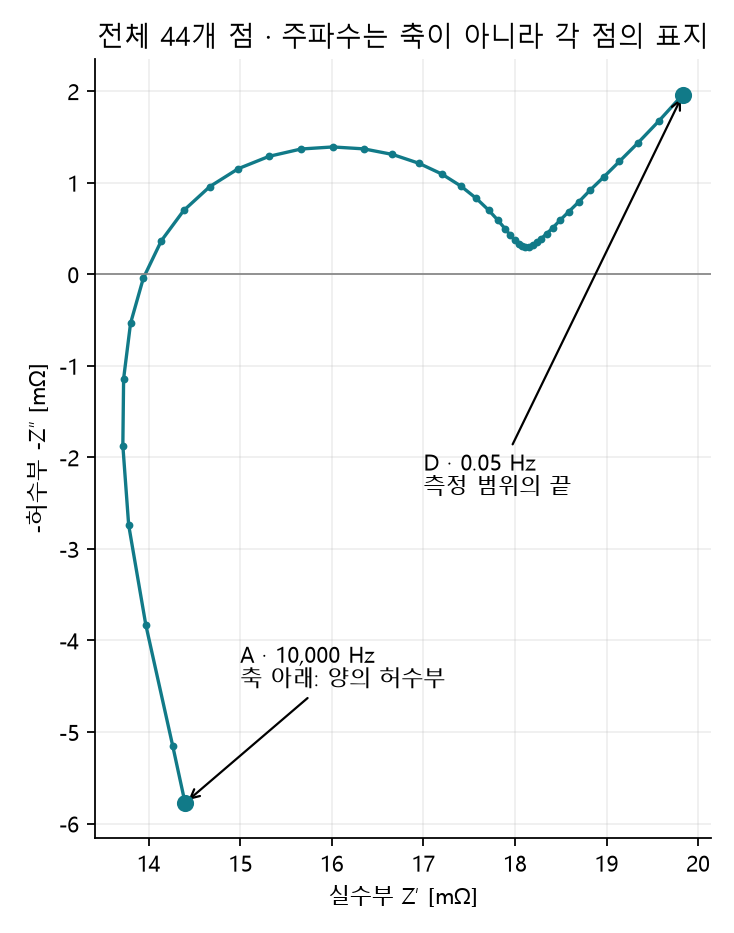
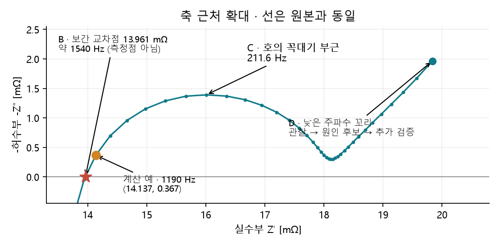
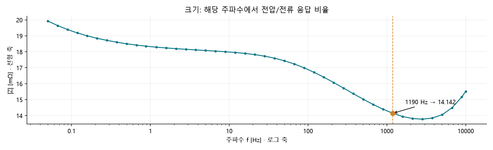
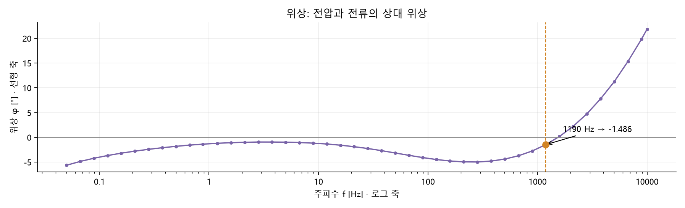
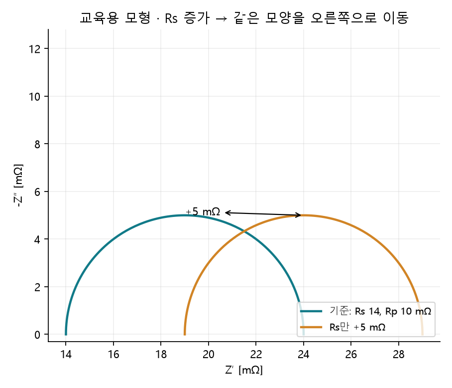
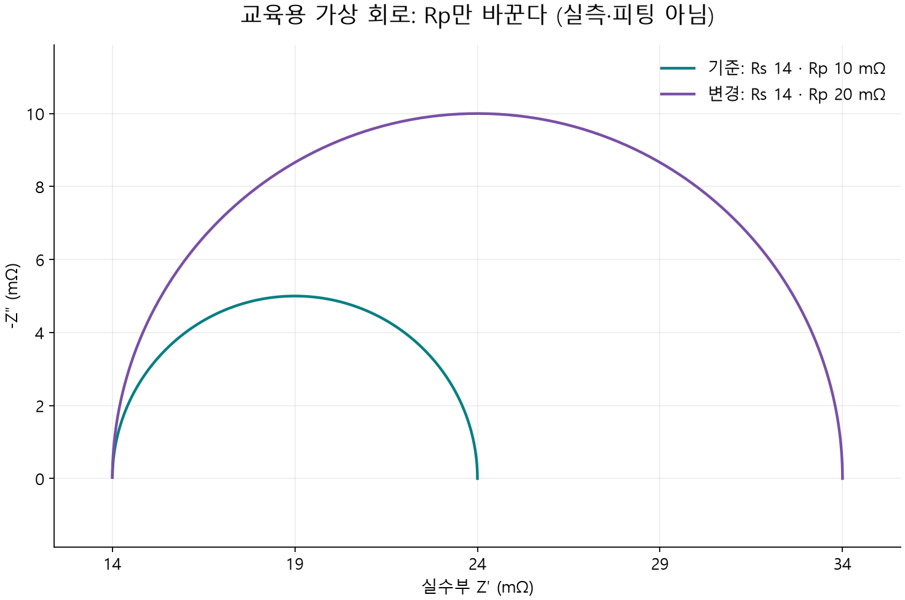

# 1.4.1.3 EIS

> 학습 상태: 학습중 (사용자가 읽고 수정하기 시작함)

[전체 INDEX](../../index.md) · [작업 계획](../../study-plan.md) · [기존 4개 파일 분석 결과](1.4.1.3%20EIS분석예시.md)

이 예시의 목표는 **열 이름을 이해하고 → 한 행을 좌표로 바꾸고 → 전체 그래프를 그리고 → 읽을 지점을 찾고 → 측정조건을 확인해 해석 범위를 정하는 것**이다. 처음에는 [NMC811 ID01 CSV](../../Data/static/eis/nmc811-21700-soc30-id01.csv) 하나만 사용한다.

파일명은 NMC811 21700·SOC 30%를 나타내지만 별도 측정 기록은 없다. 사용자가 외부 예시라고 확인한 자료이며 본인 실측 데이터가 아니다. 출처·측정 온도·진폭·휴지 시간·측정 구성은 미확인이다. 여기서는 실제 파일의 계산 결과와 교육용 모형을 구분하며, 학습 완료나 데이터의 과학적 검증 완료를 주장하지 않는다.

이 문서는 그래프를 처음 보는 사람의 교육용 설명이다. **그림 하나 → 그 그림의 축·점·선 → 관찰할 부분 → 이해 확인** 순서로 읽고, 네 그림을 익힌 뒤 연결해서 해석한다. 수식과 회로의 상세 계산은 선택해서 읽을 수 있게 접어 두었다. 이후 같은 종류의 다른 데이터를 분석할 때는 이 기초 설명을 참조하고 새 데이터의 목적·조건·특징·비교 결과를 중심으로 정리한다.

## 1. 먼저 데이터시트의 정체를 확인한다

이 CSV는 임피던스 계산 결과가 담긴 형태다. 전압·전류의 시간 파형에서 임피던스를 추출하는 과정이나 장비의 실제 측정 기록은 이 파일에 들어 있지 않다. 한 행은 **한 주파수의 복소 임피던스 한 점**이다. 여러 행은 충방전 시간의 순서가 아니라 주파수별 점들이다.

| 열 | 의미 | 원본 단위 | 그래프에서 사용 |
| --- | --- | --- | --- |
| `Frequency_Hz` | 신호가 1초에 반복되는 횟수 f | Hz | Bode X축, Nyquist 점의 주파수 표지 |
| `Real_Ohm` | 임피던스 실수부 Z′ | Ω | Nyquist X축 |
| `Imag_Ohm` | 부호가 포함된 임피던스 허수부 Z″ | Ω | 부호를 반대로 해 Nyquist Y축 |

실수부는 저항성 성분, 허수부는 위상이 어긋난 성분을 나타낸다. [표현과 회로의 기본 근거](https://www.gamry.com/application-notes/EIS/basics-of-electrochemical-impedance-spectroscopy/)

**주의:** 실수부 한 값을 전하전달저항이나 전해질 저항으로 바로 이름 붙이지 않는다. 여러 과정이 합쳐진 응답일 수 있다.

실수부에 함께 영향을 줄 수 있는 요소는 다음과 같다. 아래는 해석할 때 검토할 후보이며, 이번 ID01에서 각각의 기여가 확인되었다는 뜻은 아니다.

| 영향을 줄 수 있는 요소 | 어떤 과정인가 | 한 값을 해석할 때 확인할 것 |
| --- | --- | --- |
| 전해질·분리막·전극 기공의 이온 이동 | 전해질을 통해 이온이 이동하며 생기는 저항성 기여. 이동 거리·전도도·기공 구조·젖음 상태가 관련됨 | 고주파 측 값에도 전해질 외의 저항이 포함될 수 있으므로 전해질 저항 하나로 단정하지 않음 |
| 전극·집전체·탭의 전자 전도와 내부 접촉 | 전자가 전극과 금속 경로를 지나고 접촉부를 통과하며 생기는 저항성 기여 | 전극 구성과 내부 접촉 상태를 함께 확인 |
| 전극 표면의 계면막 | 음극 SEI 등 표면막을 통과하는 이온 이동과 계면 응답 | 계면막의 응답과 전하전달 응답이 겹칠 수 있음 |
| 양극·음극의 전하전달 반응 | 전극과 전해질 계면에서 전하가 전달되는 반응과 이중층의 결합 응답 | 2단자 셀 측정에는 두 전극의 응답이 함께 들어오므로 어느 전극의 Rct인지 한 점으로 구분하지 않음 |
| 확산·농도 변화 | 활물질 내부 또는 전해질에서 물질이 이동하며 농도가 변하는 과정 | 느린 응답은 실수부·허수부 모두에 기여할 수 있어 저주파 실수값을 단순 저항 하나로 읽지 않음 |
| 측정 리드·클립·치구의 저항과 접촉 | 셀 외부 연결부가 측정값에 포함시키는 저항성 기여 | 2단자/4단자 구성·전압 감지 위치·접촉 상태·보정 여부 확인 |

셀 내부의 전극·분리막·계면막·반응·확산 기여는 [BioLogic의 배터리 EIS 설명 7쪽](https://www.biologic.net/wp-content/uploads/2019/08/studying-batteries-with-electrochemical-impedance-spectroscopy-wp1-electrochemistry-battery.pdf), 외부 배선·접촉의 영향은 [Gamry의 저임피던스 배터리 측정 설명](https://www.gamry.com/application-notes/EIS/eis-measurement-of-a-very-low-impedance-lithium-ion-battery)을 참고한다.

**같은 셀에서도 주파수에 따라 각 과정의 기여가 달라진다.** 예를 들어 뒤의 이상적인 `Rs + (Rp ∥ C)` 모형에서도 실수부는 항상 Rs나 Rp 하나가 아니라 주파수에 따라 달라지는 합성값이다. 따라서 한 행의 실수부를 특정 저항으로 이름 붙이기 전에 전체 주파수 곡선·측정조건·회로 가정을 함께 확인한다. 온도·SOC·휴지 시간은 위 과정들의 상태를 바꾸는 조건이며, 그 비교 방법은 5절에서 설명한다.

검사 결과는 **44개 점, 0.05–10,000 Hz, 누락·비수치·주파수 중복 없음**이다. 원본을 보존하고 주파수 내림차순으로 연결한다. 이 검사만으로 선형성·정상성·측정 정확성이 검증된 것은 아니다.

## 2. 한 행을 직접 그래프 좌표로 바꾼다

원본의 **9번째 데이터 행**(헤더까지 포함하면 파일 10번째 줄)을 보자.

```csv
Frequency_Hz,Real_Ohm,Imag_Ohm
1190,0.014137316349661,-0.000366713851690292
```

### Nyquist의 X·Y 설정

```text
X = Real_Ohm × 1000
  = 14.137316... mΩ

Y = -Imag_Ohm × 1000
  = 0.366714... mΩ

그래프의 점 = (14.137, 0.367), 주파수 표지 = 1190 Hz
```

`1 Ω = 1000 mΩ`이므로 작은 셀 임피던스를 읽기 편하게 바꿨다. 원본 허수부가 음수이기 때문에 이번 점은 X축 위에 놓인다. 파일이 이미 `-Zimag`를 저장했다면 부호를 다시 뒤집으면 안 된다. [기존 MJ1 예시](1.4.1.3%20EIS분석예시.md)는 그런 열 형식을 사용한다.

### 같은 행을 Bode 두 점으로 바꾸기

```text
|Z| = sqrt(Real_Ohm² + Imag_Ohm²) × 1000
    = 14.142072... mΩ

φ = atan2(Imag_Ohm, Real_Ohm) × 180/π
  = -1.485886... °

크기 그래프의 점 = (1190 Hz, 14.142 mΩ)
위상 그래프의 점 = (1190 Hz, -1.486°)
```

따라서 **하나의 행이 Nyquist의 점 하나와 Bode의 크기·위상 점 하나씩**으로 나타난다. `atan2`는 실수·허수부의 부호와 사분면을 함께 반영한다.

## 3. 그래프를 하나씩 읽는다 — 처음 보는 점·축·선부터

EIS는 셀에 작은 주기적 신호를 주고 응답을 살펴보는 방법이다. 여기서는 결과가 이미 숫자로 들어 있다. **신호가 빠르게 반복될 때와 천천히 반복될 때 응답이 어떻게 다른지**를 숫자 44행 대신 그림으로 보는 것이다. 그 빠르고 느린 조건을 표시한 숫자가 주파수(Hz)다. 이번 파일에는 원본 전압·전류 시간 파형이나 실제 측정 기록은 없다.

아래 네 그림은 모두 ID01 한 파일에서 만들었다. 그림별로 무엇을 읽는지가 다르다. 처음에는 각 그림 아래의 “여기서 확인”까지만 이해하고 다음으로 넘어간다.

### 3-1. 첫 번째 그림 — 전체 Nyquist: 점과 선의 뜻

**이 그림의 목적:** 실수부와 허수부가 주파수별로 어떤 위치와 모양을 이루는지 본다. Nyquist는 “나이퀴스트”라고 읽는다. 이름보다 축과 점의 뜻을 먼저 익힌다.



**① 가로축부터 읽는다.** 아래쪽 X축은 실수부 Z′이며 단위는 mΩ다. 왼쪽에서 오른쪽으로 갈수록 실수부가 커진다. 가로축은 시간이나 주파수가 아니다.

**② 세로축을 읽는다.** 왼쪽 Y축은 허수부의 부호를 뒤집은 -Z″다. 단위는 역시 mΩ다. 회색 가로선은 Y=0이다. 원본 허수부가 음수이면 부호를 뒤집어 축 위에, 양수이면 축 아래에 표시한다.

**③ 점 하나는 원본 한 행이다.** 예를 들어 아래쪽 A는 10,000 Hz의 행을 옮긴 점이다. 실수부 14. 397 mΩ, 원본 허수부+5. 774 mΩ이므로 좌표는 `(14. 397, -5. 774)`다. 축 아래에 있다는 이유만으로 잘못된 데이터라고 판단하지 않는다.

**④ 선은 점 44개를 주파수 순서로 이은 것이다.** 이번에는 높은 주파수에서 낮은 주파수 순서로 연결했다. A의 10,000 Hz에서 시작해 D의 0. 05 Hz로 이어진다. 중간에 왼쪽으로 이동하는 구간도 있으므로 가로 위치만으로 주파수를 판단하지 않는다. 선 사이의 모든 위치를 측정한 것은 아니다. 이론식에 맞추는 피팅이나 점을 매끈하게 바꾸는 평활화도 하지 않았다.

**⑤ 그림의 모양을 말해본다.** 아래쪽에서 올라오고, 축을 지난 뒤 둥글게 굽었다가, 끝에서 다시 올라간다. 굽은 부분을 “호”, 뒤로 이어지는 부분을 “꼬리”라고 부른다. 지금은 모양을 찾아보는 단계다.

이번 축은 **선형**이다. 14→15와 15→16은 같은 1 mΩ 차이라 같은 간격이다. 가로 1 mΩ와 세로 1 mΩ도 같은 화면 길이로 그려 모양이 찌그러져 보이지 않게 했다.

**여기서 확인:** 점 하나가 원본 한 행임을 설명하고 A와 D를 찾을 수 있는가? 오른쪽으로 이동한 것이 시간 경과라는 뜻이 아님을 설명할 수 있는가?

### 3-2. 두 번째 그림 — 확대 Nyquist: 한 점과 굽은 부분 읽기

**이 그림의 목적:** 첫 그림의 축 근처를 확대해 작은 차이를 읽는다. 새로운 시료나 새로운 측정이 아니다. 원본 44개 점을 유지하고 보이는 범위만 줄였다.



**① 주황색 점부터 찾는다.**2절에서 계산한 1190 Hz 행이다. 점에서 아래로 내려가 가로축을 읽으면 약 14. 137, 왼쪽으로 가서 세로축을 읽으면 약 0. 367이다. 즉 `(14. 137, 0. 367) mΩ`다.

**② B 별표를 찾는다.** 곡선이 회색 Y=0 선을 지나는 곳이다. 이를 **실축 교차점**이라고 한다. “실축”은 실수부를 표시하는 가로축이다. 이번 교차 위치의 X는 약 13. 961 mΩ다.

B는 원본 측정점이 아니다. 1586. 89 Hz 점은 축 아래,1190 Hz 점은 축 위에 있어서 그 사이를 잇는 선이 0을 지나는 위치를 계산했다. 점 사이를 추정하는 것을 **보간**이라고 한다. 주파수는 로그 주파수에서 보간해 약 1540 Hz다. 최저 실수값 13. 717 mΩ(약 3763 Hz)은 B와 다르다. “가장 왼쪽”과 “축을 지나는 곳”은 다른 기준이다.

**③ C 부근의 호를 찾는다.** 둥글게 올라갔다 내려오는 부분이다. 선택한 점 C는 211. 6 Hz, `(16. 010, 1. 391) mΩ`다. 측정된 점 중 고른 값이며 정확한 이론상 꼭대기를 확정한 것은 아니다. 얼마나 넓은지·높은지·어느 주파수에서 굽는지를 먼저 관찰한다.

**④ D로 이어지는 꼬리를 찾는다.** 호를 지난 뒤 다시 올라가는 부분이다. 마지막 D는 0. 05 Hz, `(19. 834, 1. 963) mΩ`다. 그림은 여기서 끝나므로 더 낮은 주파수에서 어떻게 이어지는지는 모른다.

**주의:** 지금은 위치와 모양을 읽었다. B를 전해질 저항 하나로, C를 양극 또는 음극의 전하전달 반응 하나로, D를 확산 하나로 확정한 것은 아니다. 원인을 해석하는 단계는 4절에서 연결한다.

**여기서 확인:** 주황색 점의 X·Y를 읽고 B·C·D가 각각 어느 부분인지 찾을 수 있는가? 확대가 원본 삭제를 뜻하지 않음을 설명할 수 있는가?

### 3-3. 세 번째 그림 — Bode 크기: 어떤 주파수에서 얼마나 큰가?

**이 그림의 목적:** 주파수별 임피던스의 크기를 직접 읽는다. Bode는 “보드”라고 읽는다. Nyquist에 없는 주파수 축을 보여주는 표현이다.



**① 가로축은 주파수다.** 낮은 값이 왼쪽, 높은 값이 오른쪽이다. 0. 1→1→10→100→1000→10000은 각각 10배 간격인데 화면에서는 같은 폭이다. 이를 **로그 축**이라고 한다. 낮은 주파수와 높은 주파수를 한 그림에 보기 위해 사용했다. 값 자체를 바꾼 것은 아니다.

**② 세로축은 크기 |Z|다.** 실수부와 허수부를 함께 반영한 크기이며 단위는 mΩ다. 이 값은 같은 주파수에서 전압 신호 진폭을 전류 신호 진폭으로 나눈 비율에 해당한다. 실수부만 읽은 값과는 다르다. 2절의 제곱합·제곱근 계산이 이 값을 만든다.

**③ 점선을 따라 읽는다.**1000 Hz 조금 오른쪽의 주황색 점선은 1190 Hz다. 곡선과 만나는 주황색 점의 높이는 14. 142 mΩ다. 두 번째 그림의 주황색 행을 다른 축으로 표시한 것이다.

**④ 전체 경향을 말해본다.** 이번 파일은 낮은 주파수 끝에서 약 19. 931 mΩ이고, 수천 Hz 부근에서 더 낮아졌다가 가장 높은 주파수 쪽에서 다시 올라간다. 끝점 둘만 비교하지 않고 중간에 굽는 부분도 본다. 오른쪽으로 갈수록 늘 커지거나 늘 작아지는 곡선은 아니다.

세로축은 이번 그림에서 선형이다. 14→15와 15→16은 같은 간격이다. 기존 4개 파일 보고서는 크기 세로축도 로그로 표시했으므로 모양이 달라 보일 수 있다. 비교할 때는 단위와 축 배율을 맞춘다.

**여기서 확인:**1190 Hz에서 14. 142 mΩ를 찾을 수 있는가? 가로축의 1→10과 10→100이 같은 폭인 이유를 설명할 수 있는가?

### 3-4. 네 번째 그림 — Bode 위상: 전압과 전류는 얼마나 어긋나는가?

**이 그림의 목적:** 크기만으로 표현되지 않는 전압·전류의 상대 위상을 읽는다. 주기적인 두 신호가 같은 때 오르내리는지, 어긋나 있는지를 각도(°)로 나타낸 값이 **위상**이다.



**① 가로축은 바로 앞과 같다.** 주파수를 로그 축으로 표시했다. 같은 주파수의 점을 비교하면 된다.

**② 세로축은 위상 φ다.** 단위는 도(°)이고 이번 그림에서는 선형이다. 0°는 두 신호의 위상이 같다는 뜻이다. 이 문서는 전압 위상에서 전류 위상을 뺀 부호를 사용하므로 음수는 전압 위상이 전류보다 뒤에, 양수는 앞에 있다는 뜻이다. 원본 시간 파형을 직접 확인한 것은 아니며 실수·허수부에서 계산했다.

**③ 주황색 점을 읽는다.**1190 Hz에서 위상은-1. 486°다. 0°에 가깝지만 정확히 0°는 아니다. 같은 행의 크기는 세 번째 그림에서 14. 142 mΩ였고, 여기서는 그 행의 위상 정보를 읽는다.

**④ 부호가 바뀌는 곳을 찾는다.** 이번 곡선은 낮은 주파수와 중간 주파수에서 음수이고 고주파 쪽에서 양수로 바뀐다. 이는 첫 그림의 축 위·아래와 연결된다. 원본 허수부가 양수이고 실수부가 양수인 A는 Nyquist에서는 부호를 뒤집어 축 아래, 위상 그래프에서는 양수로 나타난다.

**주의:** 위상은 성능 점수가 아니다. 더 낮거나 더 높다는 것만으로 셀이 좋다·나쁘다고 판정하지 않는다. 크기·주파수·조건과 함께 읽는다.

**여기서 확인:** 같은 1190 Hz의 크기와 위상을 각각 찾을 수 있는가? “크기”와 “어긋남”이 서로 다른 정보임을 설명할 수 있는가? [그래프 표현의 공식 설명](https://www.gamry.com/application-notes/EIS/basics-of-electrochemical-impedance-spectroscopy/)

## 4. 네 그림을 익힌 뒤 연결해서 해석한다

먼저 같은 1190 Hz 행을 연결해 말해본다. **전체 Nyquist에 포함된 한 점을 확대 Nyquist에서 `(14. 137, 0. 367) mΩ`로 읽었고, Bode에서는 크기 14. 142 mΩ와 위상-1. 486°로 읽었다.** 네 그림이 네 번의 서로 다른 실험을 뜻하는 것이 아니라, 같은 응답의 전체 모양·세부 위치·크기·위상을 보여주는 것이다.

다음으로 그림의 위치와 원인 후보를 연결한다. **관찰한 사실 → 가능한 설명 → 더 확인할 것** 순서로 정리한다.

| 지점 | 이번 데이터에서 직접 확인한 내용 | 무엇을 확인하려고 보는가 | 아직 결정할 수 없는 내용 |
| --- | --- | --- | --- |
| A: 고주파 시작, 10 kHz | Z″가 +5. 774 mΩ여서 Nyquist Y는 -5. 774 mΩ | 유도성 응답·배선/접촉 영향과 측정 구성 점검 | 셀 자체 유도성인지 배선 영향인지 분리 |
| B: 고주파 측 실축 교차 | 인접 점 보간 X≈13. 961 mΩ, f≈1540 Hz | 조건을 맞춘 뒤 교차 위치가 이동하는지 비교 | 이것을 확정된 순수 옴 저항 Rs나 전해질 저항으로 단정 |
| C: 호의 꼭대기 부근 | 211. 6 Hz에서 X≈16. 010, Y≈1. 391 mΩ | 호의 폭·높이·특징 주파수 변화 관찰 | 단일 Rct·C 값이나 양극/음극/계면막의 독립 기여 |
| D: 저주파 끝, 0. 05 Hz | X≈19. 834, Y≈1. 963 mΩ; 끝에서도 꼬리가 상승 | 느린 응답·더 낮은 주파수의 필요성·측정 중 드리프트 검토 | DC 저항, 확산계수, 확산만으로 설명되는지 여부 |

표에서 **유도성**은 주기적 신호에서 나타나는 응답 유형이고, **드리프트**는 측정 중 상태나 값이 서서히 변하는 현상이다. 0. 05 Hz의 한 주기는 약 20초이므로 여러 주기를 측정하면 시간이 더 걸린다. 그동안 상태가 안정적인지도 확인해야 한다.

A의 유도성 응답은 배선과 셀 내부 모두 검토할 수 있어 전부 장비 오류라고 지우지 않는다. C의 호는 두 전극·계면막의 응답이 겹친 것일 수 있다. D는 느린 물질 이동·저장 응답을 살펴볼 단서지만 꼬리만으로 원인을 확정하지 않는다. [배선 영향](https://www.gamry.com/application-notes/EIS/eis-measurement-of-a-very-low-impedance-lithium-ion-battery), [셀 응답과 겹친 호](https://www.biologic.net/wp-content/uploads/2019/08/studying-batteries-with-electrochemical-impedance-spectroscopy-wp1-electrochemistry-battery.pdf)

이번 단계의 목표는 네 그림을 연결해 관찰과 확인할 사항을 말하는 것이다. 특정 저항값을 확정하는 것은 측정조건과 모델을 검증한 뒤 진행한다.

## 5. 측정조건을 바꾸면 무엇이 달라질까

### 5-1. 처음에는 온도 하나를 바꾸는 비교로 생각해보자

측정조건은 그래프를 얻을 당시의 온도·충전상태·신호 크기·기다린 시간·배선 구성 등을 말한다. 같은 셀의 온도만 바꿔 비교한다면 다른 조건은 최대한 맞추고 셀 온도가 안정된 뒤 측정해야 한다. 온도와 충전상태를 동시에 바꾸면 어느 조건 때문에 그림이 달라졌는지 구분하기 어렵다.

1. 두 파일의 단위·측정조건을 확인하고 같은 축에 서로 다른 색으로 그린다.
2. Nyquist에서 B가 옆으로 이동했는지, C의 호가 넓거나 높아졌는지, D의 꼬리가 달라졌는지 적는다.
3. Bode에서는 **같은 주파수**에서 크기·위상이 어떻게 달라졌는지 읽는다. 서로 다른 주파수의 값을 조건 차이처럼 비교하지 않는다.
4. “호가 넓어졌다”는 관찰과 “반응 저항이 바뀌었을 수 있다”는 원인 후보를 나눠 쓴다.

이번 파일에는 실제 온도별 측정 세트가 없다. 따라서 온도 변화량과 그래프 변화량을 실제 결과로 계산할 수는 없다.

### 5-2. 표에 나오는 용어를 먼저 읽자

- **SOC:** 충전상태를 나타내는 값이다.
- **AC 진폭:** 주기적으로 흔드는 전압·전류 신호의 크기다.
- **휴지 시간:** 충방전을 멈춘 뒤 측정까지 기다린 시간이다.
- **산포:** 점들이 들쭉날쭉하게 퍼지는 정도다.
- **선형성:** 작은 신호의 크기를 바꿀 때 응답도 그 크기에 비례하는 성질이다.
- **정상성:** 측정하는 동안 분석 대상의 상태가 충분히 일정한 성질이다.

### 5-3. 바꾼 조건에 맞춰 중점적으로 볼 부분을 고른다

아래는 **새 조건으로 측정할 때 점검할 방향**이다. 이번 CSV는 조건별 세트가 아니므로 실제 변화량을 계산한 결과가 아니다. 기존 ID01·ID02·ID03에도 온도별·SOC별 조건을 임의로 붙이지 않는다.

| 바꾸는 조건 | 변화가 생기는 과정·검토할 원인 | 그래프에서 집중할 곳 | 비교 전에 맞출 것 |
| --- | --- | --- | --- |
| SOC | 전극의 리튬 저장 상태·전위가 달라져 반응·전달 응답이 바뀔 수 있음. 방향은 소재·SOC 구간에 따라 다름 | B 교차 위치, C 호의 크기·주파수, D 저주파 응답 | 온도·휴지·진폭·시료 상태·주파수 범위 |
| 온도 | 반응속도·전달과 전해질 전도도가 달라짐. 저항성 응답의 변화 방향·크기는 소재·상태·구간별 비교로 확인하고 고정 증가량으로 환산하지 않음 | B 이동, C 호의 변화·주파수 이동, Bode 크기·위상 | SOC·온도 평형·휴지·이력 |
| AC 진폭 | 작으면 신호대잡음이 부족할 수 있고, 크면 선형 범위를 벗어나 상태가 변할 수 있음 | 점의 산포, 진폭별 곡선 일치, 고조파·검증 지표 | 정전류/정전압 모드, 진폭의 peak/RMS 정의·단위 |
| 휴지 시간 | 충방전 직후의 농도·전압 상태가 완화됨. 측정 중 계속 변하면 정상성 조건에 맞지 않음 | 시간에 따른 곡선 재현성, 특히 긴 저주파 측정의 드리프트 | 직전 충방전 방향·SOC·온도·시작 OCV |
| 배선·고정·접촉 | 전류·전압 리드의 배치와 접촉 상태가 측정에 영향을 줌 | A의 축 아래 부분, B의 이동·산포 | 4단자 구성·접촉 압력·케이블 배치·보정 |
| 최저 주파수·점 수 | 기존 측정 응답을 더 오래·세밀하게 관찰함. 측정시간이 늘어 상태 변화도 확인 필요 | D의 꼬리가 어디까지 이어지는지, 호의 완결 여부 | 데이터가 안정적인지; 표시 확대와 실제 재측정을 구분 |

SOC별 비교에는 [BioLogic의 배터리 EIS 설명](https://www.biologic.net/wp-content/uploads/2019/08/studying-batteries-with-electrochemical-impedance-spectroscopy-wp1-electrochemistry-battery.pdf)을, 진폭·모드에는 [Gamry의 정전류/정전압 EIS 설명](https://www.gamry.com/application-notes/EIS/eis-potentiostatic-galvanostatic-mode/)을 참고한다. 온도·휴지·선형성·정상성은 측정 상태를 함께 확인해야 한다. [기본 측정 가정](https://www.gamry.com/application-notes/EIS/basics-of-electrochemical-impedance-spectroscopy/)

[BioLogic의 측정조건 자료](https://www.biologic.net/wp-content/uploads/2019/12/impedance_partiv_condexp.pdf)는 17쪽에서 온도 관리의 필요성, 24쪽에서 진폭과 신호·선형성의 관계를 설명한다. 17쪽의 TestBox 회로 사례를 이번 배터리의 온도별 실측 결과로 확대하지 않는다.

### 5-4. 선택 학습 — 모형에서 한 가지씩 바꿔본다

여기부터는 네 그림을 읽은 뒤 선택해서 보는 보충 설명이다. 아래 그림은 **교육용 계산 곡선**이며 ID01의 피팅이나 실제 온도·SOC 변경 실험 결과가 아니다. 모형의 숫자 하나를 바꾸면 어떤 모양 변화가 생기는지 분리해서 본다.

모형에는 직렬 저항 Rs, 병렬 저항 Rp, 전하를 저장하는 용량 C가 있다. Rs는 같은 응답 전체에 더해지는 저항이고, Rp와 C는 병렬로 연결해 주파수에 따라 달라지는 응답을 만든다. 이것은 셀 전체를 그대로 복제한 회로가 아니라 원리 설명을 위한 간단한 회로다.

**첫 모형 그림 — Rs만 바꾼다.** 청록색이 기준, 주황색이 Rs를 5 mΩ 늘린 곡선이다.



먼저 두 곡선의 왼쪽 끝, 꼭대기, 오른쪽 끝을 각각 비교한다. 모양과 높이는 같은데 모두 오른쪽으로 5 mΩ 이동했다. Rs만 증가하면 모든 주파수의 실수부에 같은 값이 더해지기 때문이다. 이것을 실제 온도 변화의 결과로 해석하지 않는다.

**두 번째 모형 그림 — Rp만 바꾼다.** 청록색이 기준, 보라색이 Rp를 10→20 mΩ로 늘린 곡선이다. C는 같은 값으로 유지했다.



왼쪽 끝은 같지만 반원의 폭은 10→20 mΩ, 높이는 5→10 mΩ로 커진다. 꼭대기 주파수는 318. 3→159. 2 Hz로 낮아진다. 따라서 “모양을 유지한 이동”과 “호 자체가 커지는 변화”를 구분해 볼 수 있다.

실제 온도나 SOC를 바꾸면 여러 성분이 함께 변할 수 있다. 오른쪽 이동만 보고 원인을 하나로 확정하거나, 이 모형의 Rp를 검증 없이 실제 전하전달저항 Rct라고 부르지 않는다.

<details>
<summary>선택해서 읽기: 모형의 계산식·입력값·꼭대기 주파수</summary>

`∥`는 병렬 연결을 뜻한다. 이 모형은 `Rs + (Rp ∥ C)`이며 식에서 j는 허수 단위, f는 주파수(Hz), C는 용량(F)이다.

```text
Z(f) = Rs + Rp / (1 + j·2πf·Rp·C)

기준:       Rs = 14 mΩ, Rp = 10 mΩ, C = 0. 05 F
Rs 변화:    Rs = 19 mΩ, Rp = 10 mΩ, C = 0. 05 F
Rp 변화:    Rs = 14 mΩ, Rp = 20 mΩ, C = 0. 05 F
```

이상적 모형의 꼭대기 주파수는 `1/(2πRpC)`다. Rp를 두 배로 하고 C를 고정하면 꼭대기 주파수는 절반으로 줄어든다. 이 모형의 실수부는 `Rs + Rp/[1 + (2πfRpC)²]`이므로 한 주파수의 실수부도 Rs 또는 Rp 하나와 일반적으로 같지 않다.

실제 셀은 여러 응답이 겹칠 수 있으므로 C 지점의 높이를 두 배 해서 바로 Rct라고 부르거나 전체 곡선에 단일 반원을 강제로 맞추지 않는다. [모형과 해석 범위](https://www.gamry.com/application-notes/EIS/basics-of-electrochemical-impedance-spectroscopy/)

</details>

### 5-5. 실제 비교 데이터를 받았을 때의 기록 순서

예를 들어 같은 셀에서 온도만 바꿨다면 다음 순서로 진행한다.

1. 온도 두 수준과 실제 측정 온도, SOC·휴지·진폭·모드를 기록한다. 이 예시는 실제 설정값을 정하지 않는다.
2. 셀의 온도·전압이 안정된 뒤 같은 주파수 범위로 측정하고 입력 파일을 따로 보존한다.
3. 두 그래프를 동일 축·단위·배율에 겹친다. 주파수 배열이 다르면 같은 주파수 비교를 위한 정렬·보간 방법을 기록한다.
4. 먼저 A의 배선 영향·산포와 측정 반복의 재현성을 본다.
5. B 위치, 호의 폭과 특징 주파수, 같은 주파수의 \|Z\|·위상을 비교한다. 호의 양 끝이 분리되지 않으면 Rct라는 이름 대신 관찰 지표를 쓴다.
6. 차이값은 `조건 2 − 조건 1`, 변화율은 `(조건 2 − 조건 1)/조건 1 × 100%`로 기록한다. 위상 차이는 도(°)로 쓰고, 기준이 0에 가깝거나 부호가 바뀌면 변화율을 쓰지 않는다.
7. 다시 기준 조건으로 돌아가 재측정하면 조건 변화의 가역성, 드리프트·이력의 가능성을 구분하는 데 도움이 된다.
8. 두 조건의 비교 관찰과 원인 가설을 분리해 쓰고, 회로 피팅은 선형성·정상성·주파수 범위·잔차·식별성을 확인한 뒤 진행한다.

## 6. 이번 결과를 문장으로 읽어보자

**관찰:** ID01에서 10 kHz 점은 Nyquist 축 아래에 있고, 고주파 측 실축 교차값은 보간상 약 13. 961 mΩ다. 중간 주파수에는 호가 있으며 0. 05 Hz에서도 꼬리가 이어진다.

**해석 후보:** 고주파의 유도성 응답, 중간 주파수의 겹친 반응·계면 응답, 저주파의 느린 전달·저장 응답을 검토할 수 있다.

**추가 확인:** 온도·SOC·진폭·휴지·배선·시료 관계를 확인하고, 조건을 통제한 비교와 모델 검증이 필요하다.

따라서 이번 자료만으로 “전하전달저항은 ○○이고 배터리가 열화됐다”는 결론을 쓰지 않는다. **그래프에서 보인 것 → 가능한 설명 → 확인할 측정·자료**의 순서로 결과를 남긴다.

## 7. 직접 따라 해볼 확인 질문

1. 1190 Hz의 원본 허수부가 음수인데 왜 Nyquist 점은 X축 위에 놓이는가?
2. 네 그림에서 같은 1190 Hz 행을 찾을 수 있는가? Bode의 크기·위상은 각각 무엇을 말하는가?
3. ID01의 최저 실수값과 고주파 측 실축 교차값이 왜 다를 수 있는가?
4. 온도만 비교하려면 SOC와 휴지 시간을 왜 맞춰야 하는가?
5. Rs 변화처럼 오른쪽으로 이동한 곡선을 보았을 때, 실제로 어떤 원인을 먼저 확인해야 하는가?

이 질문을 설명할 수 있으면 다음 단계에서 조건별 데이터를 비교한다. 확인 질문을 마련한 것을 사용자의 학습 완료로 기록하지 않는다.

## 8. 다음 데이터부터는 그 데이터의 특징을 중심으로 정리한다

같은 EIS를 다시 분석할 때는 이 문서의 기초 설명을 연결하고, 다음 순서로 결과를 작성한다. 새로운 그래프 종류를 처음 접하면 다시 그림 하나씩 축·점·선부터 설명한다. 이번 문서 작성으로 사용자가 기초를 모두 이해했다고 가정하지 않는다.

1. **이번에 알고 싶은 것:** 온도 차이인지, SOC 차이인지, 시료 간 차이인지 먼저 적는다.
2. **데이터와 조건:** 열·단위·시료 관계·주파수 범위·통제한 조건과 모르는 조건을 적는다.
3. **각 그림의 관찰:** 그림 하나와 설명을 붙여 보여주며 이번 목적에 관련된 위치·크기·위상·산포를 우선 읽는다.
4. **비교값과 중점:** 같은 주파수의 크기·위상, 식별 가능한 교차 위치 등을 수치로 비교한다. 교차나 호가 분리되지 않으면 억지로 값을 만들지 않는다. 목적별로 중요한 지점을 고른다.
5. **종합 해석:** 그림별 관찰이 서로 어떻게 연결되는지 설명하고, 확인된 결과·원인 후보·남은 확인을 구분한다.

예를 들어 온도별 데이터가 오면 조건을 맞춘 뒤 같은 주파수의 크기·위상과 호·교차 위치 변화가 중점이다. 배선별 데이터가 오면 고주파 부분과 접촉·연결 구성의 영향이 중점이다. 어떤 데이터를 받든 모든 지표를 똑같은 비중으로 나열하지 않는다.

## 재현 파일과 근거

| 파일 | 용도 |
| --- | --- |
| [원본 CSV](../../Data/static/eis/nmc811-21700-soc30-id01.csv) | 원본 44개 점 |
| [선택 행 계산표](walkthrough_points.csv) | 원본 행 번호·축 좌표·크기·위상 확인 |
| [그림 생성 코드](../../Tools/build_eis_walkthrough.py) | 주석 그림·모형·수치 검증 재생성 |
| [검증 기록](walkthrough-record.json) | 입력 해시·계산 예·교육용 모형 구분 |

기존 분석 코드의 CSV 읽기·검증을 재사용한다. 실행은 `python Tools/build_eis_walkthrough.py`이며 현재 PC에서는 [작업 계획](../../study-plan.md)의 앱 포함 Python을 사용한다. 문서는 수동 편집하고 그림·계산표만 코드로 재생성한다. WBS의 내용 원본·항목별 PDF는 변경하지 않는다.

근거 확인일은 2026-10-03이다. 위 공식 장비사 자료는 그래프 표현과 측정·모형 해석의 근거이며, 예시 CSV의 출처를 확인한 자료는 아니다.
