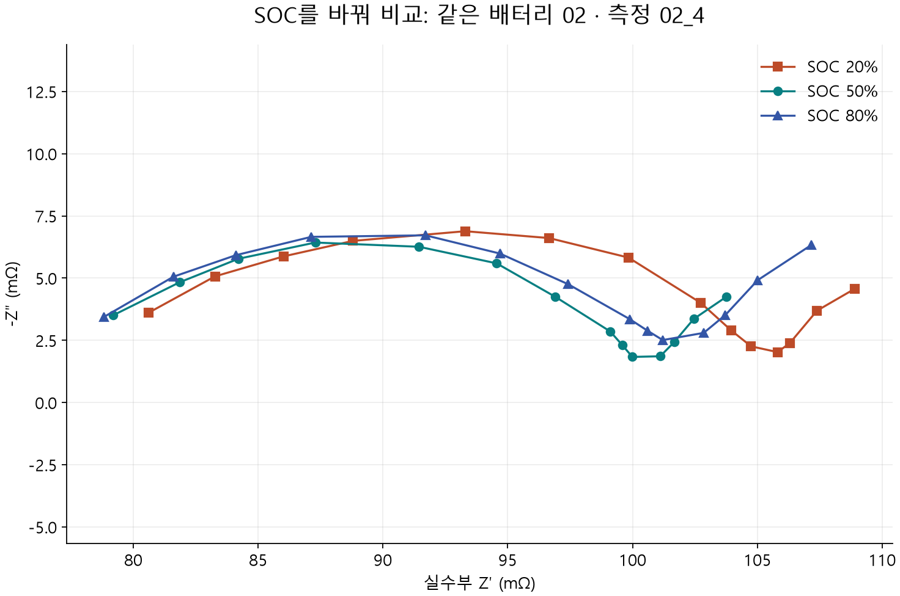
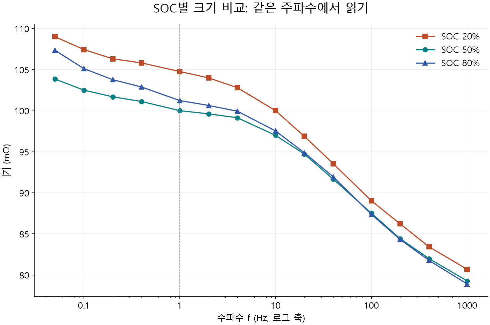
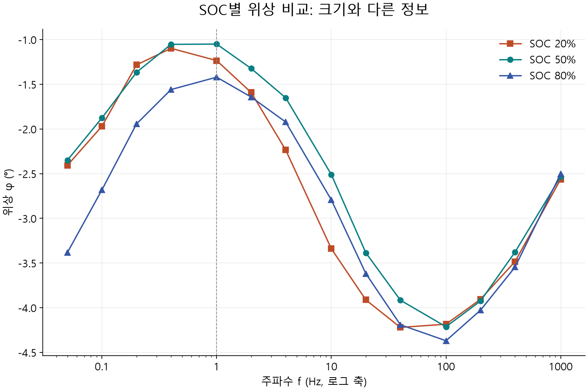
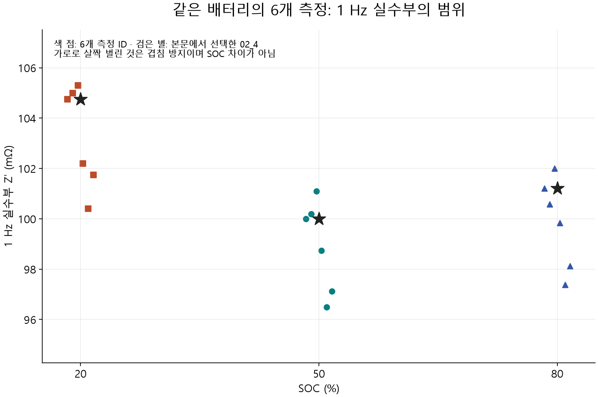

# 1.4.1.3 EIS분석예시

> 학습 상태: 학습중 | 2026-10-04 | 공개 데이터 SOC 비교 | 검토 상태: 사용자 검토 대기

[전체 INDEX](../../index.md) · [EIS 내용](1.4.1.3%20EIS.md) · [데이터 전달 양식](#데이터와-함께-보내는-분석-요청-양식)

## 1. 이번에 확인하려는 질문

**같은 배터리에서 온도를 일정하게 유지하고 SOC를 바꿨을 때, 곡선과 같은 주파수의 값이 어떻게 달라질까?**

단순히 그래프 3개를 그리는 것에서 끝내지 않고 질문·조건·축·관찰·수치·한계를 연결한다. 이 문서는 사용자가 앞으로 제공할 데이터의 결과 설명 방식을 함께 검토하는 공개 예시다. 처음 그래프를 배우면 [EIS 내용 3절](1.4.1.3%20EIS.md#3-그래프를-하나씩-처음부터-읽는다)에서 SOC 50% 한 곡선부터 읽는다.

## 2. 분석 요청을 실제로 구체화한 공개 예시

| 요청 항목 | 이번 공개 데이터에서 적을 내용 |
| --- | --- |
| 목적 | SOC별 EIS 차이를 같은 배터리에서 비교 |
| 바뀐 조건 | SOC 80%·50%·20%, 방전 방향으로 낮춘 단계 |
| 유지한 조건 | 배터리 02, 논문상 항온조 25 ± 1°C, 같은 주파수·다중사인 조건 |
| 비교 ID | `BATTERY_ID=02`, `MEASURE_ID=02_4`의 세 SOC; 정렬 첫 측정 ID를 선택 |
| 반복 확인 | 같은 배터리 02의 측정 ID 6개를 별도로 확인 |
| 시료 | Samsung ICR18650-26J 완전셀, 정격 3.7 V·2.6 Ah |
| 연결·장비 | 자체 제작 4선 측정계, Keysight U2351A DAQ |
| EIS 범위 | 0.05–1000 Hz 14점, 여러 주파수를 동시에 가한 다중사인 전류 |
| 진폭·시간 | 각 주파수 성분 50 mA, EIS 측정 구간 40초; 합성 신호 전체 RMS가 아님 |
| SOC 설정·휴지 | 정격 용량 기준 1 A×936초로 10% 방전, SOC 단계 사이 1800초 휴지 |
| 분석 범위 | 원본 검사·단위 환산·그래프·같은 주파수 비교; 피팅·평활화·행 제거 없음 |
| 미확인 정보 | CSV에는 실제 온도 시계열·각 회차의 장비 경고·진폭 peak/RMS 기준이 없음; ID 접미사와 실제 사이클 수의 대응은 추정하지 않음 |

조건은 [논문](https://pmc.ncbi.nlm.nih.gov/articles/PMC9493380/), 시료·ID·단위·반복 정보는 [원본 데이터 v3](https://data.mendeley.com/datasets/mbv3bx847g/3)와 CSV를 확인했다. 일부 정보가 명확해졌다고 전체 측정의 정확성·선형성·정상성을 새로 검증한 것은 아니다.

## 3. 원본 확인과 축 설정

- 전체 원본은 3360행, 4개 배터리·24개 측정 ID·240개 스펙트럼이다. 각각 14개 주파수, 누락·비수치·중복 없음. 제공자의 SHA-256과 일치한다.
- `FREQUENCY_ID`를 대응표와 연결한다. ID 4는 4 Hz가 아니라 1 Hz다. 배터리 ID `02`의 앞자리 0은 보존한다.
- 세 SOC에서 14개 점씩 **42개 점을 선택**하고 높은 주파수→낮은 주파수로 잇는다. 나머지 원본을 삭제하지 않는다.
- Nyquist: X=Z′×1000, Y=-Z″×1000 (mΩ). Bode: X=f (Hz, 로그), 크기=sqrt(Z′²+Z″²)×1000, 위상=atan2(Z″,Z′)×180/π.
- 표시한 선은 점 사이를 연결한 것이며 측정하지 않은 주파수의 실제값이나 피팅 결과가 아니다.

## 4. 첫 비교 그림 — Nyquist에서 모양과 위치를 본다



가로는 실수부, 세로는 부호를 뒤집은 허수부다. 주황 사각형=20%, 청록 원=50%, 파랑 삼각형=80%다. 색만 보지 않고 범례·점 모양도 확인한다.

먼저 왼쪽 고주파 끝, 중간 굽은 구간, 오른쪽 저주파 끝을 각각 비교한다. SOC 20% 곡선은 상당 구간에서 오른쪽에 있고, 50%·80%는 비슷해 보이면서도 저주파 쪽 모양이 다르다. 이것을 수치로 확인하려면 **같은 주파수의 점**을 비교해야 한다. 가로 좌표가 같은 두 점이 같은 주파수라는 보장은 없다.

이번 선택 데이터의 모든 허수부는 음수다. 측정 구간에서 실축 교차점이 없으므로 1000 Hz 끝값을 Rs나 전해질 저항으로 읽지 않는다. 호 전체의 양끝이 분리되지 않아 폭을 바로 Rct라고 계산하지 않는다.

**여기서 확인:** 같은 모양의 평행 이동만 보이는가, 구간별 모양도 달라지는가? 더 높은 주파수의 점이 없다는 사실이 해석에 어떤 제한을 주나?

## 5. 두 번째 비교 그림 — 크기를 같은 주파수에서 읽는다



가로축은 로그 주파수, 세로축은 크기 |Z|다. 회색 점선의 **1 Hz**에서 세 곡선의 높이를 읽는다. 전체 Nyquist 그림에서 겹쳐 보이는 차이를 같은 주파수로 비교할 수 있다.

1 Hz의 크기는 20%=**104.775**, 50%=**100.010**, 80%=**101.242 mΩ**다. 선택한 회차에서는 20%가 가장 크지만 **20→50→80% 순서로 단조롭게 감소하지 않는다.** 한 주파수·한 회차의 값이며 다른 배터리에도 같은 관계를 적용하지 않는다.

**여기서 확인:** 세 값을 비교한 기준이 같은 1 Hz임을 설명할 수 있나? SOC가 높을수록 언제나 임피던스가 작아진다는 결론을 이 숫자로 낼 수 있나?

## 6. 세 번째 비교 그림 — 위상에서도 같은 차이인지 본다



가로축은 앞 그림과 같고 세로축은 위상(°)이다. 1 Hz에서는 20%=**-1.234°**, 50%=**-1.050°**, 80%=**-1.420°**다. 크기가 가장 큰 SOC와 위상의 음수 절댓값이 가장 큰 SOC가 다르다.

크기와 위상은 서로 다른 정보다. 한 곡선의 높이만으로 좋다·나쁘다를 판정하지 않고 주파수별 변화와 조건을 함께 읽는다. 위상 차이는 도(°)로 적으며 0° 근처에서 불안정한 변화율을 만들지 않는다.

**여기서 확인:** 20%의 크기가 가장 크다고 위상도 가장 음수라고 할 수 있나?

## 7. 읽은 차이를 수치로 정리한다

| SOC | 1000 Hz 실수부 (mΩ) | 1 Hz 실수부 (mΩ) | 1 Hz 크기 (mΩ) | 1 Hz 위상 (°) |
| --- | --- | --- | --- | --- |
| 20% | 80.611 | 104.751 | 104.775 | -1.234 |
| 50% | 79.187 | 99.993 | 100.010 | -1.050 |
| 80% | 78.829 | 101.211 | 101.242 | -1.420 |

선택한 `02_4`에서 20%−50%의 1 Hz 실수부 차이는 **4.758 mΩ**, 80%−50%는 **1.218 mΩ**다. 관찰 지표의 차이이며 특정 저항 파라미터의 변화량이 아니다. 1000 Hz 실수부도 실제 측정된 점으로만 적는다.

## 8. 네 번째 그림 — 다른 회차에서도 같은 정도인가?



가로축은 **SOC**, 세로축은 **1 Hz 실수부**다. 앞의 Bode와 가로축이 달라졌음을 먼저 확인한다. 각 색 점은 서로 다른 6개 측정 ID, 검은 별은 앞에서 선택한 `02_4`다. 같은 SOC의 점을 가로로 조금 벌린 것은 겹침 방지이며 SOC 값이 서로 다른 뜻이 아니다.

| SOC | 회차 수 | 1 Hz 실수부의 관측 최솟값–최댓값 (mΩ) |
| --- | --- | --- |
| 20% | 6 | 100.403–105.304 |
| 50% | 6 | 96.489–101.092 |
| 80% | 6 | 97.383–101.995 |

세 SOC의 범위는 겹친다. 한 회차에서 보인 작은 차이를 곧바로 모든 회차를 대표하는 차이나 정확한 SOC 판별 기준으로 삼기 어렵다는 것을 보여준다. 이 범위는 **기기 정확도·표준오차·신뢰구간이 아니다.** 서로 다른 방전 회차의 상태·시간·이력과 측정 변동이 함께 들어 있다. 검은 별 하나로 대표성을 보장하지 않는다.

**여기서 확인:** 별 한 개의 차이와 같은 색 점들이 퍼진 범위를 함께 설명할 수 있나?

## 9. 네 그림을 연결해 종합한다

| 구분 | 이번 결과에서 말할 수 있는 내용 |
| --- | --- |
| 관찰 | 같은 배터리·선택 회차에서 SOC에 따라 곡선과 같은 주파수의 값이 달라짐. 1 Hz에서 20%의 크기·실수부가 가장 큼 |
| 해석 후보 | SOC에 따른 전극의 저장 상태·전위·전달 응답 변화와 양립함. 어떤 성분의 변화인지 분리한 결과는 아님 |
| 판단 제한 | 50%와 80%의 작은 차이 및 회차 범위 겹침. 임피던스 크기를 성능 점수·열화 정도·독립 Rct로 확대하지 않음 |
| 다음 확인 | 다른 회차·배터리에서도 같은 주파수 특징이 유지되는지, 실제 온도·휴지·순서·이력을 더 확인 |
| 더 깊은 분석 | SOC 판별 모델·회로 피팅은 별도 목적·검증이 필요. 14점과 제한된 고주파 범위를 고려 |

온도를 바꾼 실험이나 열화 비교를 한 것처럼 기록하지 않는다. SOC 변화와 함께 시간·방전 이력도 진행되므로 특정 원인을 완전히 분리했다고 말하지 않는다.

## 10. 출처·파일·재현

Buchicchio, E.; De Angelis, A.; Santoni, F.; Carbone, P. (2022), Mendeley Data **v3**, DOI [10.17632/mbv3bx847g.3](https://data.mendeley.com/datasets/mbv3bx847g/3). 이용 조건: [CC BY 4.0](https://creativecommons.org/licenses/by/4.0/). 논문 DOI: [10.1016/j.dib.2022.108589](https://pmc.ncbi.nlm.nih.gov/articles/PMC9493380/).

원본 CSV는 수정하지 않았다. 이 저장소에서 시료·SOC 선택, 복소수 분리, 단위 환산·계산표·그래프·한국어 설명을 추가했다. 저자의 승인·보증을 의미하지 않는다. 원문·출처와 조건 확인일: 2026-10-04.

| 파일 | 역할 |
| --- | --- |
| [impedance.csv](../../Data/static/eis/buchicchio-2022/impedance.csv) | 전체 3360개 원본 응답 |
| [frequencies.csv](../../Data/static/eis/buchicchio-2022/frequencies.csv) | 주파수 ID와 Hz 대응 |
| [source-manifest.json](../../Data/static/eis/buchicchio-2022/source-manifest.json) | 출처·버전·라이선스·제공자 해시 |
| [derived_points.csv](derived_points.csv) | 선택한 42개 점·원본 줄 번호·좌표·크기·위상 |
| [summary.csv](summary.csv) | 조건별 지표·6개 회차 범위 |
| [analysis-record.json](analysis-record.json) | 질문·조건·검사·선택·계산·한계 |
| [analyze_eis_soc.py](../../Tools/analyze_eis_soc.py) | 공개 원본 검사·그래프·계산 기록 재현 |

재현: `python Tools/analyze_eis_soc.py` (그래프에 matplotlib 필요). 검사·수치 기록만 갱신할 때는 `--validate-only`를 붙인다. 학습내용과 이 분석예시는 수동 검토·편집하며 도구 실행으로 설명을 덮어쓰지 않는다. PDF는 만들지 않았다. 이전 출처 미확인 CSV와 그림은 변경 이력을 위해 남겨 두었으며 현재 학습·분석예시의 근거로 사용하지 않는다.

<!-- analysis-request-form:start -->
## 데이터와 함께 보내는 분석 요청 양식

실험을 계획할 때는 **무엇을 바꿀지·무엇을 같게 유지할지·어떤 결과를 확인할지**를 먼저 적는다. 측정한 뒤에는 계획값과 실제 측정값을 구분해 아래 양식에 기록한다. 이 양식은 장비 조작 매뉴얼이나 모든 시료에 적용하는 측정조건 권장값이 아니다. 실제 설정은 연구실 절차와 사용하는 장비의 설명서를 확인한다.

### 1. 먼저 적을 핵심 정보

처음부터 모든 칸을 채울 필요는 없다. 우선 **확인하고 싶은 질문, 비교 대상, 파일과 시료의 대응, 온도·SOC/전압, 주파수·진폭, 데이터 열·단위**를 알려준다. 모르는 값은 `미확인`, 해당하지 않으면 `해당 없음`으로 적는다. 파일 이름이나 이전 예시의 조건을 보고 빈칸을 추측해서 채우지 않는다.

| 항목 | 어떻게 적나 | 분석에서 확인하는 것 |
| --- | --- | --- |
| 확인하고 싶은 질문 | 무엇을 바꾸면 어느 특징이 달라지는지 구체적으로 적기 | 필요한 그래프·비교 지표와 결론의 범위 |
| 시료와 파일 대응 | 익명 시료 ID, 파일명, 같은 시료의 전후인지 다른 시료인지 | 서로 비교 가능한 데이터인지, 반복 측정인지 |
| 바꾼 조건·유지한 조건 | 온도·SOC·사이클 등 바꾼 것과 일정하게 유지한 것 | 관찰된 차이의 원인 후보와 구분하지 못하는 영향 |
| 시료 구성 | 완전셀·반쪽셀·대칭셀, 2/3전극 구성과 각 전극의 역할 | 측정 응답이 어느 전극·셀 구성에서 나온 것인지 |
| 장비와 연결 | 제조사·모델·소프트웨어, 전류선·전압선 연결과 홀더 | 파일 형식, 접촉·배선 영향과 장비 오류 가능성 |
| 측정 시 상태 | 실제 온도, SOC와 산정 기준 또는 전압과 기준 전극, 직전 충방전·휴지 | 비교 시 시료 상태가 같았는지 |
| EIS 설정 | 전압/전류 제어, 주파수 범위·방향·점 수, 교류 진폭·단위·표기 기준 | 어떤 주파수 구간을 측정했는지, 진폭 조건을 비교할 수 있는지 |
| 원본 열·단위 | Hz/kHz, Ω/mΩ/Ω·cm², Zimag 또는 -Zimag, 위상 °/rad | 축·부호·단위와 정규화 처리 |
| 측정 품질·처리 이력 | 경고·범위 초과·접촉 변화, 보정·삭제·평활화 여부 | 원본을 어디까지 해석할 수 있는지 |

주파수·진폭·선형 응답의 의미는 [Gamry EIS 기초](https://www.gamry.com/application-notes/EIS/basics-of-electrochemical-impedance-spectroscopy/), 전류선·전압선 분리와 연결 영향은 [Gamry 배터리 4단자 EIS](https://www.gamry.com/application-notes/battery-research/four-terminal-eis-of-batteries/)를 참고한다(확인일: 2026-10-04). 이 표는 분석 전에 정보를 확인하기 위한 기록 양식이며 장비별 설정값은 해당 장비 문서에서 확인한다.

### 2. 복사해서 작성하는 양식

아래 내용을 복사해 **외부 AI 서비스로 전달해도 되는 정보만** 채팅에 보낸다. 연구실 허용 여부가 미확인이면 실제 파일·조건을 보내지 않고 공개·가상 자료로 양식을 먼저 다듬는다. 작성한 실제 요청서도 공개 GitHub에 올리지 않는다.

```text
[EIS 분석 요청]

1) 목적과 요청 범위 — 공통 정보
- 진행 단계: 실험 계획 중 / 측정 완료
- 확인하고 싶은 질문:
- 실험 전에 예상한 변화와 그 이유 (가설, 확정된 사실 아님):
- 비교할 기준 또는 대조군:
- 바꿀/바꾼 조건:
- 같게 유지할/유지한 조건:
- 원하는 결과: 채팅 설명 / 그래프 / PDF (PDF는 별도 요청 시)
- 피팅 요청 여부와 목적: 요청 없음 / 논의 필요 / 요청함
- 데이터 공유 허용 범위: 외부 AI 전달 승인 여부 / 미확인
- 실제 데이터·조건·결과의 GitHub 게시: 하지 않음

2) 파일과 시료 — 공통 정보
- 익명 시료 ID와 파일명 대응:
- 같은 시료의 전후 / 다른 시료 / 같은 시료 반복 측정:
- 시료 수와 시료별 반복 횟수:
- 시료 구성: 완전셀 / 반쪽셀 / 대칭셀 / 기타
- 전극 구성: 2전극 / 3전극; 작동·상대·기준 전극 (해당 시):
- 소재·셀 형식·전극 면적·로딩 등 해석에 필요한 공개 가능한 정보:
- 원본 그대로인지, 단위 환산·면적 정규화·행 삭제 등 처리 이력:
- 파일의 열 이름과 각 단위:

3) 측정조건 — EIS 정보 (계획값과 실제값을 구분)
- 장비 제조사·모델 / 소프트웨어·버전:
- 측정 방식: 전압 제어 EIS / 전류 제어 EIS / 미확인
- 주파수 시작→끝과 단위 / 측정 방향 / 점 수 또는 간격:
- 교류 진폭과 단위: mV / mA 등
- 진폭 기준: peak / peak-to-peak / RMS / 미확인
- 직류 설정: 개방회로전압(OCV) / 인가 전압 또는 전류:
- SOC(%)와 산정 기준, 또는 측정 전압(V)과 기준:
- 측정 온도(°C): 설정값 / 확인한 실제값
- 직전 충방전 조건·종료 상태 / 측정 전 휴지 시간:
- 사이클 수·보관/열화 이력 (해당 시):
- 연결 구성: 전류선·전압선 분리 여부 / 홀더·접촉 / 2선·4선 등
- 보정·교정 여부와 내용 / 측정 범위 설정 (알 때만):
- 측정 중 전압·온도 변화, 장비 경고·범위 초과·접촉 이상:

4) 축과 비교 — EIS 정보
- 주파수 단위: Hz / kHz / 미확인
- 임피던스 단위: Ω / mΩ / Ω·cm² / 기타 / 미확인
- 면적 정규화 여부와 사용 면적(cm²), 계산식 (해당 시):
- 허수부 열: Zimag / -Zimag / 미확인
- 위상 단위: ° / rad / 미확인
- 특별히 확인하고 싶은 구간·현상:
- 먼저 받고 싶은 비교: 전체 곡선 / 확대 / 크기·위상 / 기타
- 아직 모르거나 추가 설명이 필요한 부분:
```

`교류 진폭`은 측정할 때 가하는 작은 전압·전류 변화의 크기다. `peak`, `peak-to-peak`, `RMS`는 크기를 표시하는 서로 다른 기준이므로 장비 화면에 적힌 값과 기준을 함께 전달한다. `전압 기준`은 완전셀 단자 전압인지, 특정 기준 전극에 대한 전위인지 적는 것이다. SOC를 모르면 전압만 적되 전압만으로 SOC를 확정하지 않는다.

### 3. 질문을 구체화하는 연습

다음은 **질문 작성용 가상 상황**이며 현재 예시 데이터에서 실제로 측정한 조건이 아니다.

- 막연한 요청: “EIS 그래프를 분석해줘.”
- 구체화한 요청: “같은 셀에서 SOC와 연결 구성을 유지하고 온도를 바꿨을 때, 고주파 쪽 교차 위치·곡선 모양·위상이 어떻게 달라지는지 보고 싶다. 온도 외에 달라진 조건이 있는지도 확인해줘.”
- 계획할 때의 확인: 온도별 안정화·휴지 조건, 측정 순서와 반복 여부를 함께 기록한다. 같은 셀의 연속 측정이라도 시간·이력의 영향을 구분할 수 있는지 검토한다.

이 단계에서는 “온도 때문에 전하전달저항이 변했다”처럼 원인을 미리 결론 내리지 않는다. 먼저 관찰할 차이를 정하고, 해석에 필요한 추가 조건·모델·검증이 있는지 확인한다.

### 4. 요청을 받으면 결과를 정리하는 순서

1. 데이터가 EIS인지 열·단위·장비 정보로 확인하고, 애매한 점과 누락된 조건을 알린다.
2. GitHub의 최신 [EIS 내용](1.4.1.3%20EIS.md)과 이 분석예시를 확인한다. 실제 파일·조건·결과는 공개 저장소에 저장하지 않고 분석용으로만 다룬다.
3. 확인된 조건과 미확인 조건, 원본 열에서 축으로 바꾸는 방법을 먼저 설명한다.
4. 질문에 필요한 그래프를 하나씩 보여주고 관찰한 특징·비교값을 설명한다. 피팅은 조건과 모델을 검토한 뒤 요청 범위에 맞게 수행한다.
5. 관찰·가능한 해석·판단할 수 없는 점·다음 확인을 구분해 종합한다. PDF는 별도 요청할 때만 채팅에서 제공한다.

### 5. 다른 분석법에도 같은 구조로 확장

목적·비교 대상·파일/시료 대응·열/단위·처리 이력은 공통으로 유지하고, 측정조건 부분은 분석법과 장비에 맞춰 바꾼다. 예를 들어 GCD·CC-CV에는 전류·전압 종료 조건·휴지·사이클과 용량의 기준, ICP-OES에는 전처리·희석·검량·측정 원소/파장·농도 단위 등을 기록하는 양식이 필요하다. 세부 항목은 해당 분석을 함께 학습하고 장비 문서를 확인하면서 정한다.

아직 내용·분석예시가 없는 분석은 학습문서를 함께 읽고 수정한 뒤, 실제 비공개 실험을 그대로 옮기지 않는 공개·가상 분석예시와 빈 요청 양식을 만든다. 사용자가 검토한 학습 내용과 공개 가능한 예시만 GitHub에 반영한다.
<!-- analysis-request-form:end -->
