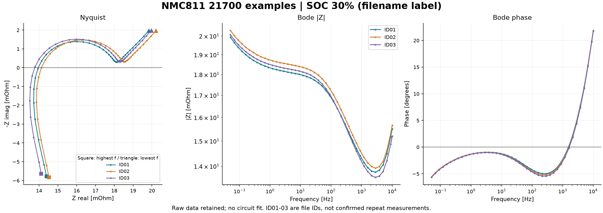
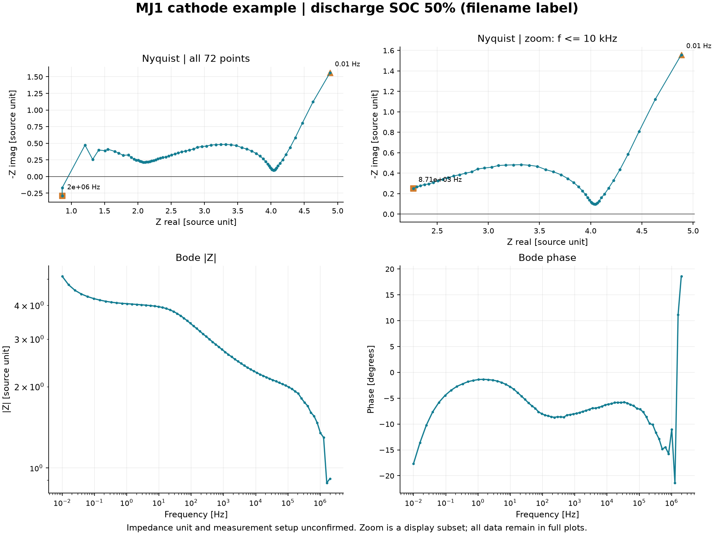

# EIS 예시 데이터 분석 결과

> 2026-10-03 | 분류: 1.4.1.3 EIS (`method.eis`) | 검토 상태: pending_review

[전체 구조](../../index.md) · [작업 계획](../../study-plan.md)

## 예시 자료의 범위

이 자료는 EIS 분석·그래프 작성 방법을 보여주는 외부 예시다. 사용자는 본인의 실제 측정 데이터가 아니며, CSV 4개와 분석 결과의 공개 GitHub 업로드를 승인했다고 확인했다(2026-10-03). 합성 데이터인지 실제 외부 측정값인지는 확인되지 않았다. 원본 출처·이용 조건·일부 단위·측정조건은 미확인으로 유지한다. 공개 승인은 데이터나 해석의 검증 완료를 의미하지 않는다.

## 결과 요약

NMC811 세 파일은 같은 44개 주파수 지점에서 비슷한 곡선 형태를 보인다. ID02의 실수 임피던스가 ID01·ID03보다 높다. 파일 ID만으로 동일 시료의 반복 측정인지 서로 다른 셀인지 알 수 없어 반복성이나 열화 정도로 단정하지 않는다.

고주파 측 실축 교차값은 13.771–14.124 mΩ, 최저 주파수 0.05 Hz에서 실수 임피던스는 19.834–20.211 mΩ이다. 교차값은 인접 두 점의 선형 보간값이며 확정된 옴 저항 R_s가 아니다.

MJ1 파일은 양극 데이터라는 파일명과 다른 주파수 범위·임피던스 스케일을 갖는다. 단위와 측정 구성이 불명확하므로 NMC811 셀과 수치 크기로 성능을 비교하지 않는다.

## NMC811 셀 예시: Nyquist와 Bode

| 파일 ID | 점 수 | 주파수 범위 (Hz) | 고주파 측 실축 교차값 (mΩ) | 교차 주파수 (Hz) | 0.05 Hz 실수값 (mΩ) | 0.05 Hz 위상 (°) |
| --- | --- | --- | --- | --- | --- | --- |
| ID01 | 44 | 0.05–1e+04 | 13.961 | 1540.3 | 19.834 | -5.65 |
| ID02 | 44 | 0.05–1e+04 | 14.124 | 1591.2 | 20.211 | -5.56 |
| ID03 | 44 | 0.05–1e+04 | 13.771 | 1635.2 | 19.968 | -5.67 |

고주파에서 양의 허수값, 중간·낮은 주파수에서 음의 허수값이 나타난다. 유도성 응답은 연결선·측정 배치 등의 영향일 수 있지만 이 데이터만으로 원인을 특정하지 않는다. 저주파 쪽 곡선의 증가는 느린 응답과 양립하며, 확산계수·전하전달저항·열화 원인은 별도 모델과 검증 없이는 결정하지 않는다.

## MJ1 양극 예시: 전체 범위와 확대

전체 72개 지점(가정: 0.01 Hz–2 MHz)을 표시한다. 오른쪽 위 Nyquist는 10 kHz 이하만 확대한다. 확대를 위한 표시 범위이며 이상치 제거가 아니다. 전체 데이터와 Bode에는 모든 지점이 남아 있다.

고주파에서 굴곡이 보이고 전체 데이터에서 허수부 부호 전환은 1회 확인된다. 장비·배선·보정·데이터 출처를 확인해야 하며, 임의로 한 개 반원에 피팅하지 않았다.

## 계산·단위·검증

- 복소 임피던스: `Z = Zreal + j Zimag`.
- Nyquist: 가로 `Zreal`, 세로 `-Zimag`. NMC811만 Ω→mΩ로 변환함.
- Bode 크기: `|Z| = sqrt(Zreal² + Zimag²)`; 위상: `atan2(Zimag, Zreal) × 180/π`.
- MJ1은 원본 `-Zimag`의 부호를 복원함. `abs`와 재계산 크기, `phase`와 라디안 위상의 일치를 검증함.
- 네 파일 모두 유한한 수치·양의 주파수·주파수 중복 없음 확인. NMC811 세 파일의 주파수 배열이 정확히 일치함.
- 모든 입력 행을 유지하고 주파수 내림차순으로 정렬함. 평활화·이상치 제거·회로 피팅을 수행하지 않음.
- 고주파 측 교차값은 주파수 내림차순으로 처음 나타나는 허수부 양→음 부호 전환의 실수값을 선형 보간함. 교차 주파수는 log10(f)에서 보간함.

## 파일과 재현

| 산출물 | 용도 |
| --- | --- |
| [summary.csv](summary.csv) | 파일별 지표; 원본 단위 유지 |
| [derived_points.csv](derived_points.csv) | 모든 204개 점의 크기·위상 계산 |
| [analysis-record.json](analysis-record.json) | 입력 해시·검증·단위·가정·한계 |
| [분석 코드](../../Tools/analyze_eis_examples.py) | 결과와 그래프 재생성 |

입력 파일:

- [nmc-mj1-cathode-discharge-soc50.csv](../../Data/static/eis/nmc-mj1-cathode-discharge-soc50.csv)
- [nmc811-21700-soc30-id01.csv](../../Data/static/eis/nmc811-21700-soc30-id01.csv)
- [nmc811-21700-soc30-id02.csv](../../Data/static/eis/nmc811-21700-soc30-id02.csv)
- [nmc811-21700-soc30-id03.csv](../../Data/static/eis/nmc811-21700-soc30-id03.csv)

일반 Python 환경은 `pip install matplotlib numpy` 후 `python Tools/analyze_eis_examples.py`로 실행한다. 현재 환경은 [작업 계획](../../study-plan.md)의 앱 포함 Python 경로를 사용하며 `.analysis-deps`에 그래프 의존성을 설치했다.

## 해석 근거 및 다음 확인

- [Gamry: Basics of EIS](https://www.gamry.com/application-notes/EIS/basics-of-electrochemical-impedance-spectroscopy): Nyquist·Bode 표현과 등가회로 해석의 기본. 데이터 원본 출처를 뜻하지 않음.
- [Gamry: Four-terminal EIS of batteries](https://www.gamry.com/application-notes/battery-research/four-terminal-eis-of-batteries/): 배선·접촉·측정 구성의 영향.
- 확인일: 2026-10-03. 원본 데이터 출처·이용 조건, MJ1의 단위·주파수 단위, 온도·진폭·휴지 시간·전극 면적·시료 관계를 확인해야 함.
- 위 조건을 확보하면 적절한 등가회로 선정, 적합도·잔차·파라미터 식별성 및 Kramers–Kronig 검증을 검토할 수 있음.
