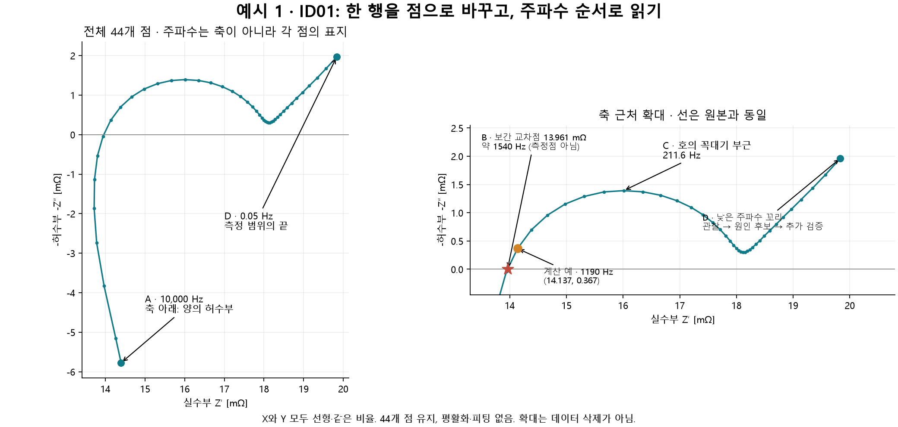
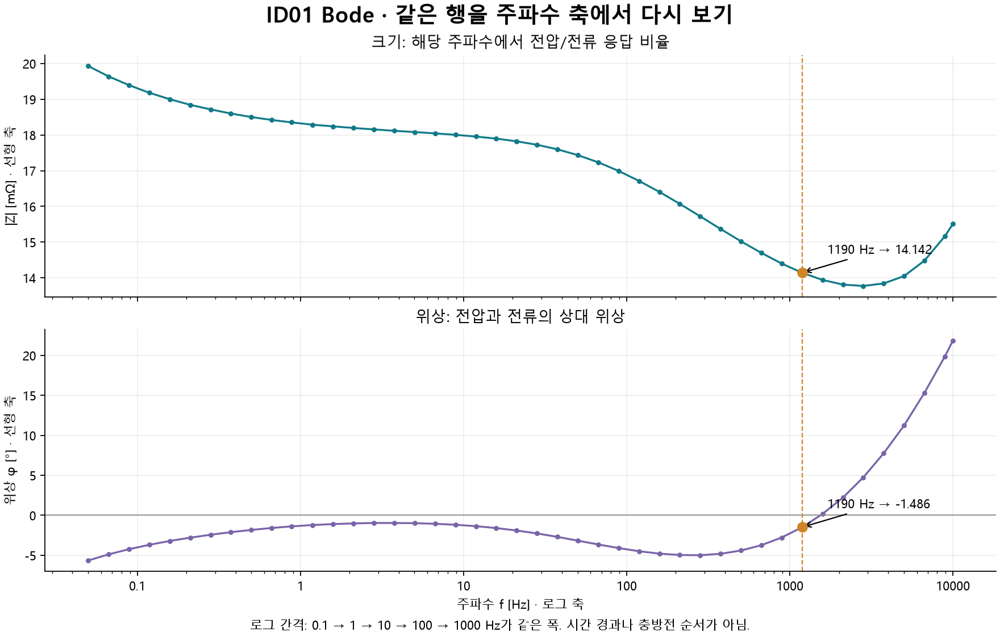
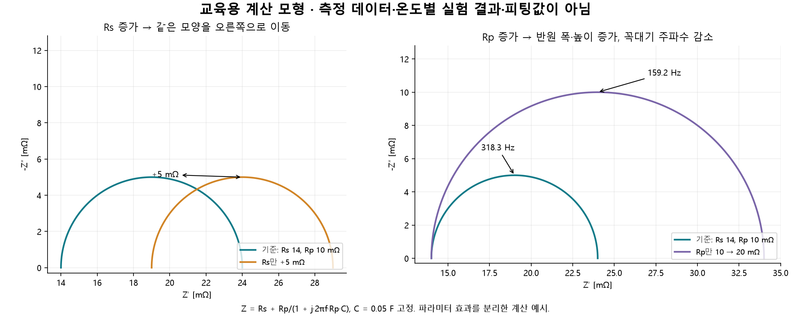

# 예시 1 — EIS 데이터시트에서 그래프와 해석까지

[전체 INDEX](../../index.md) · [작업 계획](../../study-plan.md) · [기존 4개 파일 분석 결과](README.md)

이 예시의 목표는 **열 이름을 이해하고 → 한 행을 좌표로 바꾸고 → 전체 그래프를 그리고 → 읽을 지점을 찾고 → 측정조건을 확인해 해석 범위를 정하는 것**이다. 처음에는 [NMC811 ID01 CSV](../../Data/static/eis/nmc811-21700-soc30-id01.csv) 하나만 사용한다.

파일명은 NMC811 21700·SOC 30%를 나타내지만 별도 측정 기록은 없다. 사용자가 외부 예시라고 확인한 자료이며 본인 실측 데이터가 아니다. 출처·측정 온도·진폭·휴지 시간·측정 구성은 미확인이다. 여기서는 실제 파일의 계산 결과와 교육용 모형을 구분하며, 학습 완료나 데이터의 과학적 검증 완료를 주장하지 않는다.

## 1. 먼저 데이터시트의 정체를 확인한다

이 CSV는 임피던스 계산 결과가 담긴 형태다. 전압·전류의 시간 파형에서 임피던스를 추출하는 과정이나 장비의 실제 측정 기록은 이 파일에 들어 있지 않다. 한 행은 **한 주파수의 복소 임피던스 한 점**이다. 여러 행은 충방전 시간의 순서가 아니라 주파수별 점들이다.

| 열 | 의미 | 원본 단위 | 그래프에서 사용 |
| --- | --- | --- | --- |
| `Frequency_Hz` | 신호가 1초에 반복되는 횟수 f | Hz | Bode X축, Nyquist 점의 주파수 표지 |
| `Real_Ohm` | 임피던스 실수부 Z′ | Ω | Nyquist X축 |
| `Imag_Ohm` | 부호가 포함된 임피던스 허수부 Z″ | Ω | 부호를 반대로 해 Nyquist Y축 |

실수부는 저항성 성분, 허수부는 위상이 어긋난 성분을 나타낸다. [표현과 회로의 기본 근거](https://www.gamry.com/application-notes/EIS/basics-of-electrochemical-impedance-spectroscopy/)

**주의:** 실수부 한 값을 전하전달저항이나 전해질 저항으로 바로 이름 붙이지 않는다. 여러 과정이 합쳐진 응답일 수 있다.

실수부에 함께 영향을 줄 수 있는 요소는 다음과 같다. 아래는 해석할 때 검토할 후보이며, 이번 ID01에서 각각의 기여가 확인되었다는 뜻은 아니다.

| 영향을 줄 수 있는 요소 | 어떤 과정인가 | 한 값을 해석할 때 확인할 것 |
| --- | --- | --- |
| 전해질·분리막·전극 기공의 이온 이동 | 전해질을 통해 이온이 이동하며 생기는 저항성 기여. 이동 거리·전도도·기공 구조·젖음 상태가 관련됨 | 고주파 측 값에도 전해질 외의 저항이 포함될 수 있으므로 전해질 저항 하나로 단정하지 않음 |
| 전극·집전체·탭의 전자 전도와 내부 접촉 | 전자가 전극과 금속 경로를 지나고 접촉부를 통과하며 생기는 저항성 기여 | 전극 구성과 내부 접촉 상태를 함께 확인 |
| 전극 표면의 계면막 | 음극 SEI 등 표면막을 통과하는 이온 이동과 계면 응답 | 계면막의 응답과 전하전달 응답이 겹칠 수 있음 |
| 양극·음극의 전하전달 반응 | 전극과 전해질 계면에서 전하가 전달되는 반응과 이중층의 결합 응답 | 2단자 셀 측정에는 두 전극의 응답이 함께 들어오므로 어느 전극의 Rct인지 한 점으로 구분하지 않음 |
| 확산·농도 변화 | 활물질 내부 또는 전해질에서 물질이 이동하며 농도가 변하는 과정 | 느린 응답은 실수부·허수부 모두에 기여할 수 있어 저주파 실수값을 단순 저항 하나로 읽지 않음 |
| 측정 리드·클립·치구의 저항과 접촉 | 셀 외부 연결부가 측정값에 포함시키는 저항성 기여 | 2단자/4단자 구성·전압 감지 위치·접촉 상태·보정 여부 확인 |

셀 내부의 전극·분리막·계면막·반응·확산 기여는 [BioLogic의 배터리 EIS 설명 7쪽](https://www.biologic.net/wp-content/uploads/2019/08/studying-batteries-with-electrochemical-impedance-spectroscopy-wp1-electrochemistry-battery.pdf), 외부 배선·접촉의 영향은 [Gamry의 저임피던스 배터리 측정 설명](https://www.gamry.com/application-notes/EIS/eis-measurement-of-a-very-low-impedance-lithium-ion-battery)을 참고한다.

**같은 셀에서도 주파수에 따라 각 과정의 기여가 달라진다.** 예를 들어 뒤의 이상적인 `Rs + (Rp ∥ C)` 모형에서도 실수부는 항상 Rs나 Rp 하나가 아니라 주파수에 따라 달라지는 합성값이다. 따라서 한 행의 실수부를 특정 저항으로 이름 붙이기 전에 전체 주파수 곡선·측정조건·회로 가정을 함께 확인한다. 온도·SOC·휴지 시간은 위 과정들의 상태를 바꾸는 조건이며, 그 비교 방법은 5절에서 설명한다.

검사 결과는 **44개 점, 0.05–10,000 Hz, 누락·비수치·주파수 중복 없음**이다. 원본을 보존하고 주파수 내림차순으로 연결한다. 이 검사만으로 선형성·정상성·측정 정확성이 검증된 것은 아니다.

## 2. 한 행을 직접 그래프 좌표로 바꾼다

원본의 **9번째 데이터 행**(헤더까지 포함하면 파일 10번째 줄)을 보자.

```csv
Frequency_Hz,Real_Ohm,Imag_Ohm
1190,0.014137316349661,-0.000366713851690292
```

### Nyquist의 X·Y 설정

```text
X = Real_Ohm × 1000
  = 14.137316... mΩ

Y = -Imag_Ohm × 1000
  = 0.366714... mΩ

그래프의 점 = (14.137, 0.367), 주파수 표지 = 1190 Hz
```

`1 Ω = 1000 mΩ`이므로 작은 셀 임피던스를 읽기 편하게 바꿨다. 원본 허수부가 음수이기 때문에 이번 점은 X축 위에 놓인다. 파일이 이미 `-Zimag`를 저장했다면 부호를 다시 뒤집으면 안 된다. [기존 MJ1 예시](README.md)는 그런 열 형식을 사용한다.

### 같은 행을 Bode 두 점으로 바꾸기

```text
|Z| = sqrt(Real_Ohm² + Imag_Ohm²) × 1000
    = 14.142072... mΩ

φ = atan2(Imag_Ohm, Real_Ohm) × 180/π
  = -1.485886... °

크기 그래프의 점 = (1190 Hz, 14.142 mΩ)
위상 그래프의 점 = (1190 Hz, -1.486°)
```

따라서 **하나의 행이 Nyquist의 점 하나와 Bode의 크기·위상 점 하나씩**으로 나타난다. `atan2`는 실수·허수부의 부호와 사분면을 함께 반영한다.

## 3. 전체 그래프를 그린다 — 축을 이렇게 정한 이유

| 그래프 | X축 | Y축 | 축 배율과 목적 |
| --- | --- | --- | --- |
| Nyquist | Z′ (mΩ) | -Z″ (mΩ) | 둘 다 선형, X:Y 길이 비율 동일; 곡선 형태와 위치를 본다 |
| Bode 크기 | f (Hz) | \|Z\| (mΩ) | X 로그·Y 선형; 이번 파일의 약 14–20 mΩ 변화를 쉽게 읽는다 |
| Bode 위상 | f (Hz) | φ (°) | X 로그·Y 선형; 부호·위상 변화의 주파수를 본다 |

Nyquist에는 주파수 축이 없다. 44개 주파수의 좌표를 하나씩 찍고 순서대로 잇는다. 선은 점 사이의 이동을 읽도록 잇는 선이며 피팅 결과가 아니다. 주파수 표지가 없으면 호의 어느 지점이 빠른 응답인지 알기 어렵다.

Bode X축은 0.1→1→10→100→1000 Hz처럼 10배 간격을 같은 폭으로 표시한다. 낮은 주파수와 높은 주파수를 함께 보기 위해 로그 축을 선택했다. 기존 보고서는 크기 Y축도 로그로 표시했지만, 이 따라하기는 작은 크기 차이를 읽도록 Y를 선형으로 표시했다. **같은 데이터이며 표시 배율만 다르다.** [Nyquist·Bode 근거](https://www.gamry.com/application-notes/EIS/basics-of-electrochemical-impedance-spectroscopy/)



왼쪽에는 전체 점을 남겼고 오른쪽은 같은 곡선을 확대했다. 고주파 부분이 확대 화면 밖에 있어도 데이터를 제거한 것이 아니다.



점선과 주황색 점은 앞에서 계산한 1190 Hz 행이다. Nyquist에서는 `(14.137, 0.367)`, Bode에서는 `14.142 mΩ`와 `-1.486°`를 찾아보면 된다.

## 4. 어디에 집중해서 볼까 — A → B → C → D

| 지점 | 이번 데이터에서 직접 확인한 내용 | 무엇을 확인하려고 보는가 | 아직 결정할 수 없는 내용 |
| --- | --- | --- | --- |
| A: 고주파 시작, 10 kHz | Z″가 +5.774 mΩ여서 Nyquist Y는 -5.774 mΩ | 유도성 응답·배선/접촉 영향과 측정 구성 점검 | 셀 자체 유도성인지 배선 영향인지 분리 |
| B: 고주파 측 실축 교차 | 인접 점 보간 X≈13.961 mΩ, f≈1540 Hz | 조건을 맞춘 뒤 교차 위치가 이동하는지 비교 | 이것을 확정된 순수 옴 저항 Rs나 전해질 저항으로 단정 |
| C: 호의 꼭대기 부근 | 211.6 Hz에서 X≈16.010, Y≈1.391 mΩ | 호의 폭·높이·특징 주파수 변화 관찰 | 단일 Rct·C 값이나 양극/음극/계면막의 독립 기여 |
| D: 저주파 끝, 0.05 Hz | X≈19.834, Y≈1.963 mΩ; 끝에서도 꼬리가 상승 | 느린 응답·더 낮은 주파수의 필요성·측정 중 드리프트 검토 | DC 저항, 확산계수, 확산만으로 설명되는지 여부 |

**B는 실측 점이 아니라 보간한 점**이다. 1586.89 Hz와 1190 Hz 사이에서 허수부 부호가 바뀌므로 두 점 사이를 선형 보간했다. 주파수는 log10(f)에서 보간한다. 최저 실수값 13.717 mΩ는 약 3763 Hz에 있으며 B의 13.961 mΩ와 다르다. 고주파의 첫 점·최저 실수값·실축 교차값을 같은 값으로 취급하면 안 된다.

고주파 배선 영향은 낮은 임피던스에서 더 중요할 수 있으며, 실제 셀의 유도성 응답도 가능하다. 그러므로 A를 임의로 지우거나 모두 장비 오류라고 표시하지 않는다. [배선과 저임피던스 측정 근거](https://www.gamry.com/application-notes/EIS/eis-measurement-of-a-very-low-impedance-lithium-ion-battery)

이상적인 `Rs + (Rp ∥ C)` 하나라면 반원의 폭은 Rp이고 꼭대기 주파수는 `1/(2πRpC)`다. 그러나 실제 셀은 여러 응답이 겹칠 수 있고 이 예시에는 고주파 유도성 부분과 저주파 꼬리가 있다. **C의 높이를 두 배 해 바로 Rct라고 부르거나, 이 곡선 전체에 단일 반원을 강제로 맞추지 않는다.** [비유일한 모델과 해석 범위](https://www.gamry.com/application-notes/EIS/basics-of-electrochemical-impedance-spectroscopy/)

## 5. 측정조건을 바꾸면 무엇이 달라질까

아래는 **새 조건으로 측정할 때 점검할 방향**이다. 이번 CSV는 조건별 세트가 아니므로 실제 변화량을 계산한 결과가 아니다. 기존 ID01·ID02·ID03에도 온도별·SOC별 조건을 임의로 붙이지 않는다.

| 바꾸는 조건 | 변화가 생기는 과정·검토할 원인 | 그래프에서 집중할 곳 | 비교 전에 맞출 것 |
| --- | --- | --- | --- |
| SOC | 전극의 리튬 저장 상태·전위가 달라져 반응·전달 응답이 바뀔 수 있음. 방향은 소재·SOC 구간에 따라 다름 | B 교차 위치, C 호의 크기·주파수, D 저주파 응답 | 온도·휴지·진폭·시료 상태·주파수 범위 |
| 온도 | 반응속도·전달과 전해질 전도도가 달라짐. 저항성 응답의 변화 방향·크기는 소재·상태·구간별 비교로 확인하고 고정 증가량으로 환산하지 않음 | B 이동, C 호의 변화·주파수 이동, Bode 크기·위상 | SOC·온도 평형·휴지·이력 |
| AC 진폭 | 작으면 신호대잡음이 부족할 수 있고, 크면 선형 범위를 벗어나 상태가 변할 수 있음 | 점의 산포, 진폭별 곡선 일치, 고조파·검증 지표 | 정전류/정전압 모드, 진폭의 peak/RMS 정의·단위 |
| 휴지 시간 | 충방전 직후의 농도·전압 상태가 완화됨. 측정 중 계속 변하면 정상성 조건에 맞지 않음 | 시간에 따른 곡선 재현성, 특히 긴 저주파 측정의 드리프트 | 직전 충방전 방향·SOC·온도·시작 OCV |
| 배선·고정·접촉 | 전류·전압 리드의 배치와 접촉 상태가 측정에 영향을 줌 | A의 축 아래 부분, B의 이동·산포 | 4단자 구성·접촉 압력·케이블 배치·보정 |
| 최저 주파수·점 수 | 기존 측정 응답을 더 오래·세밀하게 관찰함. 측정시간이 늘어 상태 변화도 확인 필요 | D의 꼬리가 어디까지 이어지는지, 호의 완결 여부 | 데이터가 안정적인지; 표시 확대와 실제 재측정을 구분 |

SOC별 비교에는 [BioLogic의 배터리 EIS 설명](https://www.biologic.net/wp-content/uploads/2019/08/studying-batteries-with-electrochemical-impedance-spectroscopy-wp1-electrochemistry-battery.pdf)을, 진폭·모드에는 [Gamry의 정전류/정전압 EIS 설명](https://www.gamry.com/application-notes/EIS/eis-potentiostatic-galvanostatic-mode/)을 참고한다. 온도·휴지·선형성·정상성은 측정 상태를 함께 확인해야 한다. [기본 측정 가정](https://www.gamry.com/application-notes/EIS/basics-of-electrochemical-impedance-spectroscopy/)

[BioLogic의 측정조건 자료](https://www.biologic.net/wp-content/uploads/2019/12/impedance_partiv_condexp.pdf)는 17쪽에서 온도 관리의 필요성, 24쪽에서 진폭과 신호·선형성의 관계를 설명한다. 17쪽의 TestBox 회로 사례를 이번 배터리의 온도별 실측 결과로 확대하지 않는다.

### 먼저 모형에서 한 가지씩 바꿔보자

아래 그림은 **교육용 계산 곡선**이다. ID01의 피팅이나 실제 온도·SOC 변경 실험 결과가 아니다. 파라미터가 바뀌면 어떤 모양 변화가 생기는지 분리해서 보기 위한 것이다.

```text
Z(f) = Rs + Rp / (1 + j·2πf·Rp·C)

기준:       Rs = 14 mΩ, Rp = 10 mΩ, C = 0.05 F
Rs 변화:    Rs = 19 mΩ, Rp = 10 mΩ, C = 0.05 F
Rp 변화:    Rs = 14 mΩ, Rp = 20 mΩ, C = 0.05 F
```



- **Rs만 5 mΩ 증가**: 모든 점의 X가 5 mΩ 증가하고 Y는 그대로다. 같은 호가 오른쪽으로 이동한다.
- **Rp만 두 배 증가**: 왼쪽 교차는 그대로이고 반원의 폭은 10→20 mΩ, 높이는 5→10 mΩ로 커진다. C가 고정이면 꼭대기 주파수는 318.3→159.2 Hz로 낮아진다.
- 실제 온도나 SOC를 바꾸면 Rs·Rp·용량성·확산성 성분이 함께 바뀔 수 있다. 위 변화 한 가지를 특정 측정조건의 효과와 일대일로 연결하지 않는다.

이 모형의 Rp는 이상적인 병렬 저항이다. 실제 전하전달저항 Rct로 해석하려면 해당 회로와 물리 가정이 맞는지 검증해야 한다.

### 실제 조건 비교는 이렇게 기록한다

예를 들어 같은 셀에서 온도만 바꿨다면 다음 순서로 진행한다.

1. 온도 두 수준과 실제 측정 온도, SOC·휴지·진폭·모드를 기록한다. 이 예시는 실제 설정값을 정하지 않는다.
2. 셀의 온도·전압이 안정된 뒤 같은 주파수 범위로 측정하고 입력 파일을 따로 보존한다.
3. 두 그래프를 동일 축·단위·배율에 겹친다. 주파수 배열이 다르면 같은 주파수 비교를 위한 정렬·보간 방법을 기록한다.
4. 먼저 A의 배선 영향·산포와 측정 반복의 재현성을 본다.
5. B 위치, 호의 폭과 특징 주파수, 같은 주파수의 \|Z\|·위상을 비교한다. 호의 양 끝이 분리되지 않으면 Rct라는 이름 대신 관찰 지표를 쓴다.
6. 차이값은 `조건2 − 조건1`, 변화율은 `(조건2 − 조건1)/조건1 × 100%`로 기록한다. 위상 차이는 도(°)로 쓰고, 기준이 0에 가깝거나 부호가 바뀌면 변화율을 쓰지 않는다.
7. 다시 기준 조건으로 돌아가 재측정하면 조건 변화의 가역성, 드리프트·이력의 가능성을 구분하는 데 도움이 된다.
8. 두 조건의 비교 관찰과 원인 가설을 분리해 쓰고, 회로 피팅은 선형성·정상성·주파수 범위·잔차·식별성을 확인한 뒤 진행한다.

## 6. 이번 결과를 문장으로 읽어보자

**관찰:** ID01에서 10 kHz 점은 Nyquist 축 아래에 있고, 고주파 측 실축 교차값은 보간상 약 13.961 mΩ다. 중간 주파수에는 호가 있으며 0.05 Hz에서도 꼬리가 이어진다.

**해석 후보:** 고주파의 유도성 응답, 중간 주파수의 겹친 반응·계면 응답, 저주파의 느린 전달·저장 응답을 검토할 수 있다.

**추가 확인:** 온도·SOC·진폭·휴지·배선·시료 관계를 확인하고, 조건을 통제한 비교와 모델 검증이 필요하다.

따라서 이번 자료만으로 “전하전달저항은 ○○이고 배터리가 열화됐다”는 결론을 쓰지 않는다. **그래프에서 보인 것 → 가능한 설명 → 확인할 측정·자료**의 순서로 결과를 남긴다.

## 7. 직접 따라 해볼 확인 질문

1. 1190 Hz의 원본 허수부가 음수인데 왜 Nyquist 점은 X축 위에 놓이는가?
2. Nyquist X축을 주파수로 바꾸면 어떤 그래프가 되는가? Bode의 Y에는 무엇을 써야 하는가?
3. ID01의 최저 실수값과 고주파 측 실축 교차값이 왜 다를 수 있는가?
4. 온도만 비교하려면 SOC와 휴지 시간을 왜 맞춰야 하는가?
5. Rs 변화처럼 오른쪽으로 이동한 곡선을 보았을 때, 실제로 어떤 원인을 먼저 확인해야 하는가?

이 질문을 설명할 수 있으면 다음 단계에서 조건별 데이터를 비교한다. 확인 질문을 마련한 것을 사용자의 학습 완료로 기록하지 않는다.

## 재현 파일과 근거

| 파일 | 용도 |
| --- | --- |
| [원본 CSV](../../Data/static/eis/nmc811-21700-soc30-id01.csv) | 원본 44개 점 |
| [선택 행 계산표](walkthrough_points.csv) | 원본 행 번호·축 좌표·크기·위상 확인 |
| [그림 생성 코드](../../Tools/build_eis_walkthrough.py) | 주석 그림·모형·수치 검증 재생성 |
| [검증 기록](walkthrough-record.json) | 입력 해시·계산 예·교육용 모형 구분 |

기존 분석 코드의 CSV 읽기·검증을 재사용한다. 실행은 `python Tools/build_eis_walkthrough.py`이며 현재 PC에서는 [작업 계획](../../study-plan.md)의 앱 포함 Python을 사용한다. 문서는 수동 편집하고 그림·계산표만 코드로 재생성한다. WBS의 내용 원본·항목별 PDF는 변경하지 않는다.

근거 확인일은 2026-10-03이다. 위 공식 장비사 자료는 그래프 표현과 측정·모형 해석의 근거이며, 예시 CSV의 출처를 확인한 자료는 아니다.
